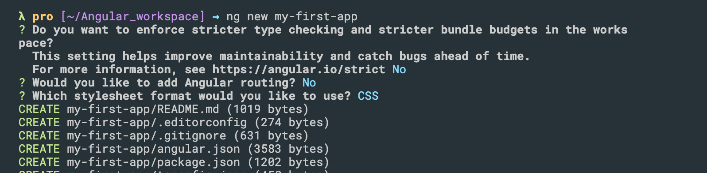
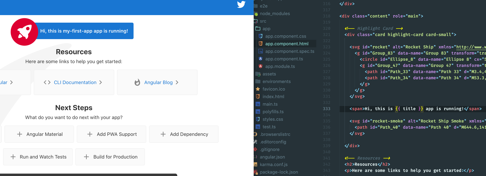
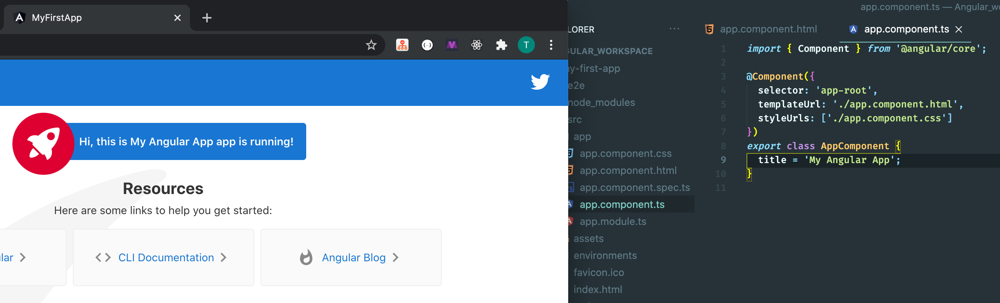
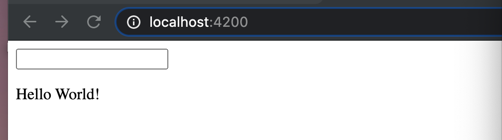
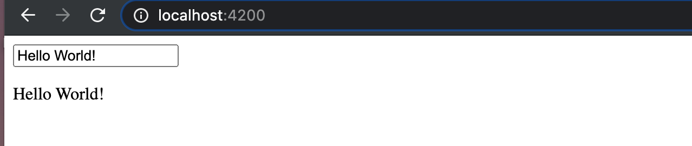
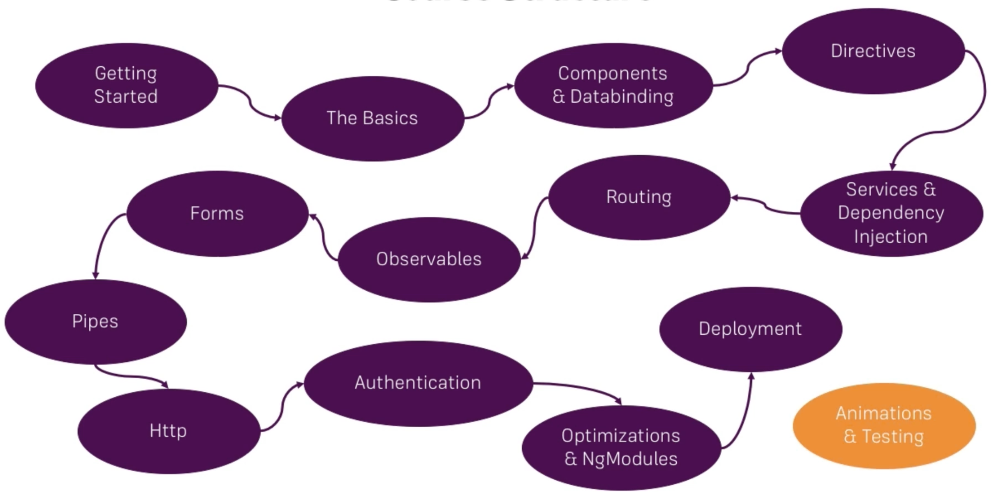
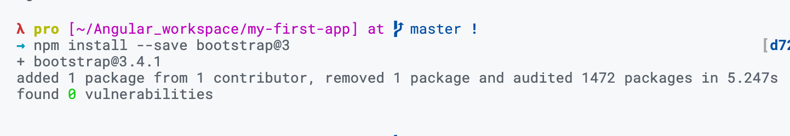
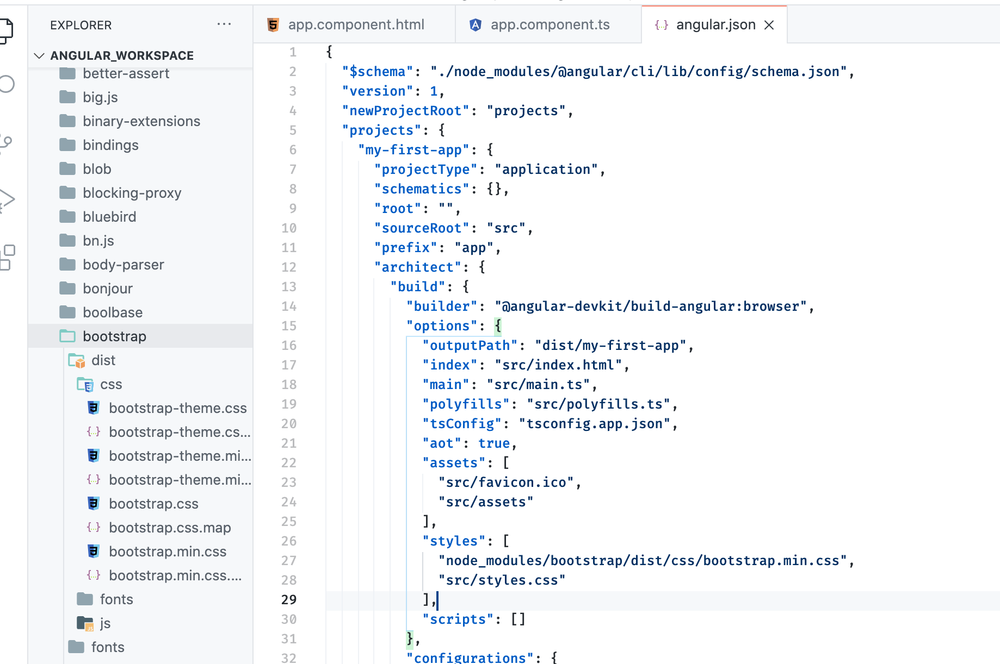
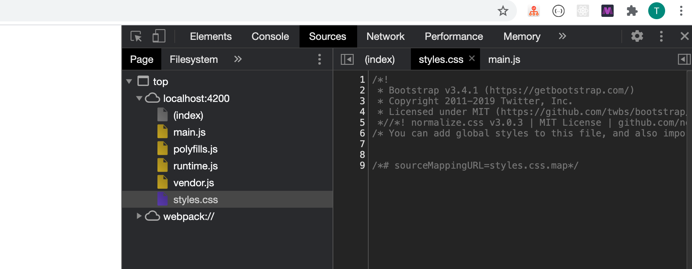

## Angular 2

- Angular 2 is similar to 3, 4, 5, ... 9

- New version every 6 months release, it doesn't change anything

---

## Set Up first project

- `npm install -g @angular/cli@latest`




- cd to `my-first-app`

- run `npm serve`

- open the browser `http://localhost:4200/`



- try to change.

- now try to change **title**



---

### Let's do something more fancy

- clear everything from `app.component.html`

```html
<input type="text">
<p>{{name}}</p>
```

- edit `app.component.ts`

```ts
import { Component } from '@angular/core';

@Component({
  selector: 'app-root',
  templateUrl: './app.component.html',
  styleUrls: ['./app.component.css']
})
export class AppComponent {
  name = 'Hello World!';
}
```



---

- edit `app.module.ts`

```ts
import { BrowserModule } from '@angular/platform-browser';
import { NgModule } from '@angular/core';
import {FormsModule} from '@angular/forms';

import { AppComponent } from './app.component';

@NgModule({
  declarations: [
    AppComponent
  ],
  imports: [
    BrowserModule,
    FormsModule
  ],
  providers: [],
  bootstrap: [AppComponent]
})
export class AppModule { }
```

- edit `app.component.html`

```html
<input type="text" [(ngModel)]="name">
<p>{{name}}</p>
```



---

## Angular Structure



---

## A Basic Project Setup using Bootstrap for Styling

- import `bootstrap`

- `npm install --save bootstrap@3`



- now we import `bootstrap` to my project
- `angular.json` import => `node_modules/bootstrap/dist/css/bootstrap.min.css`



- since we have installed `bootstrap`, we can find it from `node_modules`


- this is same to `React`



- then we can see that it imports bootstrap


