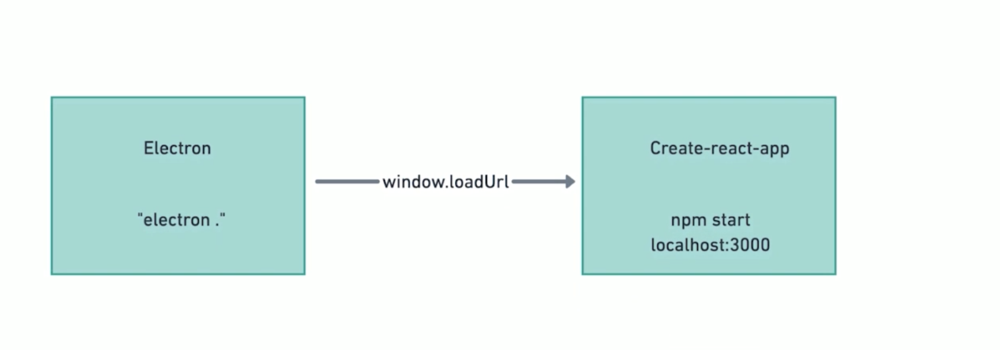
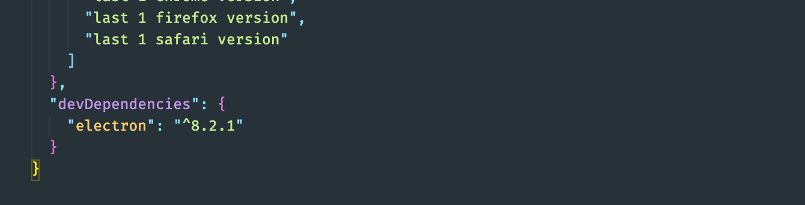
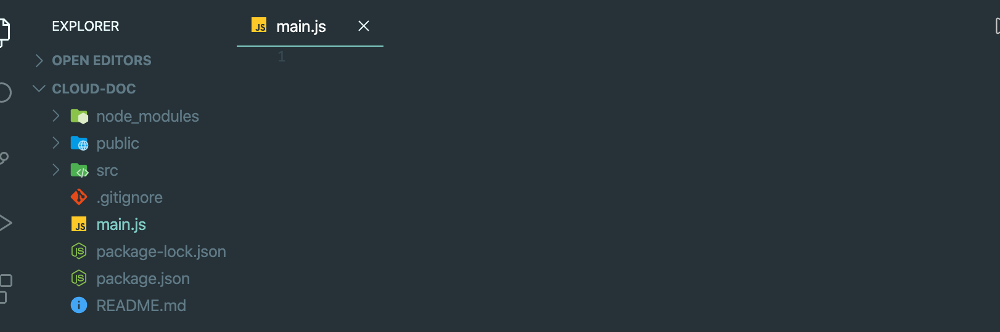
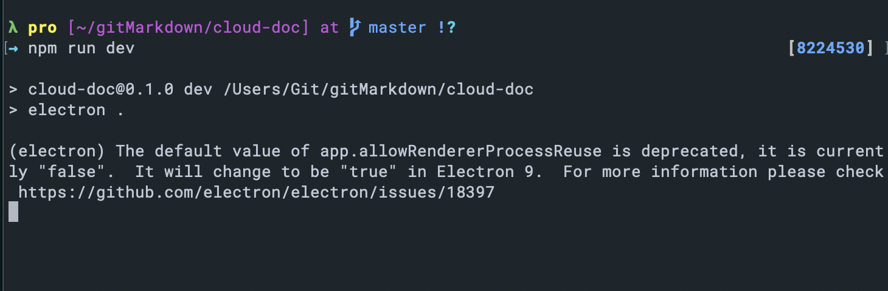
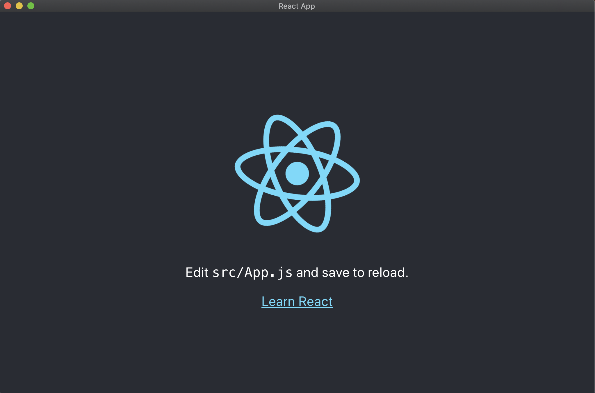

# Config develop environment



- create a new project

- `npx create-react-app` cloud-doc

- in addition, we need electron dependency

- `npm install electron --save-dev`


---

### create a main.js 



- main.js

```js
const { app, BrowserWindow } = require('electron');
let mainWindow;

app.on('ready', () => {
    mainWindow = new BrowserWindow({
        width: 1024,
        height: 680,
        webPreferences: {
            nodeIntegration: true,    //tell render process which can use Node.js
            
        }
    })
})
```

- now we need to know, mainWindow if it is in development environment or production environment

- `npm install electron-is-dev --save-dev  `

- then, main.js import electron-is-dev dependency

- update main.js

```js
const { app, BrowserWindow } = require('electron');
const isDev = require('electron-is-dev');
let mainWindow;

app.on('ready', () => {
    mainWindow = new BrowserWindow({
        width: 1024,
        height: 680,
        webPreferences: {
            nodeIntegration: true,    //tell render process which can use Node.js

        }
    })
    const urlLocation = isDev ? 'http://localhost:3000' : 'dummyurl';
    //check if it is on develop envir, if yes, mainWindow loading: http://localhost:3000
    mainWindow.loadURL(urlLocation);
})
```

- at this moment, we need to add main.js as "main" in `package.json`

- add `"dev" : "electron ."` to `package.json`

```json
{
  "name": "cloud-doc",
  "version": "0.1.0",
  "main": "main.js",
  "private": true,
  "dependencies": {
    "@testing-library/jest-dom": "^4.2.4",
    "@testing-library/react": "^9.5.0",
    "@testing-library/user-event": "^7.2.1",
    "react": "^16.13.1",
    "react-dom": "^16.13.1",
    "react-scripts": "3.4.1"
  },
  "scripts": {
    "start": "react-scripts start",
    "build": "react-scripts build",
    "test": "react-scripts test",
    "eject": "react-scripts eject",
    "dev" : "electron ."
  },
```

- now we run `npm start`

- then at second terminal run `mpm run dev`, (😄 since we add `"dev":"electron"` to `package.json`)





- Cool !!!

---
