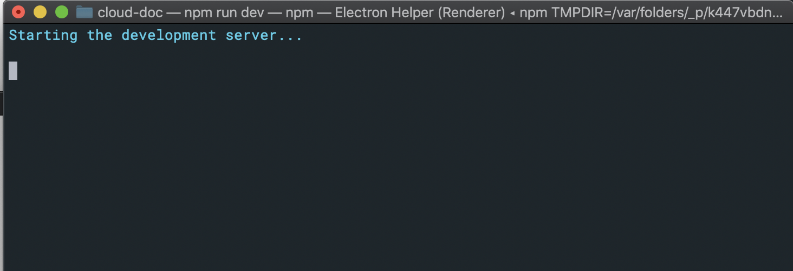
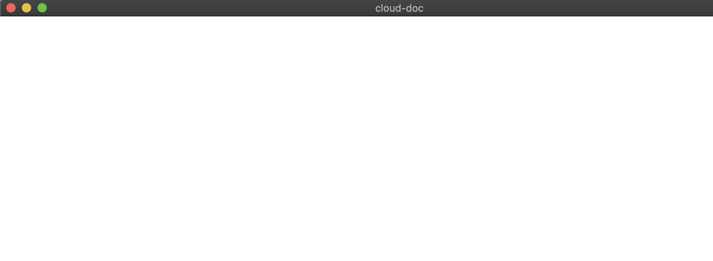
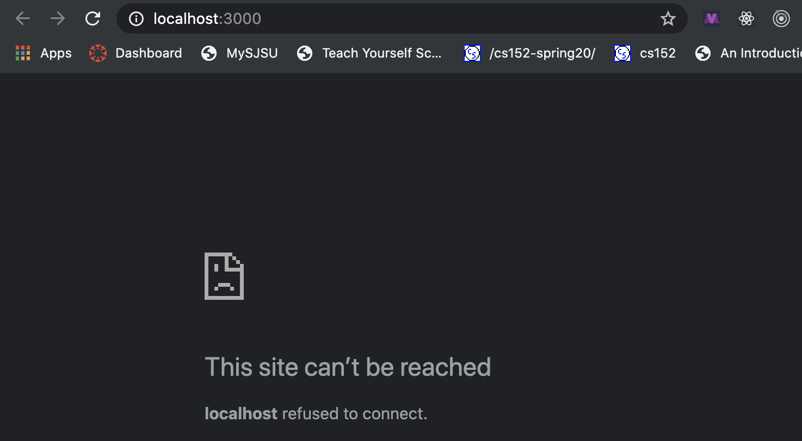
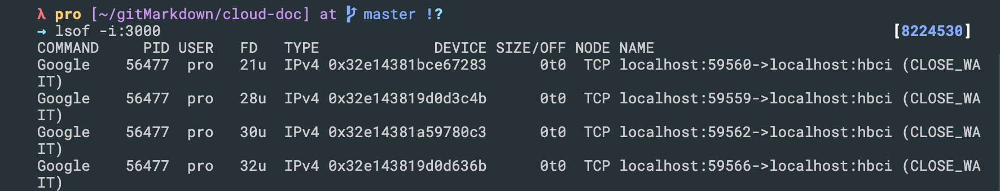
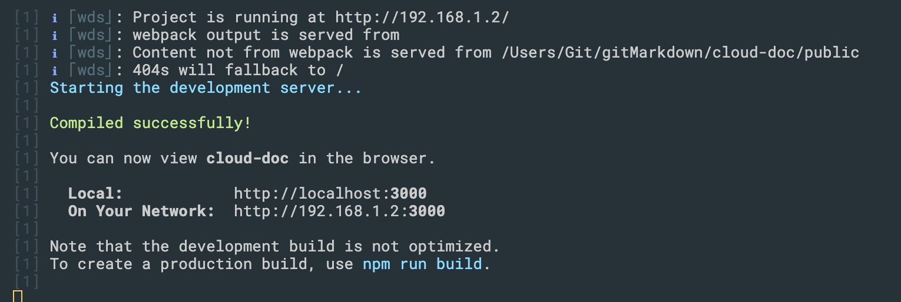
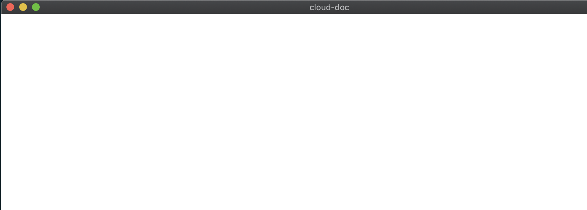
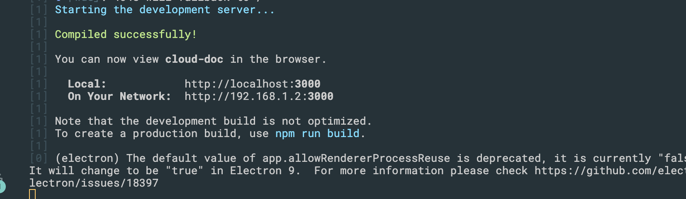
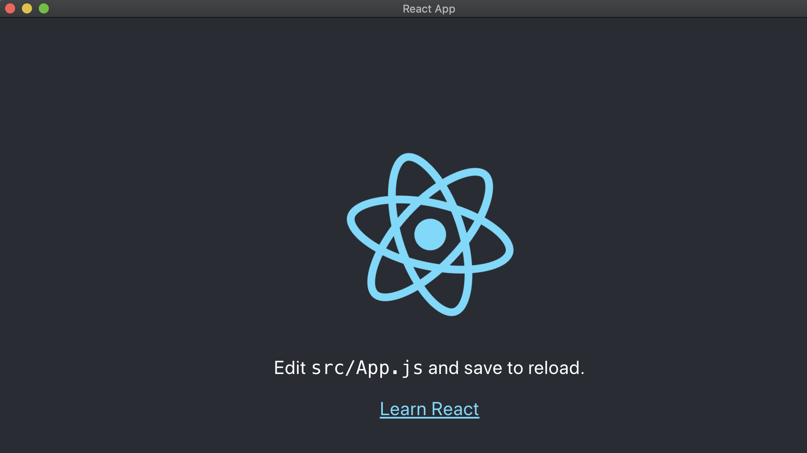
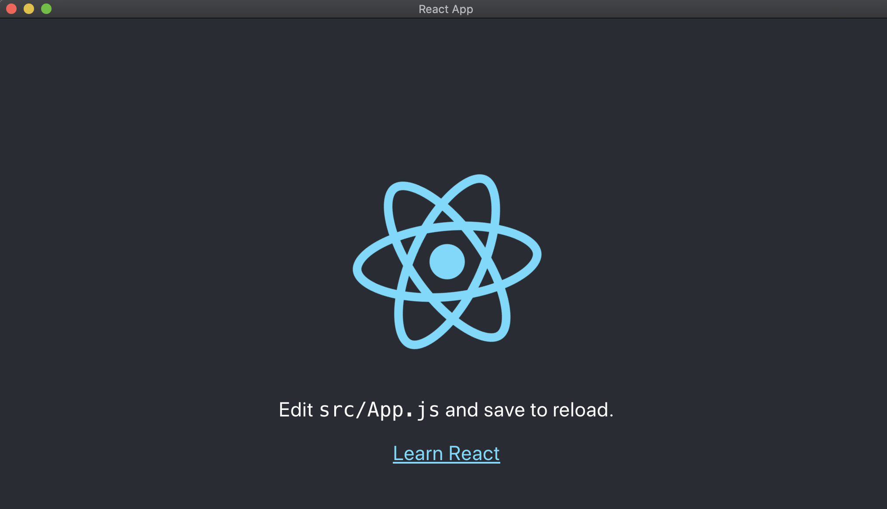

# Config develop environment 2

### but to do this, it isn't convenient. Everytime, we need to open two terminal to execute two conmmands

- 同时我们必须等待 loading 3000, 之后我们才能 run electron, 太麻烦！

---

## now we try to use this way(still not perfect):

- update package.json

```json
{
  "name": "cloud-doc",
  "version": "0.1.0",
  "main": "main.js",
  "private": true,
  "dependencies": {
    "@testing-library/jest-dom": "^4.2.4",
    "@testing-library/react": "^9.5.0",
    "@testing-library/user-event": "^7.2.1",
    "react": "^16.13.1",
    "react-dom": "^16.13.1",
    "react-scripts": "3.4.1"
  },
  "scripts": {
    "start": "react-scripts start",
    "build": "react-scripts build",
    "test": "react-scripts test",
    "eject": "react-scripts eject",
    "ele" : "electron .",        //add ele
    "dev" : "npm start & npm run ele"    // combine "npm start & npm run ele"
  },
  
```

- 这样做不完美， 我们来看它缺点（defect）

- run `npm run dev`





- 我们发现端口被占用， `→ lsof -i:3000   `



- `→ kill -9 56477   `

---

## introduction to `concurrently` (同时发生地)

- install, run `npm install concurrently --save-dev`

- update package.json

```json
  "scripts": {
    "start": "react-scripts start",
    "build": "react-scripts build",
    "test": "react-scripts test",
    "eject": "react-scripts eject",
    "ele": "electron .",
    "dev": "concurrently \"electron .\" \"npm start\" "
  },
```

- run `npm run dev` 




- 但是主窗口依然白屏，这里还是有问题.  必须刷新才能出来

- import a new tool `wait-on`

- install -> `npm install wait-on --save-dev  `

- 具体内容看官方文档

- update package.json

```json
  "scripts": {
    "start": "react-scripts start",
    "build": "react-scripts build",
    "test": "react-scripts test",
    "eject": "react-scripts eject",
    "ele": "electron .",
    "dev": "concurrently \"wait-on http://localhost:3000 && electron .\" \"npm start\" "
    //add a new instruction
  },
```

- -> `npm run dev` agian




- successfully, this time we don't need to refresh mainWindow

---

### 到这里还是不完美，因为每次都要手动先关闭浏览器 http://localhost:3000 页面，如何解决？

- in fact, create-react-app 提供了很多环境变量

- a new tool `cross-env`

- run `npm install cross-env --save-dev`

- updage package.json

```json
{
  "name": "cloud-doc",
  "version": "0.1.0",
  "main": "main.js",
  "private": true,
  "dependencies": {
    "@testing-library/jest-dom": "^4.2.4",
    "@testing-library/react": "^9.5.0",
    "@testing-library/user-event": "^7.2.1",
    "react": "^16.13.1",
    "react-dom": "^16.13.1",
    "react-scripts": "3.4.1"
  },
  "scripts": {
    "start": "react-scripts start",
    "build": "react-scripts build",
    "test": "react-scripts test",
    "eject": "react-scripts eject",
    "ele": "electron .",
    "dev": "concurrently \"wait-on http://localhost:3000 && electron .\" \"cross-env BROWSER=none npm start\" "
  },
```

- run `npm run dev`



- we see this time, it won't open the browser, since `BROWSER=none`


