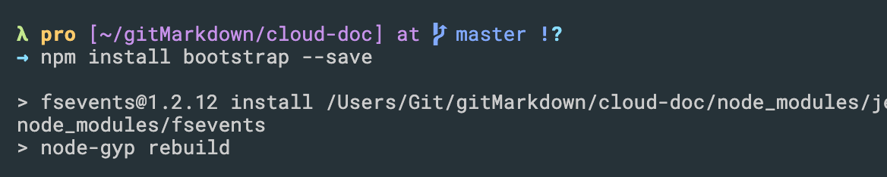
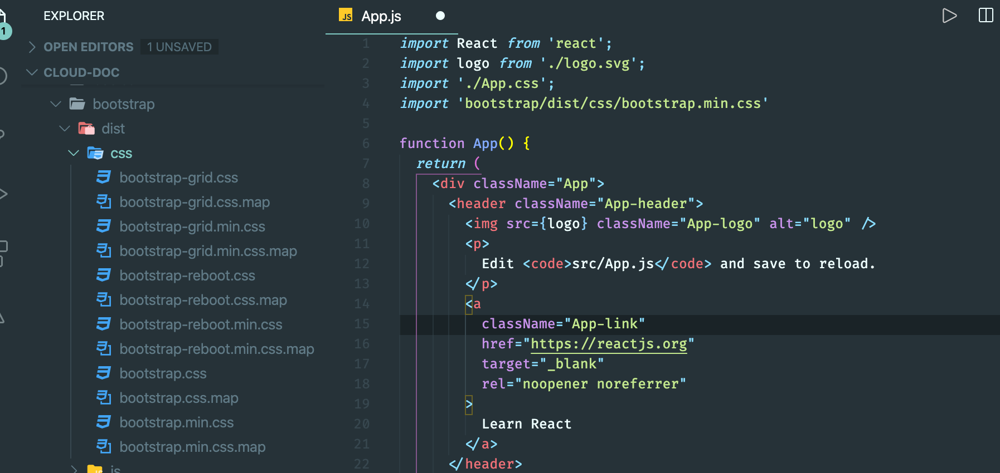
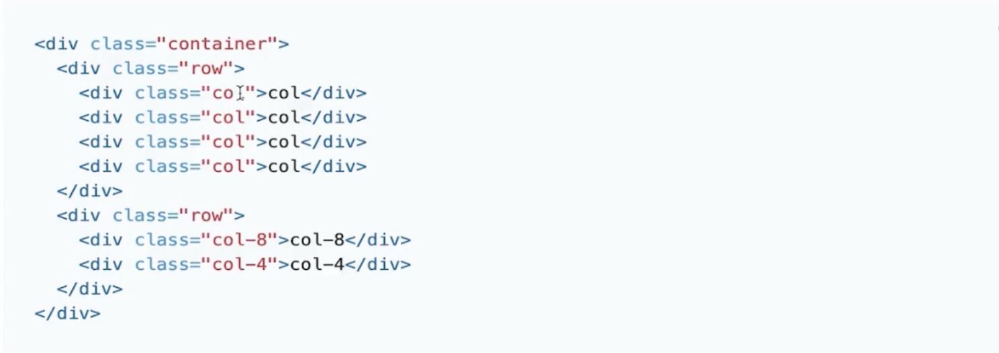
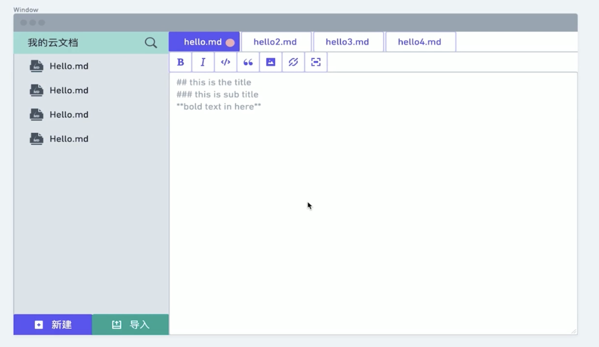
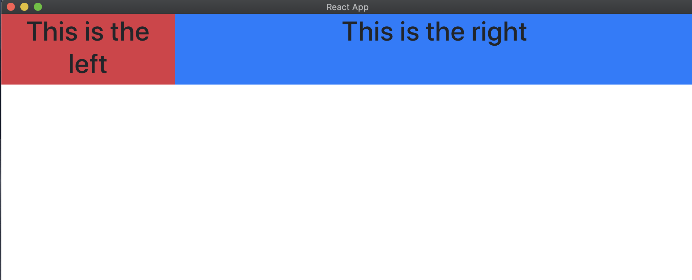

# import bootstrap library

- install bootstrap lirbary for our project

- run `npm install bootstrap --save`





- let App.js import bootstarp.min.css

- run `npm run dev` again

- update App.js

```js
import React from 'react';
import './App.css';
import 'bootstrap/dist/css/bootstrap.min.css'

function App() {
  return (
    <div className="App container-fluid"> 
    </div>
  );
}
export default App;
```



- don't more than 12 = 4 + 8



- update App.js

```js
import React from 'react';
import './App.css';
import 'bootstrap/dist/css/bootstrap.min.css'

function App() {
  return (
    <div className="App container-fluid">
      <div className="row">
        <div className="col-3 bg-danger left-panel">
          <h1>This is the left</h1>
        </div>
        <div className="col-9 bg-primary right-panel">
          <h1>This is the right</h1>
        </div>
      </div>
    </div>
  );
}
export default App;
```

- save



