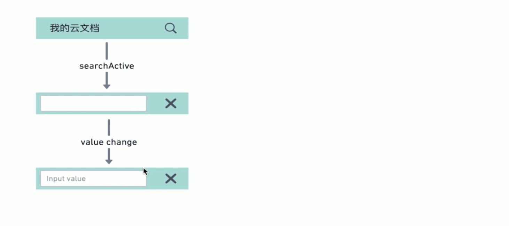
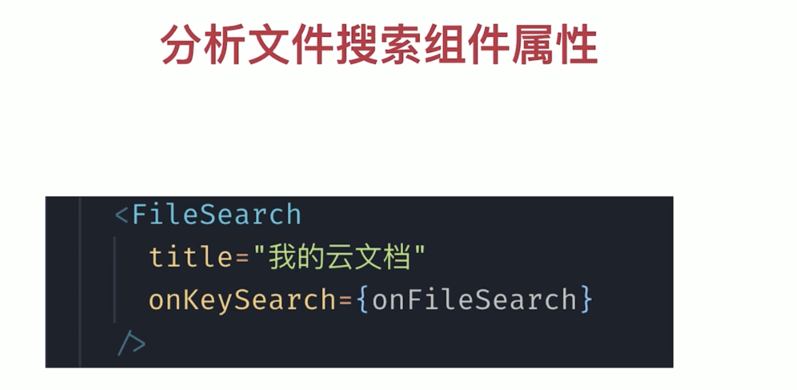
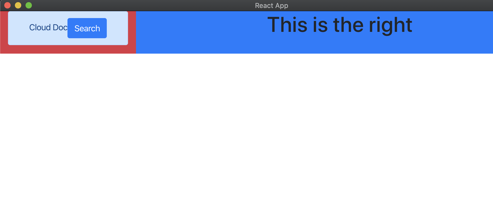
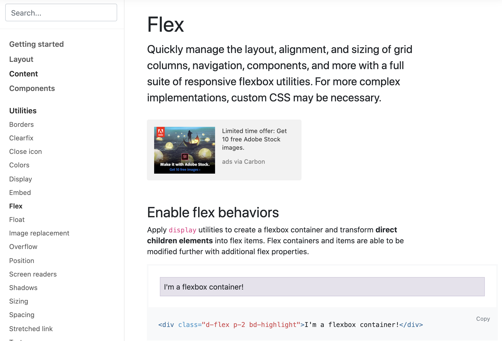
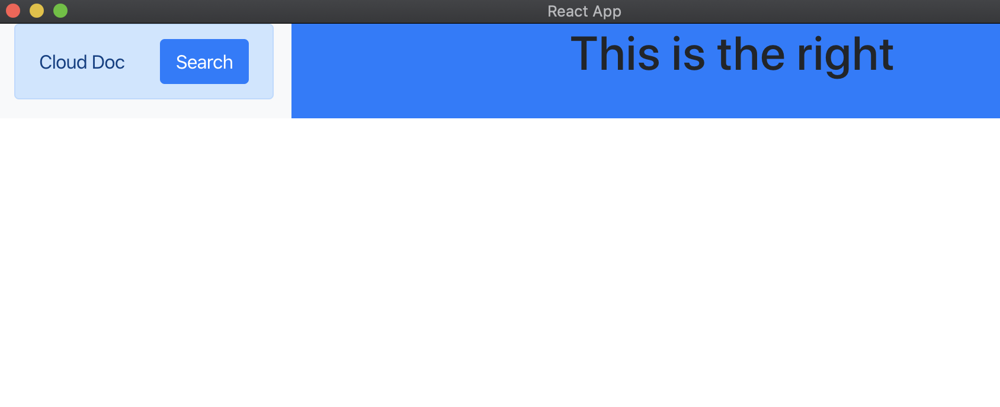
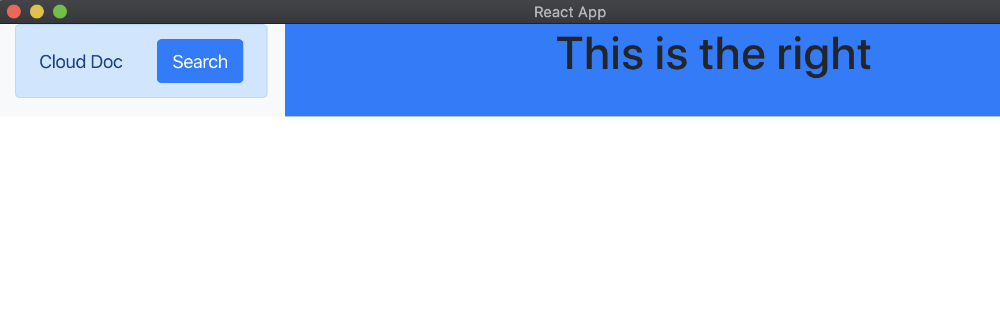
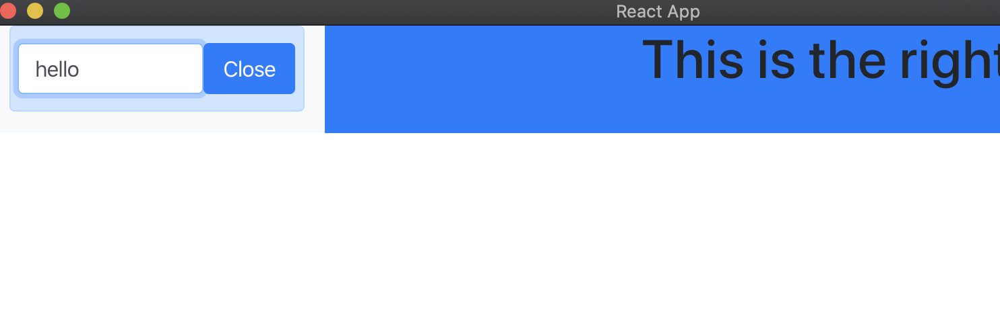

# FileSearch Component 1




- create `src/componets/FileSearch.js`

- FileSearch.js

```js
import React, { useState } from 'react';

const FileSearch = ({ title, onFileSearch }) => {
    const [inputActive, setInputActive] = useState(false);
    const [value, setValue] = useState('');
    return (
        <div className="alert alert-primary">
            {!inputActive &&
                <div>
                    <span>{title}</span>
                    <button
                        type="button"
                        className="btn btn-primary"
                    >
                        Search
                </button>
                </div>
            }
        </div>
    );
}

export default FileSearch;
```

- update App.js

```js
import React from 'react';
import './App.css';
import 'bootstrap/dist/css/bootstrap.min.css'
import FileSearch from './components/FileSearch';

function App() {
  return (
    <div className="App container-fluid">
      <div className="row">
        <div className="col-3 bg-danger left-panel">
          <FileSearch
            title='Cloud Doc'
            onFileSearch={() => { }}
          />
        </div>
        <div className="col-9 bg-primary right-panel">
          <h1>This is the right</h1>
        </div>
      </div>
    </div>
  );
}
export default App;
```



- top left corner has problem

- w3c provide a new kind of layout —— Flex



- update FileSearch

```js
import React, { useState } from 'react';

const FileSearch = ({ title, onFileSearch }) => {
    const [inputActive, setInputActive] = useState(false);
    const [value, setValue] = useState('');
    return (
        <div className="alert alert-primary">
            {!inputActive &&
                <div className="d-flex justify-content-between align-items-center">
                    <span>{title}</span>
                    <button
                        type="button"
                        className="btn btn-primary"
                    >
                        Search
                </button>
                </div>
            }
        </div>
    );
}

export default FileSearch;
```




- update FileSearch

```js
import React, { useState } from 'react';

const FileSearch = ({ title, onFileSearch }) => {
    const [inputActive, setInputActive] = useState(false);
    const [value, setValue] = useState('');
    return (
        <div className="alert alert-primary">
            {!inputActive &&
                <div className="d-flex justify-content-between align-items-center">
                    <span>{title}</span>
                    <button
                        type="button"
                        className="btn btn-primary"
                        onClick={() => { setInputActive(true) }}
                    >
                        Search
                    </button>
                </div>
            }
            {inputActive &&
                <div className="row">
                    <input
                        className="form-control col-8"
                        value={value}
                        onChange={(e) => { setValue(e.target.value) }}
                    />
                    <button
                        type="button"
                        className="btn btn-primary col-4"
                        onClick={() => { setInputActive(false) }}
                    >
                        Close
                    </button>
                </div>

            }
        </div>
    );
}

export default FileSearch;
```

- let's testing 






