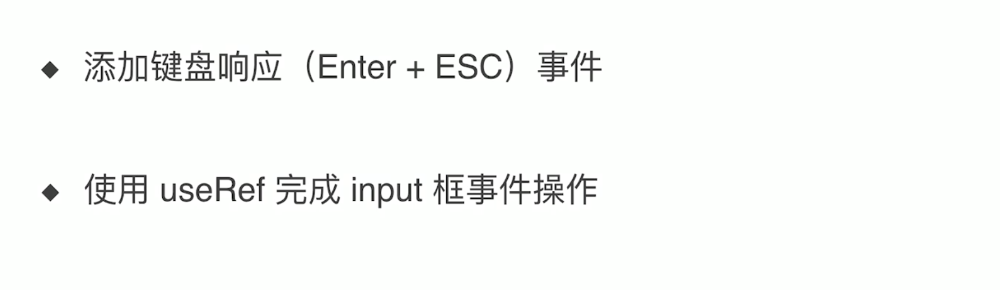
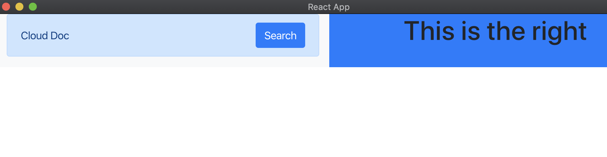
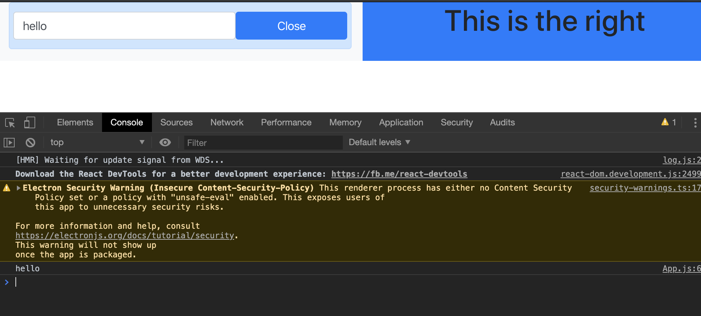
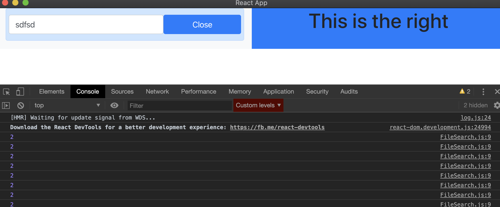
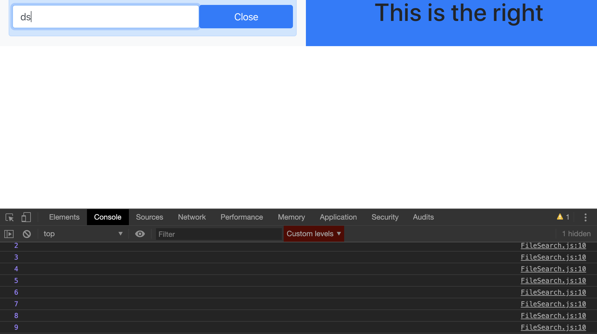
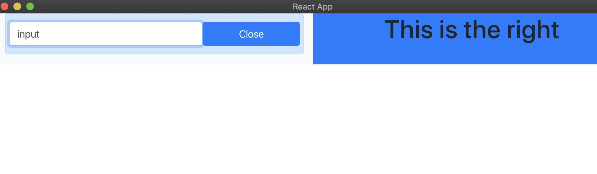

# FileSearch Component 2



- 暂时改变布局，以后再改回来，方便测试

- update App.js

```js
// FileSearch Component 2
import React from 'react';
import './App.css';
import 'bootstrap/dist/css/bootstrap.min.css'
import FileSearch from './components/FileSearch';

function App() {
  return (
    <div className="App container-fluid">
      <div className="row">
        <div className="col bg-light left-panel">
          <FileSearch
            title='Cloud Doc'
            onFileSearch={() => { }}
          />
        </div>
        <div className="col bg-primary right-panel">
          <h1>This is the right</h1>
        </div>
      </div>
    </div>
  );
}

export default App;

```




- update FileSearch

```js
import React, { useState, useEffect } from 'react';

const FileSearch = ({ title, onFileSearch }) => {
    const [inputActive, setInputActive] = useState(false);
    const [value, setValue] = useState('');

    const closeSearch = (e) => {
        e.preventDefault();
        setInputActive(false);
        setValue('')
    }
    useEffect(() => {
        const handleInputEvent = (event) => {
            const { keyCode } = event;
            if (keyCode === 13 && inputActive) {
                onFileSearch(value);
            } else if (keyCode === 27 && inputActive) {
                closeSearch(event);
            }
        }
        document.addEventListener('keyup', handleInputEvent);
        return () => {
            document.removeEventListener('keyup', handleInputEvent);
        }
    })
    return (
        <div className="alert alert-primary">
            {!inputActive &&
                <div className="d-flex justify-content-between align-items-center">
                    <span>{title}</span>
                    <button
                        type="button"
                        className="btn btn-primary"
                        onClick={() => { setInputActive(true) }}
                    >
                        Search
                    </button>
                </div>
            }
            {inputActive &&
                <div className="row">
                    <input
                        className="form-control col-8"
                        value={value}
                        onChange={(e) => { setValue(e.target.value) }}
                    />
                    <button
                        type="button"
                        className="btn btn-primary col-4"
                        onClick={closeSearch}
                    >
                        Close
                    </button>
                </div>

            }
        </div>
    );
}

export default FileSearch;
```


- update App

```js
// FileSearch Component 2
import React from 'react';
import './App.css';
import 'bootstrap/dist/css/bootstrap.min.css'
import FileSearch from './components/FileSearch';

function App() {
  return (
    <div className="App container-fluid">
      <div className="row">
        <div className="col bg-light left-panel">
          <FileSearch
            title='Cloud Doc'
            onFileSearch={(value) => { console.log(value) }}
          />
        </div>
        <div className="col bg-primary right-panel">
          <h1>This is the right</h1>
        </div>
      </div>
    </div>
  );
}

export default App;
```



- input `hello`, and enter `enter` key, calling `console.log()`

---

### introduction `useRef` function

- let's look at an example:

```js
import React, { useState, useEffect, useRef } from 'react';

const FileSearch = ({ title, onFileSearch }) => {
    const [inputActive, setInputActive] = useState(false);
    const [value, setValue] = useState('');

    let number = 1;
    number++;
    console.log(number);
```

- so everytime, number initiate to be 1, and 1++ = 2



- but, `useRef` can remember this number's value

- update App.js

```js
import React, { useState, useEffect, useRef } from 'react';

const FileSearch = ({ title, onFileSearch }) => {
    const [inputActive, setInputActive] = useState(false);
    const [value, setValue] = useState('');

    let number = useRef(1);  //useRef(1) => return an object, now number is an object
    // 1 is stored in number.current
    number.current++;
    console.log(number.current);
    const closeSearch = (e) => {
        e.preventDefault();
        setInputActive(false);
        setValue('')
    }
```



- update FileSearch

```js
import React, { useState, useEffect, useRef } from 'react';

const FileSearch = ({ title, onFileSearch }) => {
    const [inputActive, setInputActive] = useState(false);
    const [value, setValue] = useState('');

    // let number = useRef(1);  //useRef(1) => return an object, now number is an object
    // // 1 is stored in number.current
    // number.current++;
    // console.log(number.current);

    let node = useRef(null); //get the node.current

    const closeSearch = (e) => {
        e.preventDefault();
        setInputActive(false);
        setValue('')
    }
    useEffect(() => {
        const handleInputEvent = (event) => {
            const { keyCode } = event;
            if (keyCode === 13 && inputActive) {
                onFileSearch(value);
            } else if (keyCode === 27 && inputActive) {
                closeSearch(event);
            }
        }
        document.addEventListener('keyup', handleInputEvent);
        return () => {
            document.removeEventListener('keyup', handleInputEvent);
        }
    })
    useEffect(() => {
        if (inputActive) {
            node.current.focus(); //高亮; 输入以后，高亮
        }
    }, [inputActive])

    return (
        <div className="alert alert-primary">
            {!inputActive &&
                <div className="d-flex justify-content-between align-items-center">
                    <span>{title}</span>
                    <button
                        type="button"
                        className="btn btn-primary"
                        onClick={() => { setInputActive(true) }}
                    >
                        Search
                    </button>
                </div>
            }
            {inputActive &&
                <div className="row">
                    <input
                        className="form-control col-8"
                        value={value}
                        ref={node}//get the node.current
                        onChange={(e) => { setValue(e.target.value) }}
                    />
                    <button
                        type="button"
                        className="btn btn-primary col-4"
                        onClick={closeSearch}
                    >
                        Close
                    </button>
                </div>

            }
        </div>
    );
}

export default FileSearch;
```



- 当输入时候，可以看到高亮

