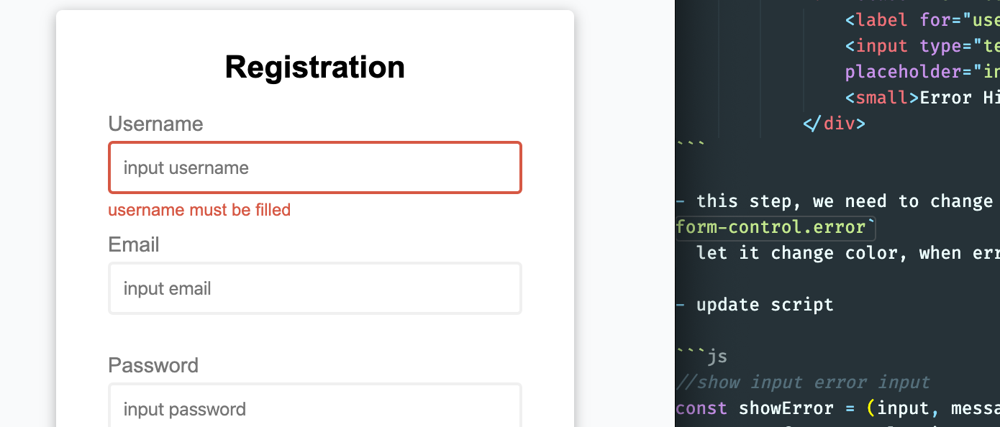
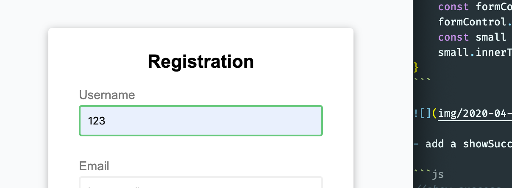
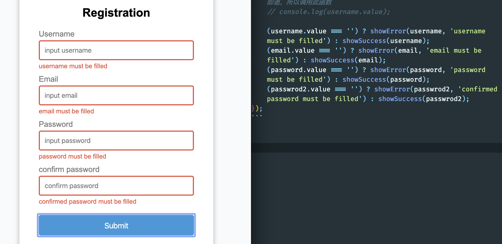
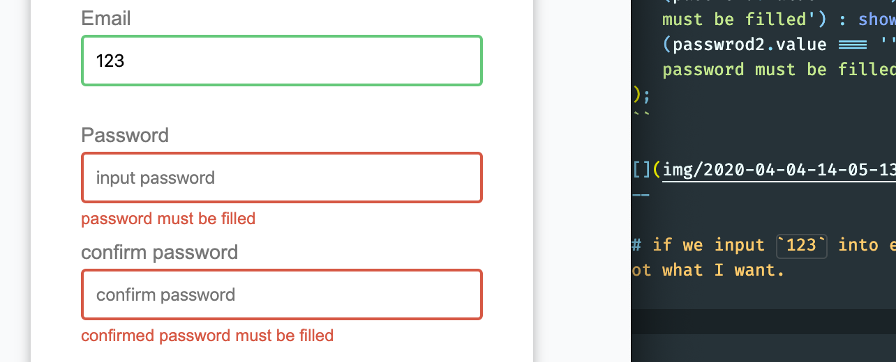
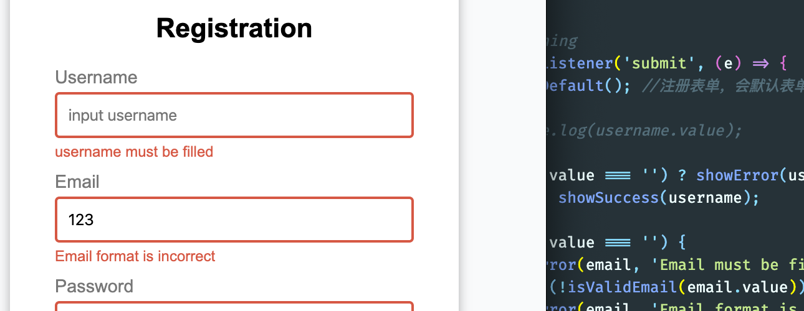
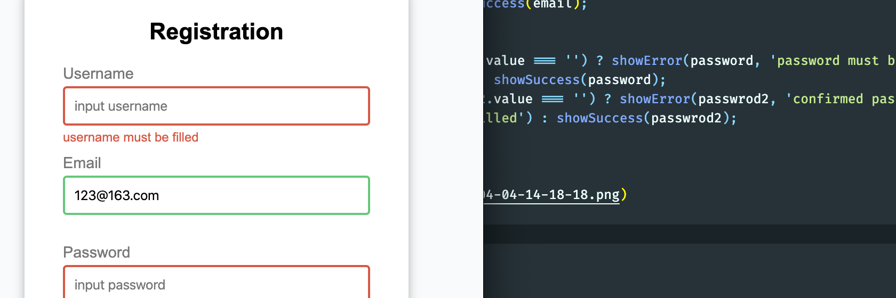

# 2. Form Authentication

- script.js

```js
//get element
const form = document.getElementById('form');
const username = document.getElementById('username');
const email = document.getElementById('email');
const password = document.getElementById('password');
const passwrod2 = document.getElementById('password2');

//show input error input

//event listening
form.addEventListener('submit', (e) => {
    e.preventDefault(); //注册表单，会默认表单事件，console.log 转瞬即逝，所以调用此函数
    // console.log(username.value);
    (username.value === '') ? showError(username, 'username must be filled') : showSuccess(username);
})
```

- we have set css style

```css
  .form-control.success input {
    border-color: var(--success-color);
  }
  
  .form-control.error input {
    border-color: var(--error-color);
  }

  .form-control.error small {
    visibility: visible;
  }
```

- and, look at the html tag

```html
            <div class="form-control">
                <label for="username">Username</label>
                <input type="text" id="username" placeholder="input username">
                <small>Error Hint</small>
            </div>
```

- this step, we need to change form-contorl's class name to `.form-control.error`
  let it change color, when error occurs

- update script

```js
//show input error input
const showError = (input, message) => {
    const formControl = input.parentElement;
    formControl.className = 'form-control error';
    const small = formControl.querySelector('small');
    small.innerText = message;
}
```



- add a showSuccess

```js
//show success
const showSuccess = (input, message) => {
    const formControl = input.parentElement;
    formControl.className = 'form-control success';
}
```



- update script.js

```js
//get element
const form = document.getElementById('form');
const username = document.getElementById('username');
const email = document.getElementById('email');
const password = document.getElementById('password');
const passwrod2 = document.getElementById('password2');

//show input error input
const showError = (input, message) => {
    const formControl = input.parentElement;
    formControl.className = 'form-control error';
    const small = formControl.querySelector('small');
    small.innerText = message;
}

//show success
const showSuccess = (input) => {
    const formControl = input.parentElement;
    formControl.className = 'form-control success';
}


//event listening
form.addEventListener('submit', (e) => {
    e.preventDefault(); //注册表单，会默认表单事件，console.log 转瞬即逝，所以调用此函数
    // console.log(username.value);

    (username.value === '') ? showError(username, 'username must be filled') : showSuccess(username);
    (email.value === '') ? showError(email, 'email must be filled') : showSuccess(email);
    (password.value === '') ? showError(password, 'password must be filled') : showSuccess(password);
    (passwrod2.value === '') ? showError(passwrod2, 'confirmed password must be filled') : showSuccess(passwrod2);
});
```


---

#### if we input `123` into email box, it can pass, but this is not what I want.



## Regular expression

- update script

```js
//get element
const form = document.getElementById('form');
const username = document.getElementById('username');
const email = document.getElementById('email');
const password = document.getElementById('password');
const passwrod2 = document.getElementById('password2');

//show input error input
const showError = (input, message) => {
    const formControl = input.parentElement;
    formControl.className = 'form-control error';
    const small = formControl.querySelector('small');
    small.innerText = message;
}

//show success
const showSuccess = (input) => {
    const formControl = input.parentElement;
    formControl.className = 'form-control success';
}

//check email if it is valid
const isValidEmail = (email) => {
    const result = /^([A-Za-z0-9_\-\.])+\@([A-Za-z0-9_\-\.])+\.([A-Za-z]{2,4})$/;
    //这是一个邮箱的regular expression
    return result.test(String(email));
}

//event listening
form.addEventListener('submit', (e) => {
    e.preventDefault(); //注册表单，会默认表单事件，console.log 转瞬即逝，所以调用此函数
    // console.log(username.value);

    (username.value === '') ? showError(username, 'username must be filled') : showSuccess(username);

    if (email.value === '') {
        showError(email, 'Email must be filled');
    } else if (!isValidEmail(email.value)) {
        showError(email, 'Email format is incorrect')
    } else {
        showSuccess(email);
    }

    (password.value === '') ? showError(password, 'password must be filled') : showSuccess(password);
    (passwrod2.value === '') ? showError(passwrod2, 'confirmed password must be filled') : showSuccess(passwrod2);
});
```





