# Dice Game

### download the .html .css from Jonas Schmedtmann (UDEMY)

---

# This project only focus on javaScript, I rewrite .js by different functioning.

- adding a event listener to bind with button 2

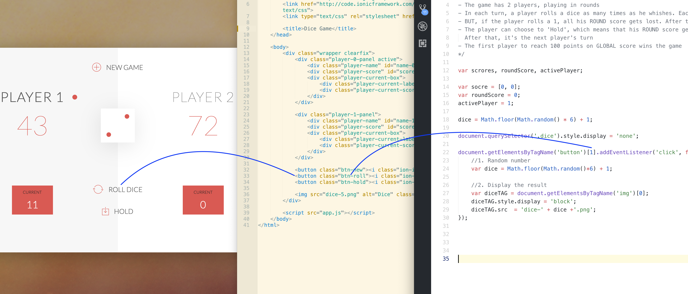;

- get the img tag; altering its img by random number:

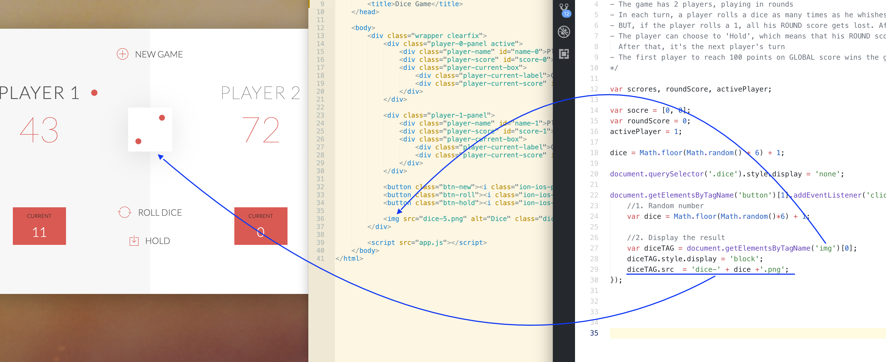;

- init all values to be 0

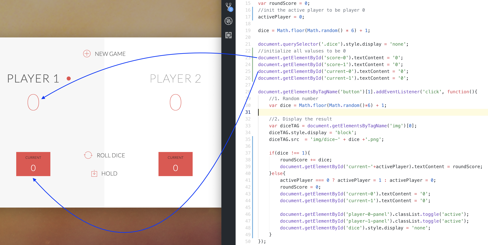;

---
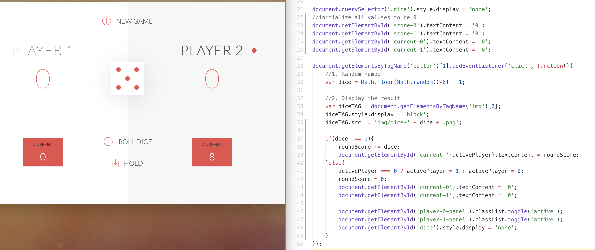;

- if dice > 1, that means dice !== 1; switch the player

```js
 activePlayer === 0 ? activePlayer = 1 : activePlayer = 0;
```

- this statement can change the player 0 to 1 or 1 to 0

- then, calling the classList.toggle() 

- toggle() method: remove and add

- the above codes are calling .getElementById()

# implement button 'btn-hold'

- add a 'hold' event

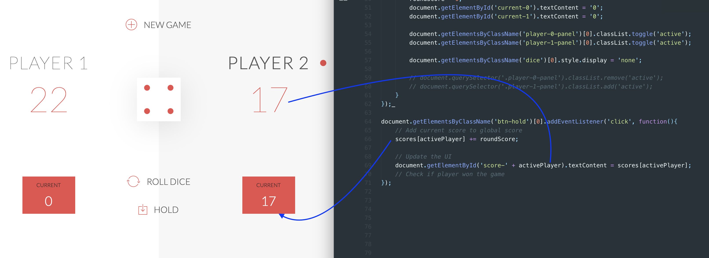

- now add this piece of codes

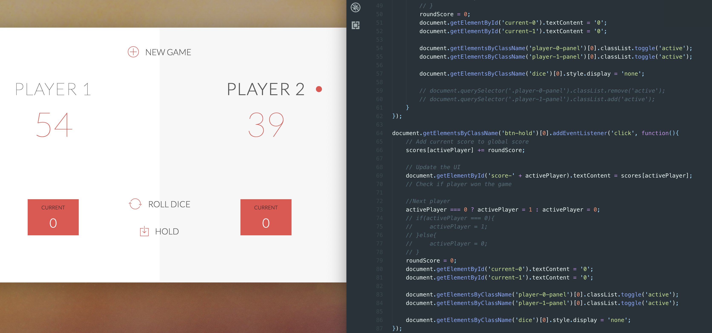

- but the problem is that we should try to not repeat

- Therefore, encapsulating this piece of codes:

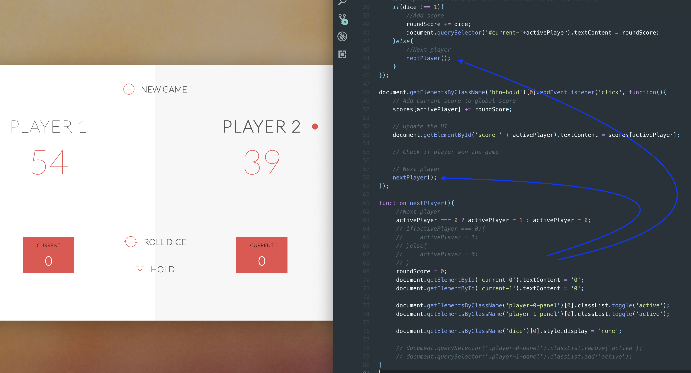

- if the player get >= 20 points, who will be the winner:

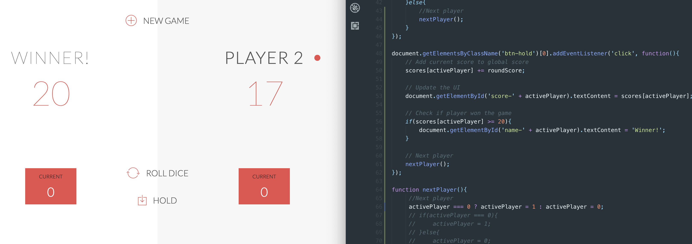

---
# Now let us implement btn-new event

- but, we firstly adding a initialize function:

```javascript
function init(){
    scores = [0, 0];
    activePlayer = 0;
    roundScore = 0;
    gamePlaying = true;

    document.querySelector('.dice').style.display = 'none';

    document.getElementById('score-0').textContent = '0';
    document.getElementById('score-1').textContent = '0';
    document.getElementById('current-0').textContent = '0';
    document.getElementById('current-1').textContent = '0';
    document.getElementById('name-0').textContent = 'Player 1';
    document.getElementById('name-1').textContent = 'Player 2';
    document.getElementsByClassName('player-0-panel')[0].classList.remove('winner');
    document.getElementsByClassName('player-1-panel')[0].classList.remove('winner');
    document.getElementsByClassName('player-0-panel')[0].classList.remove('active');
    document.getElementsByClassName('player-1-panel')[0].classList.remove('active');
    document.getElementsByClassName('player-0-panel')[0].classList.add('active');
}

// we also adding a button event:
document.getElementsByClassName('btn-new')[0].addEventListener('click', init);
```

- then, if a player won the game, we should change the player's name

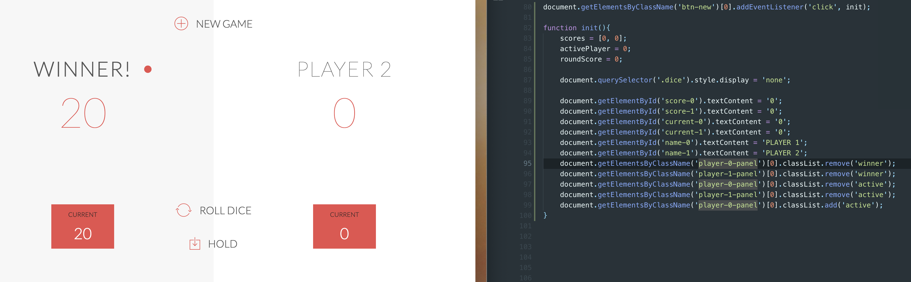
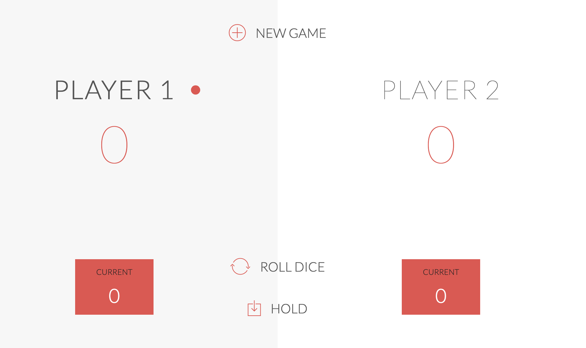


# Finally, let us solve the weird parts:

- Sine one player won the game, the game still continues

- adding some codes

- add gamePlaying = false

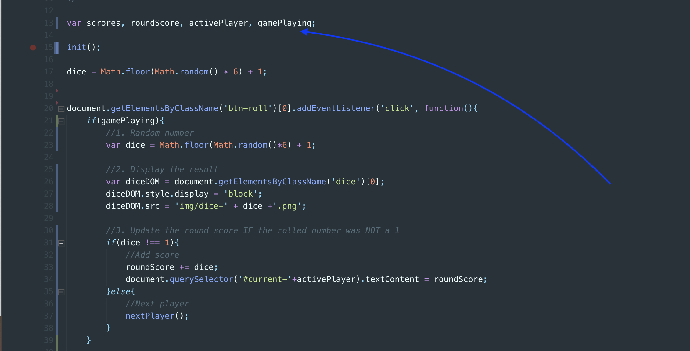

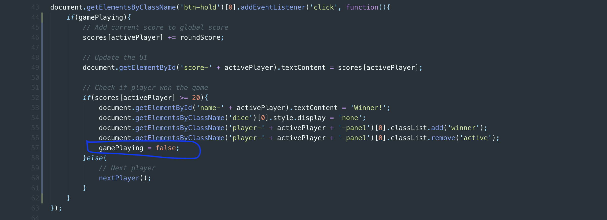

- then, click ROLL DICE button, which doesn't work

- Button HOLD doesn't work too

- click NEW GAME, the active return to the PLAYER 1

- Done!

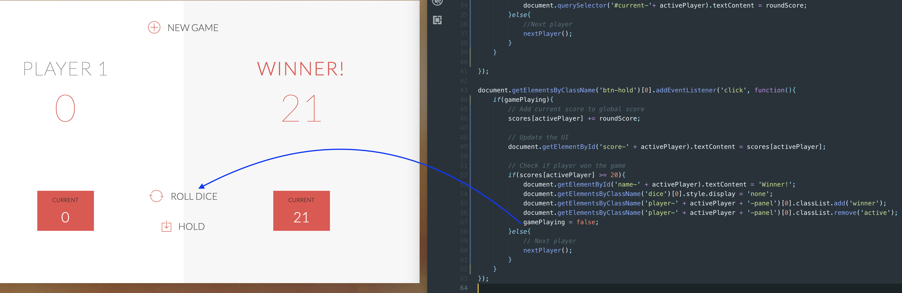
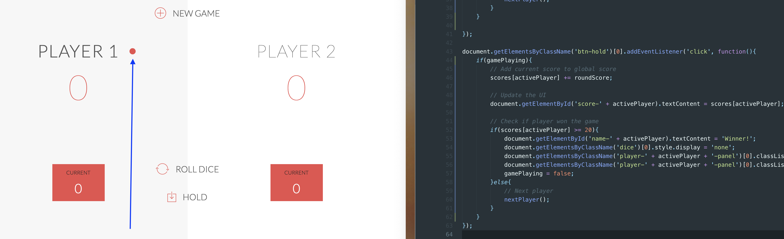


