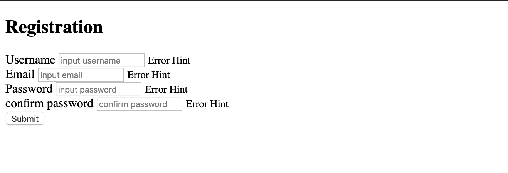
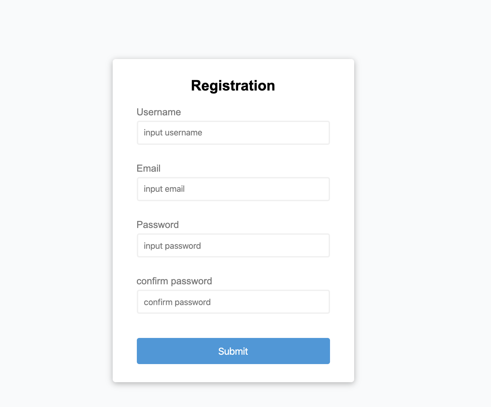

# 1. index.htm & css style

# Form Validator

- create index.html

```html
<!DOCTYPE html>
<html lang="en">
<head>
    <meta charset="UTF-8">
    <meta name="viewport" content="width=device-width, initial-scale=1.0">
    <link rel="stylesheet" href="style.css">
    <title>Form Validator</title>
</head>
<body>
    <div class="container">
        <form id="form" class="form">
            <h2>Registration</h2>
            <div class="form-control">
                <label for="username">Username</label>
                <input type="text" id="username" placeholder="input username">
                <small>Error Hint</small>
            </div>
            <div class="form-control">
                <label for="email">Email</label>
                <input type="text" id="email" placeholder="input email">
                <small>Error Hint</small>
            </div>
            <div class="form-control">
                <label for="password">Password</label>
                <input type="password" id="password" placeholder="input password">
                <small>Error Hint</small>
            </div>
            <div class="form-control">
                <label for="password2">confirm password</label>
                <input type="password" id="password2" placeholder="confirm password">
                <small>Error Hint</small>
            </div>
            <button>Submit</button>
        </form>
    </div>
    <script src="script.js"></script>
</body>
</html>

```




## CSS style

```css
:root {
    --success-color: #2ecc71;
    --error-color: #e74c3c;
  }
  
  * {
    margin: 0;
    padding: 0;
    box-sizing: border-box;
  }
  
  body {
    background-color: #f9fafb;
    font-family: Arial, Helvetica, sans-serif;
    display: flex;
    align-items: center;
    justify-content: center;
    min-height: 100vh;
  }
  
  .container {
    background-color: #fff;
    border-radius: 5px;
    box-shadow: 0 2px 10px rgba(0, 0, 0, 0.3);
    width: 400px;
  }
  
  h2 {
    text-align: center;
    margin: 0 0 20px;
  }
  
  .form {
    padding: 30px 40px;
  }
  
  .form-control {
    margin-bottom: 10px;
    padding-bottom: 20px;
    position: relative;
  }
  
  .form-control label {
    color: #777;
    display: block;
    margin-bottom: 5px;
  }
  
  .form-control input {
    width: 100%;
    border: 2px solid #f0f0f0;
    border-radius: 4px;
    display: block;
    padding: 10px;
    font-size: 14px;
  }
  
  .form-control input:focus {
    border-color: #777;
    outline: 0;
  }
  
  .form-control.success input {
    border-color: var(--success-color);
  }
  
  .form-control.error input {
    border-color: var(--error-color);
  }
  
  .form-control small {
    color: var(--error-color);
    position: absolute;
    bottom: 0;
    left: 0;
    visibility: hidden;
  }
  
  .form-control.error small {
    visibility: visible;
  }
  
  .form button {
    cursor: pointer;
    background-color: #3498db;
    border: 2px solid #3498db;
    border-radius: 4px;
    color: #fff;
    display: block;
    font-size: 16px;
    padding: 10px;
    margin-top: 20px;
    width: 100%;
  }
  
```



