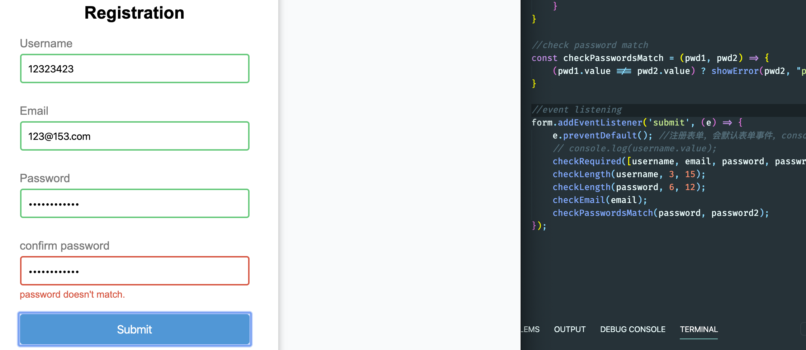

# 4. length email password verification

- code refactoring

### length email password verification

```js
//length email password verification

//get element
const form = document.getElementById('form');
const username = document.getElementById('username');
const email = document.getElementById('email');
const password = document.getElementById('password');
const passwrod2 = document.getElementById('password2');

//show input error input
const showError = (input, message) => {
    const formControl = input.parentElement;
    formControl.className = 'form-control error';
    const small = formControl.querySelector('small');
    small.innerText = message;
}

//show success
const showSuccess = (input) => {
    const formControl = input.parentElement;
    formControl.className = 'form-control success';
}

//check email if it is valid
const checkEmail = (input) => {
    const reg = /^([A-Za-z0-9_\-\.])+\@([A-Za-z0-9_\-\.])+\.([A-Za-z]{2,4})$/;
    reg.test(input.value.trim()) ? showSuccess(input) : showError(input, "email format is incorrect!");
}

//check Required input
const checkRequired = (inputArrary) => {
    inputArrary.forEach((input) => {
        // console.log(input.value);
        (input.value.trim() === '') ? showError(input, `${getKeyWords(input)} must be filled`) : showSuccess(input);
    });
}

//get keyWords
const getKeyWords = (input) => {
    return input.placeholder.slice(6); //skip first 6 chars 
}

//checkLength
const checkLength = (input, min, max) => {
    if (input.value.length < min) {
        showError(input, `${getKeyWords(input)} at least ${min} length of characters`);
    } else if (input.value.length > max) {
        showError(input, `${getKeyWords(input)} no more than ${max} length of characters`);
    } else {
        showSuccess(input);
    }
}

//check password match
const checkPasswordsMatch = (pwd1, pwd2) => {
    (pwd1.value !== pwd2.value) ? showError(pwd2, "password doesn't match.") : "";
}

//event listening
form.addEventListener('submit', (e) => {
    e.preventDefault(); //注册表单，会默认表单事件，console.log 转瞬即逝，所以调用此函数
    // console.log(username.value);
    checkRequired([username, email, password, passwrod2]);
    checkLength(username, 3, 15);
    checkLength(password, 6, 12);
    checkEmail(email);
    checkPasswordsMatch(password, password2);
});
```

