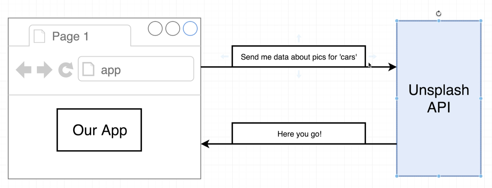
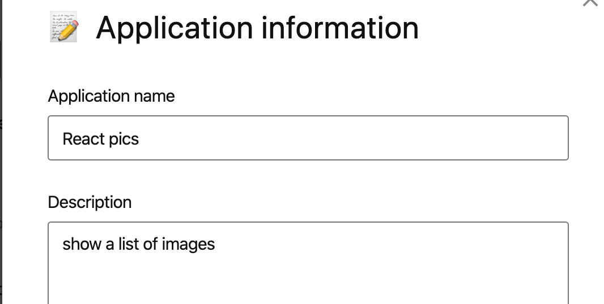
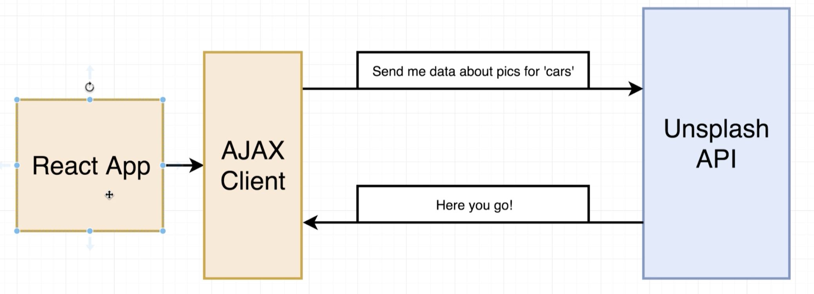
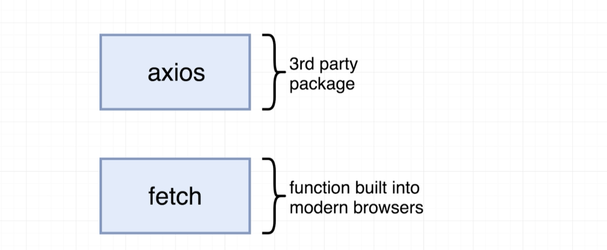
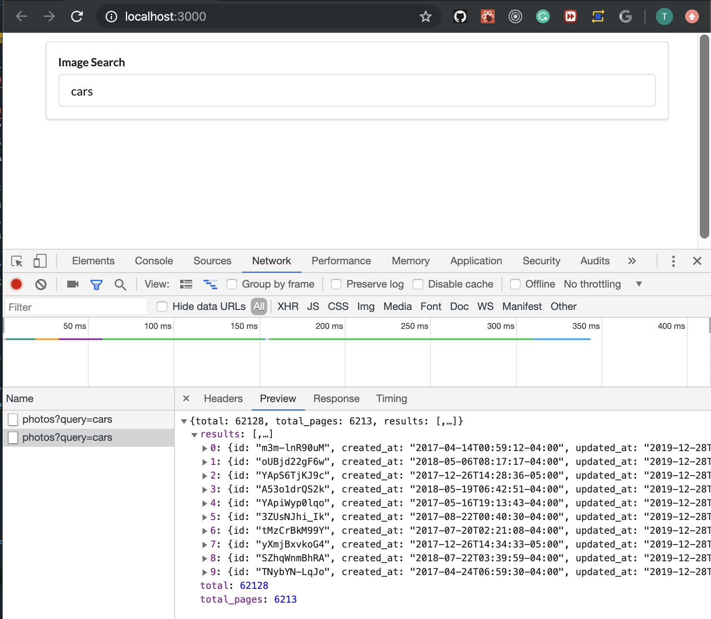
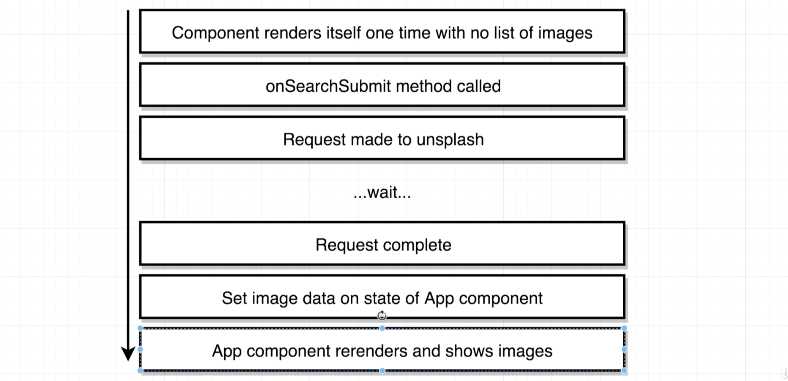
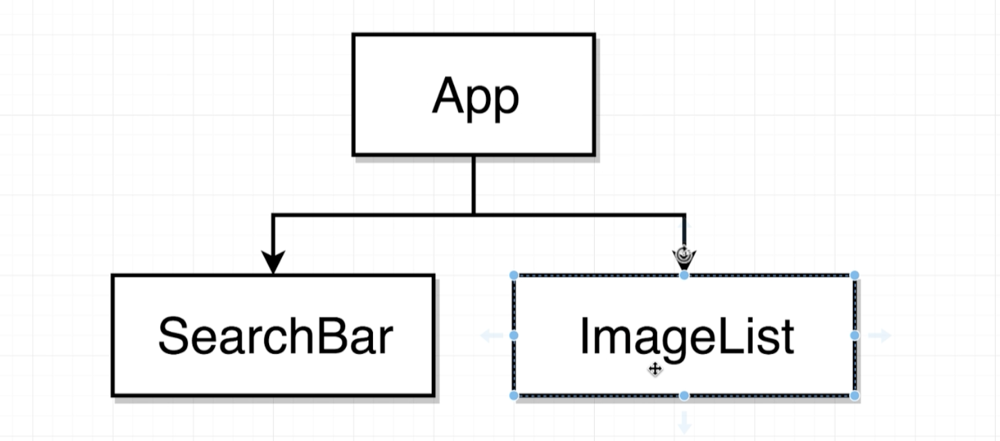
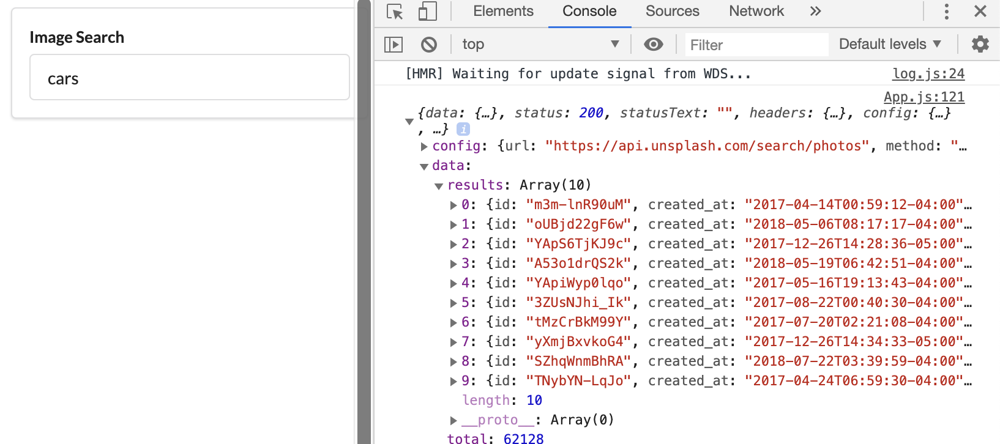
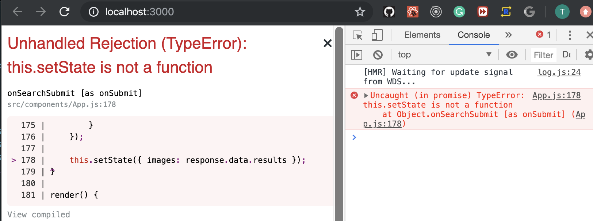

# 8. Making_API_Requests With React

## Fetching Data



- `https://unsplash.com/developers` api

- click `Register as a developer`


- click `your apps`

- `new application`


---

## Axios vs Fetch




- for axios is third party API, so we need to install

- the other option is the `fetch` function, which is a singular function that is build into almost all modern browsers.
 
- install axios

- `npm install --save axios`

---


### Viewing Request Results

- how to use API

- click `Documentaion`

- on the left navigation bar,


- `Schema`-> `location`

- The API is available at `https://api.unsplash.com/`. Responses are sent as JSON.
 
- update App.js in `pics` project

```js
//Axios vs Fetch, Viewing Request Results
import React from 'react';
import axios from 'axios';
import SearchBar from './SearchBar';
class App extends React.Component {
    onSearchSubmit(term) {
        axios.get('https://api.unsplash.com/search/photos', {

        });
    }

    render() {
        return (
            <div className="ui container" style={{ marginTop: '10px' }}>
                <SearchBar
                    onSubmit={this.onSearchSubmit}
                />
            </div >
        );
    }
};
export default App;
```

- we have to actually identify ourselves and who is trying to access the Sunsplash API.

- the instruction: `https://unsplash.com/documentation#authorization`


- put our ACCESS_KEY into APP.js, go back to `Your apps` to find our key


- copy our `Access Key`

- go to `Search`-> `Search photos`

- update App.js

```js
//Axios vs Fetch, Viewing Request Results
import React from 'react';
import axios from 'axios';
import SearchBar from './SearchBar';
class App extends React.Component {
    onSearchSubmit(term) {
        axios.get('https://api.unsplash.com/search/photos', {
            params: { query: term },
            headers: {
                Authorization: 'Client-ID 06162288b9848c9af42616ef69fd67b3c13761510fc01192ffa9aaabef240ffb'
            }
        });
    }
    render() {
        return (
            <div className="ui container" style={{ marginTop: '10px' }}>
                <SearchBar
                    onSubmit={this.onSearchSubmit}
                />
            </div >
        );
    }
};
export default App;
```


- input `cars`

- we get those pthotos

---

## Handling Request with Async Await




- in the original plan we put together we had said that we would make a new component called `imageList`

- App.js

```js
class App extends React.Component {
    onSearchSubmit(term) {
        axios.get('https://api.unsplash.com/search/photos', {
            params: { query: term },
            headers: {
                Authorization: 'Client-ID 06162288b9848c9af42616ef69fd67b3c13761510fc01192ffa9aaabef240ffb'
            }
        }).then((response) => {
            console.log(response);
        });
    }

    render() {
        return (
            <div className="ui container" style={{ marginTop: '10px' }}>
                <SearchBar
                    onSubmit={this.onSearchSubmit}
                />
            </div >
        );
    }
};
```



- update

```js
    onSearchSubmit(term) {
        axios.get('https://api.unsplash.com/search/photos', {
            params: { query: term },
            headers: {
                Authorization: 'Client-ID 06162288b9848c9af42616ef69fd67b3c13761510fc01192ffa9aaabef240ffb'
            }
        }).then((response) => {
            console.log(response.data.results);
        });
    }
```


- this is first method to use, return a promise that is object, and call .then() method

- 2nd method, by using Async Await

- App.js

```js
class App extends React.Component {
    async onSearchSubmit(term) {
        const response = await axios.get('https://api.unsplash.com/search/photos', {
            params: { query: term },
            headers: {
                Authorization: 'Client-ID 06162288b9848c9af42616ef69fd67b3c13761510fc01192ffa9aaabef240ffb'
            }
        });
        console.log(response.data.results);
    }
    render() {
        return (
            <div className="ui container" style={{ marginTop: '10px' }}>
                <SearchBar
                    onSubmit={this.onSearchSubmit}
                />
            </div >
        );
    }
};
```

- same results

---

## Setting State After Async Requests

- SearchBar.js

```js
//2nd way to solve `this`, by using arrow function
import React from 'react';

class SearchBar extends React.Component {
    state = { term: '' };

    onFormSubmit = (event) => {
        event.preventDefault();
        this.props.onSubmit(this.state.term);
    }
    render() {
        return (
            <div className="ui segment">
                <form onSubmit={this.onFormSubmit} className="ui form">
                    <div className="field">
                        <label>Image Search</label>
                        <input type="text"
                            value={this.state.term}
                            onChange={(e) => this.setState({ term: e.target.value })}
                        />
                    </div>
                </form>
            </div>
        );
    }

}
export default SearchBar;
```

- App.js

```js
import React from 'react';
import axios from 'axios';
import SearchBar from './SearchBar';
class App extends React.Component {
    state = { images: [] }

    async onSearchSubmit(term) {
        const response = await axios.get('https://api.unsplash.com/search/photos', {
            params: { query: term },
            headers: {
                Authorization: 'Client-ID 06162288b9848c9af42616ef69fd67b3c13761510fc01192ffa9aaabef240ffb'
            }
        });

        this.setState({ images: response.data.results });
    }

    render() {
        return (
            <div className="ui container" style={{ marginTop: '10px' }}>
                <SearchBar onSubmit={this.onSearchSubmit} />
                Found: {this.state.images.length} images;
            </div >
        );
    }
};
export default App;
```



- here is error

---


## Binding Callbacks

- update App.js

```js
//Binding Callbacks
import React from 'react';
import axios from 'axios';
import SearchBar from './SearchBar';
class App extends React.Component {
    state = { images: [] }

    onSearchSubmit = async (term) => {
        const response = await axios.get('https://api.unsplash.com/search/photos', {
            params: { query: term },
            headers: {
                Authorization: 'Client-ID 06162288b9848c9af42616ef69fd67b3c13761510fc01192ffa9aaabef240ffb'
            }
        });

        this.setState({ images: response.data.results });
    }

    render() {
        return (
            <div className="ui container" style={{ marginTop: '10px' }}>
                <SearchBar onSubmit={this.onSearchSubmit} />
                Found: {this.state.images.length} images;
            </div >
        );
    }
};
export default App;
```


---

## Creating Custom Clients

- create a new floder api/unpslash.js


- update App.js

```js
//Creating Custom Clients
import React from 'react';
import unsplash from '../api/unpslash';
import SearchBar from './SearchBar';
class App extends React.Component {
    state = { images: [] }

    onSearchSubmit = async (term) => {
        const response = await unsplash.get('search/photos', {
            params: { query: term }
        });

        this.setState({ images: response.data.results });
    }

    render() {
        return (
            <div className="ui container" style={{ marginTop: '10px' }}>
                <SearchBar onSubmit={this.onSearchSubmit} />
                Found: {this.state.images.length} images;
            </div >
        );
    }
};
export default App;
```


