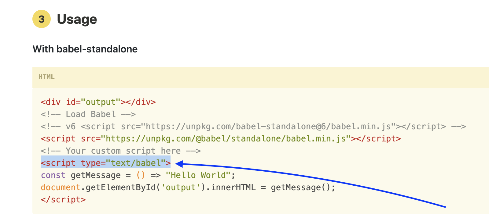
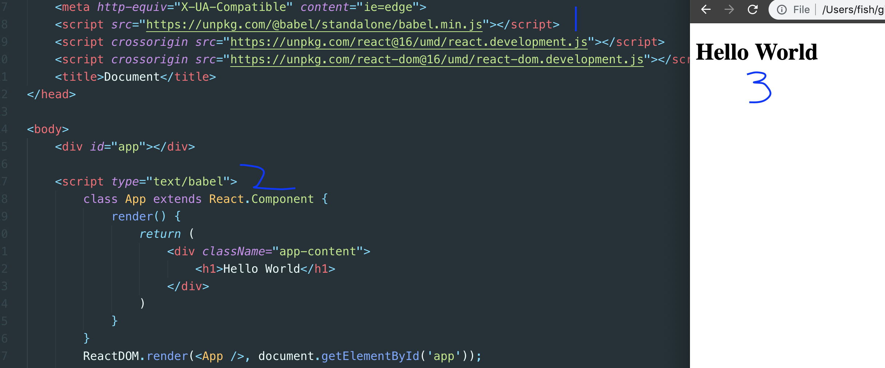
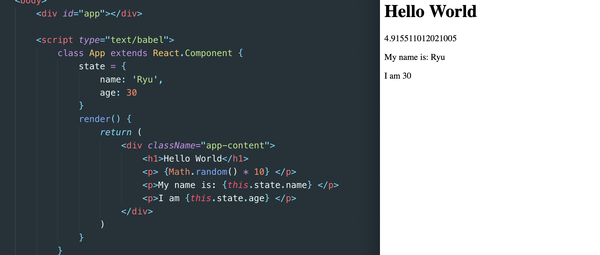
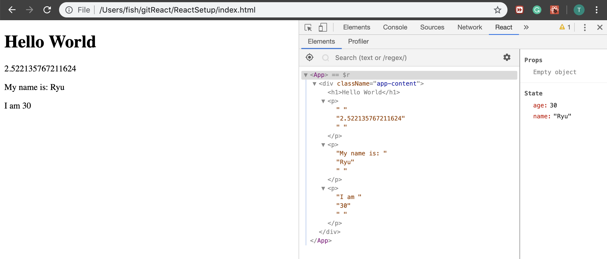

# 1. Setup

# cdn

- import react and reactDOM library

`on react official website for cdn`

```html
<head>
    <meta charset="UTF-8">
    <meta name="viewport" content="width=device-width, initial-scale=1.0">
    <meta http-equiv="X-UA-Compatible" content="ie=edge">
    <script crossorigin src="https://unpkg.com/react@16/umd/react.development.js"></script>
    <script crossorigin src="https://unpkg.com/react-dom@16/umd/react-dom.development.js"></script>
    <title>Document</title>
</head>
```

`updating html`

```html
<!DOCTYPE html>
<head>
    <meta charset="UTF-8">
    <meta name="viewport" content="width=device-width, initial-scale=1.0">
    <meta http-equiv="X-UA-Compatible" content="ie=edge">
    <script crossorigin src="https://unpkg.com/react@16/umd/react.development.js"></script>
    <script crossorigin src="https://unpkg.com/react-dom@16/umd/react-dom.development.js"></script>
    <title>Document</title>
</head>
<body>
    <div id="app"></div>
    <script>
        class App extends React.Component {
            render() {
                return (
                    <div className="app-content">
                        <h1>Hello World</h1>
                    </div>
                )
            }
        }
        ReactDOM.render(<App />, document.getElementById('app'));
    </script>
</body>
</html>
```

- but there is noting displaying on my page

- we should import babeljs library, babel.io

`Setup -> in the browser -> Usage`


`so babel is going to transpile our code ring here inot something that a browser does understand`

- bu we need one more thing




- done!



`we can insert dynamic data `

```js
    <script type="text/babel">
        class App extends React.Component {
            render() {
                return (
                    <div className="app-content">
                        <h1>Hello World</h1>
                        <p> {Math.random() * 10} </p>
                    </div>
                )
            }
        }
        ReactDOM.render(<App />, document.getElementById('app'));


    </script>
```


# Component State

- javaScript Object

- Describes the current state of the component

    - data, UI-state

- The state of a component can be updated over time

    - a model could close

    - the data we output could change

`Example:`

```js
items: [
    {name: 'navy jumper', price: 9.99},
    {name: 'ninja mask', price: 20.00},
    {name: 'black cloak', price: 15.00},

]
```

- Popup Component

```js
{
    showPopup: true
}

{
    showPopup: false
}
```

- adding a state




- adding a React Developer Tools




