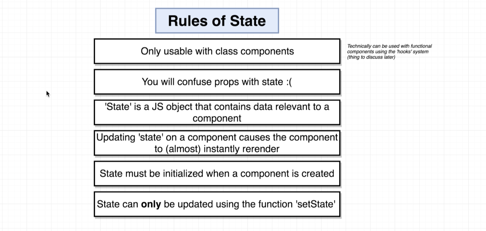

# 5. State in React Components


---

### by the way, we can pass this.props.value to self class

- update idnex.js

```js
import React from 'react';
import ReactDOM from 'react-dom';

class App extends React.Component {
    // constructor(props) {
    //     super(props)
    // }

    render() {
        window.navigator.geolocation.getCurrentPosition(
            (position) => console.log(position),
            (err) => console.log(err)
        );

        return <div>Latitude: {this.props.name} {this.props.str}</div>;
    }
}

ReactDOM.render(<div>
    <App name="hello" str="world"></App>


</div>, document.getElementById('root'));
```


---

## Initializing State Through Constructors

- update index.js

```js
//Initializing State Through Constructors
import React from 'react';
import ReactDOM from 'react-dom';

class App extends React.Component {
    constructor(props) {
        super(props);

        this.state = { lat: null };
    }
    render() {
        window.navigator.geolocation.getCurrentPosition(
            (position) => console.log(position),
            (err) => console.log(err)
        );

        return <div>Latitude: </div>;
    }
}

ReactDOM.render(<App />, document.getElementById('root'));

```

---

## Updating State Properties

- index.js

```js
//Initializing State Through Constructors
import React from 'react';
import ReactDOM from 'react-dom';

class App extends React.Component {
    constructor(props) {
        super(props);

        //THIS IS THE ONLY TIME we do direct assignment to this.state
        this.state = { lat: null };

        window.navigator.geolocation.getCurrentPosition(
            (position) => {
                //we called setState
                this.setState({ lat: position.coords.latitude });

                //we never do this:
                // this.state.lat = position.coords.latitude;
            },
            (err) => console.log(err)
        );
    }
    render() {

        return <div>Latitude: {this.state.lat}</div>;
    }
}

ReactDOM.render(<App />, document.getElementById('root'));
```


- we never do this:

- `this.state.lat = position.coords.latitude;`

---

## App Lifecycle Walkthrough

## Handling Errors Carefully

- index.js

```js
/Handling Errors Carefully
import React from 'react';
import ReactDOM from 'react-dom';

class App extends React.Component {
    constructor(props) {
        super(props);

        //THIS IS THE ONLY TIME we do direct assignment to this.state
        this.state = { lat: null };

        window.navigator.geolocation.getCurrentPosition(
            (position) => {
                //we called setState
                this.setState({ lat: position.coords.latitude });

                //we never do this:
                // this.state.lat = position.coords.latitude;
            },
            (err) => {
                this.setState({ errorMessage: err.message });
            }
        );
    };

    render() {

        return (
            <div>
                Latitude: {this.state.lat}
                <br />
                Error: {this.state.errorMessage}
            </div>
        );
    }
}

ReactDOM.render(<App />, document.getElementById('root'));
```


- choose block


---


## Conditionally Rendering Content


- update index.js

```js
//Conditionally Rendering Content
import React from 'react';
import ReactDOM from 'react-dom';

class App extends React.Component {
    constructor(props) {
        super(props);

        //THIS IS THE ONLY TIME we do direct assignment to this.state
        this.state = { lat: null };

        window.navigator.geolocation.getCurrentPosition(
            (position) => {
                //we called setState
                this.setState({ lat: position.coords.latitude });

                //we never do this:
                // this.state.lat = position.coords.latitude;
            },
            (err) => {
                this.setState({ errorMessage: err.message });
            }
        );
    };

    render() {
        if (this.state.errorMessage && !this.state.lat) {
            return <div>Error: {this.state.errorMessage}</div>
        }

        if (!this.state.errorMessage && this.state.lat) {
            return <div>Latitude: {this.state.lat}</div>
        }

        return <div>Loading!</div>
    }
}

ReactDOM.render(<App />, document.getElementById('root'));
```

- output: 3 results depend on the condition

---


