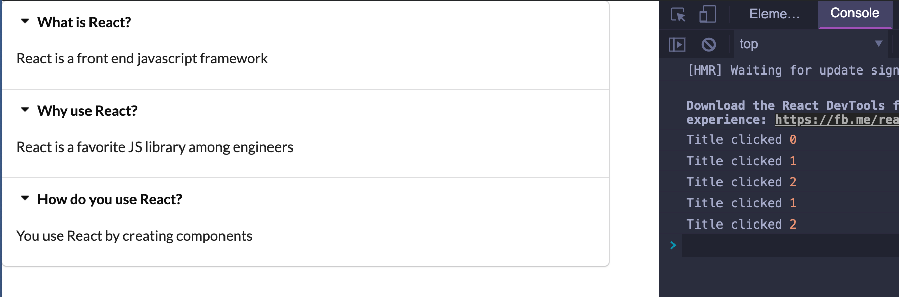
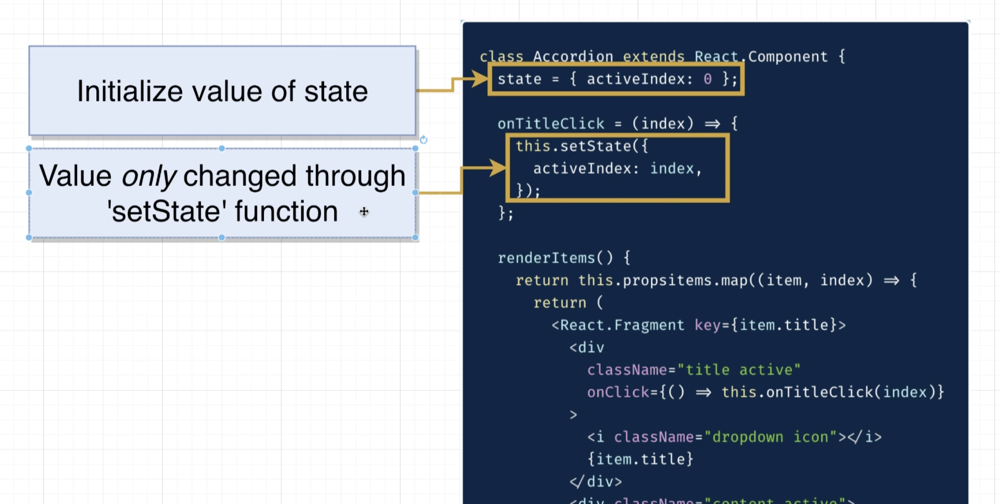
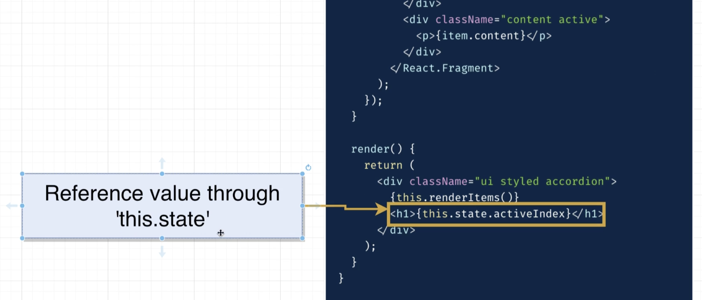
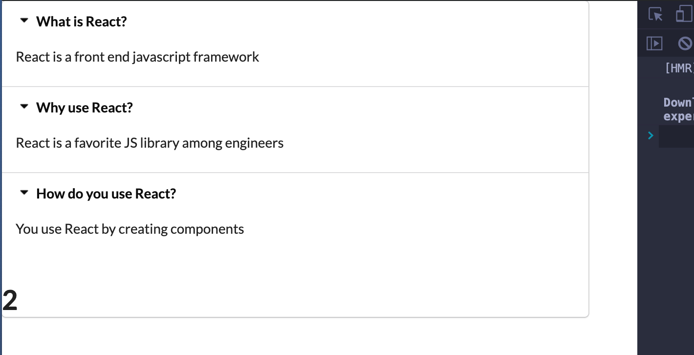

## Hooks System


- it is just helping you write reusable code.


- `npx create-react-app widgets`

- delete all files from `src`


- create `App.js`

```js
import React from 'react';

export default () => {
    return <h1>Widgets App</h1>;
};
```


- create `index.js`

```js
import React from 'react';
import ReactDOM from 'react-dom';
import App from './App';

ReactDOM.render(<App />, document.querySelector('#root'));
```


---

## Communicating the items Prop


- create `components/Accordion.js`

```js
import React from 'react';

const Accordion = () => {
    return <h1>Accordion</h1>;
};

export default Accordion;
```

- update App.js

```js
import React from 'react';
import Accordion from './components/Accordion';

export default () => {
    return (
        <div>
            <Accordion />
        </div>
    );
};
```


- update App.js

```js
import React from 'react';
import Accordion from './components/Accordion';

const items = [
    {
        title: 'What is React?',
        content: 'React is a front end javascript framework',
    },
    {
        title: 'Why use React?',
        content: 'React is a favorite JS library among engineers',
    },
    {
        title: 'How do you use React?',
        content: 'You use React by creating components',
    }
];

export default () => {
    return (
        <div>
            <Accordion items={items} />
        </div>
    );
};
```

- update `Accordion.js`

```js
import React from 'react';

const Accordion = ({ items }) => {
    return <h1>{items.length}</h1>;
};

export default Accordion;
```


---

## Building and Styling the Accordion

- update Accordion.js

```js
import React from 'react';

const Accordion = ({ items }) => {
    const renderedItems = items.map(item => {
        return (
            <div key={item.title}>
                <div className="title active">
                    <i className="dropdown icon"></i>
                    {item.title}
                </div>

                <div className="content active">
                    <p>{item.content}</p>
                </div>
            </div>
        );
    });
    return <div className="ui styled accordion">{renderedItems}</div>;
};

export default Accordion;
```


- import `semantic` css for `public/index.html`

```html
    <link
      rel="stylesheet"
      href="https://cdnjs.cloudflare.com/ajax/libs/semantic-ui/2.4.1/semantic.min.css"
    />    
```


- update `Accordion.js`

```js
import React from 'react';
const Accordion = ({ items }) => {
    const renderedItems = items.map(item => {
        return (
            <React.Fragment key={item.title}>
                <div className="title active">
                    <i className="dropdown icon"></i>
                    {item.title}
                </div>

                <div className="content active">
                    <p>{item.content}</p>
                </div>
            </React.Fragment>
        );
    });
    return <div className="ui styled accordion">{renderedItems}</div>;
};
export default Accordion;
```


---

## Helper Functions in Function Components

- update `Accordion.js`

```js
import React from 'react';

const Accordion = ({ items }) => {
    const renderedItems = items.map((item, index) => {
        return (
            <React.Fragment key={item.title}>
                <div className="title active"
                    onClick={() => { console.log("Title clicked", index) }}
                >
                    <i className="dropdown icon"></i>
                    {item.title}
                </div>

                <div className="content active">
                    <p>{item.content}</p>
                </div>
            </React.Fragment>
        );
    });

    return <div className="ui styled accordion">{renderedItems}</div>;
};

export default Accordion;
```


- update `Accordion.js`

```js
import React, { Component } from 'react';

// class Accordion extends Component{
//     onTitleClick() {
//         console.log('title was clicked');
//     }
//     render() {
        
//     }
// }


const Accordion = ({ items }) => {
    const onTitleClick = (index) => { 
        console.log('Title clicked', index);
    }

    const renderedItems = items.map((item, index) => {
        return (
            <React.Fragment key={item.title}>
                <div className="title active"
                    onClick={() => { onTitleClick(index) } }
                >
                    <i className="dropdown icon"></i>
                    {item.title}
                </div>

                <div className="content active">
                    <p>{item.content}</p>
                </div>
            </React.Fragment>
        );
    });

    return <div className="ui styled accordion">{renderedItems}</div>;
};

export default Accordion;
```

- the problem is why we using `onClick={() => { onTitleClick(index) } ` arrow function?

- if we just write `onClick={ onTitleClick(index) }`, then `onTitleClick(index)` is going to 
  be invoked the instant that our list of items is rendered. 就是说，网页上的内容会立刻全部渲染
  出来，而不是一个一个标题被绑定， 点击某一个才渲染的效果。

- Anyway, if we use arrow function here, then we can `bind(this)`, you click a title, then
  it just render one title




---

- we need to make use of the **Hook's state system** to somehow keep track of which of these
  elements should be `expanded` and `collapsed`[kəˈlæpst].


## Introducing `useState`

- before using `Hook system`, I want to show how we would approach this using simple class 
  based component





- update `Accordion.js`

```js
import React, { useState } from 'react';

const Accordion = ({ items }) => {
    const [activeIndex, setActiveIndex] = useState(null);

    const onTitleClick = (index) => {
        setActiveIndex(index);
    }

    const renderedItems = items.map((item, index) => {
        return (
            <React.Fragment key={item.title}>
                <div className="title active"
                    onClick={() => { onTitleClick(index) }}
                >
                    <i className="dropdown icon"></i>
                    {item.title}
                </div>

                <div className="content active">
                    <p>{item.content}</p>
                </div>
            </React.Fragment>
        );
    });

    return (
        <div className="ui styled accordion">
            {renderedItems}
            <h1>{activeIndex}</h1>
        </div>
    );
};

export default Accordion;
```




