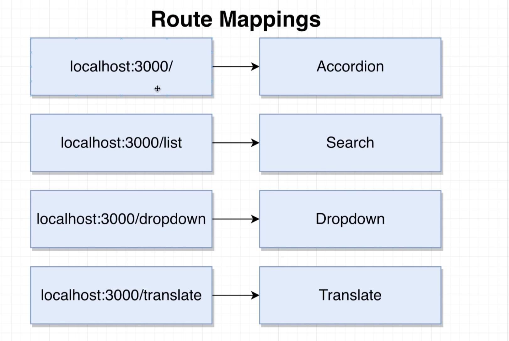
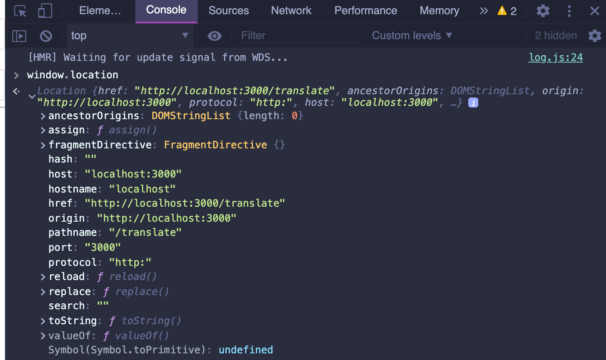
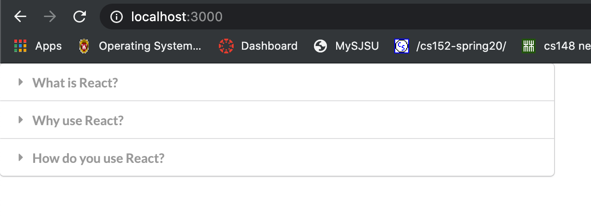
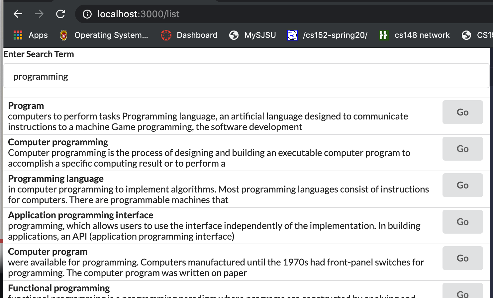
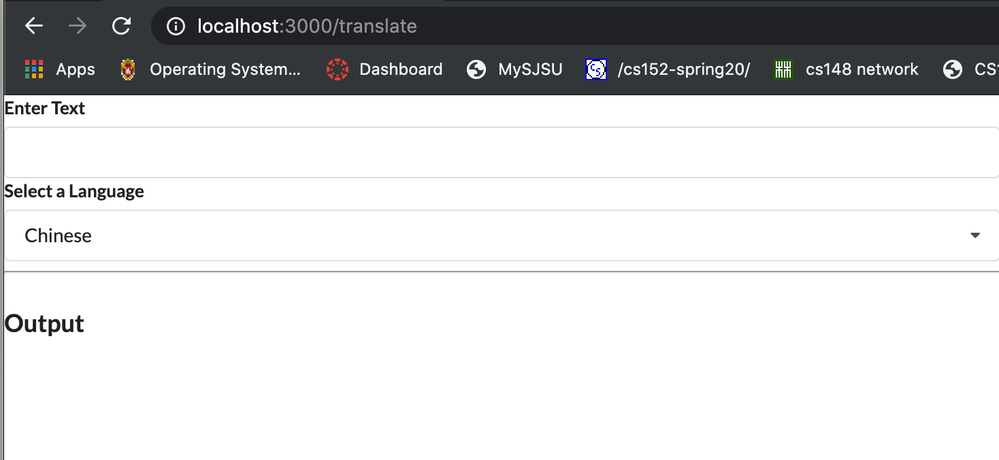
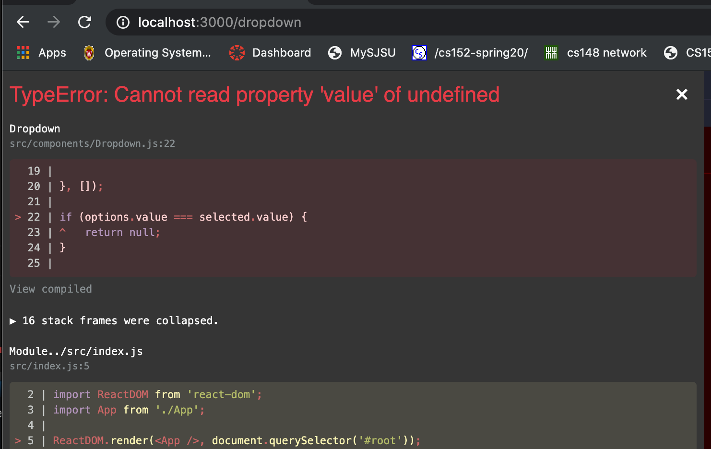
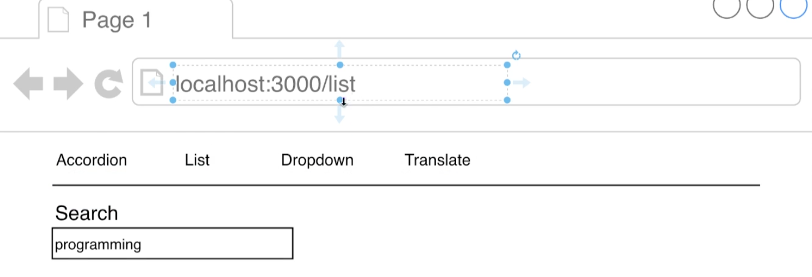
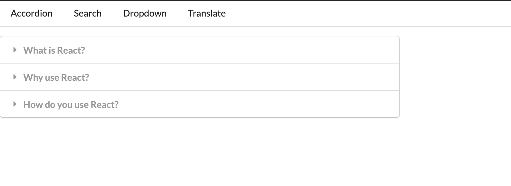

## Navigation in React

- Navigation: Showing different sets of components when the URL changes


## Basic Component Routing




- input `http://localhost:3000/translate`

- under chrome, input `window.location`




- go back to `widgets/App.js`


```js
import React, { useState } from 'react';
import Accordion from './components/Accordion';
import Search from './components/Search';
import Dropdown from './components/Dropdown';
import Translate from './components/Translate';

const items = [
    {
        title: 'What is React?',
        content: 'React is a front end javascript framework',
    },
    {
        title: 'Why use React?',
        content: 'React is a favorite JS library among engineers',
    },
    {
        title: 'How do you use React?',
        content: 'You use React by creating components',
    }
];

const options = [
    {
        label: 'The Color Red',
        value: 'red'
    },
    {
        label: 'The Color Green',
        value: 'green'
    },
    {
        label: 'The Color Blue',
        value: 'blue'
    }
];

const showAccordion = () => {
    if (window.location.pathname === '/') {
        return <Accordion items={items} />;
    }
}

const showList = () => {
    if (window.location.pathname === '/list') {
        return <Search />;
    }
}

const showDropdown = () => {
    if (window.location.pathname === '/dropdown') {
        return <Dropdown />;
    }
}

const showTranslate = () => {
    if (window.location.pathname === '/translate') {
        return <Translate />;
    }
}

export default () => {

    return (
        <div>
            {showAccordion()}
            {showList()}
            {showDropdown()}
            {showTranslate()}
            {/* <Translate /> */}
        </div>
    );
};
```

---

- NOW we test all routers







- if input '/dropdown', we get error message



---


## Building a Reusable Route

- update App.js

```js
import React, { useState } from 'react';
import Accordion from './components/Accordion';
import Search from './components/Search';
import Dropdown from './components/Dropdown';
import Translate from './components/Translate';
import Route from './components/Route';

const items = [
    {
        title: 'What is React?',
        content: 'React is a front end javascript framework',
    },
    {
        title: 'Why use React?',
        content: 'React is a favorite JS library among engineers',
    },
    {
        title: 'How do you use React?',
        content: 'You use React by creating components',
    }
];

const options = [
    {
        label: 'The Color Red',
        value: 'red'
    },
    {
        label: 'The Color Green',
        value: 'green'
    },
    {
        label: 'The Color Blue',
        value: 'blue'
    }
];

const showAccordion = () => {
    if (window.location.pathname === '/') {
        return <Accordion items={items} />;
    }
}

const showList = () => {
    if (window.location.pathname === '/list') {
        return <Search />;
    }
}

const showDropdown = () => {
    if (window.location.pathname === '/dropdown') {
        return <Dropdown />;
    }
}

const showTranslate = () => {
    if (window.location.pathname === '/translate') {
        return <Translate />;
    }
}

const showComponent = (route, component) => {
    return window.location.pathname === route ? component : null;
}

export default () => {
    const [selected, setSelected] = useState(options[0]);
    return (
        <div>
            {/* {showAccordion()}
            {showList()}
            {showDropdown()}
            {showTranslate()} */}

            {/* <Translate /> */}

            <Route path="/">
                <Accordion items={items} />
            </Route>
            <Route path="/list">
                <Search />
            </Route>
            <Route path="/dropdown">
                <Dropdown
                    label="Select a color"
                    options={options}
                    selected={selected}
                    onSelectedChange={setSelected}
                />
            </Route>
            <Route path="/translate">
                <Translate />
            </Route>
        </div>
    );
};
```


- create `components/Route.js`

```js
import React from 'react';

const Route = ({ path, children }) => {
    return window.location.pathname === path ? children : null;
}

export default Route;
```


---

## Implementing a Header for Navigation



- creat `components/Header.js`

```js
import React from 'react';

const Header = () => {
    return (
        <div className="ui secondary pointing menu">
            <a href="/" className="item">
                Accordion
            </a>
            <a href="/list" className="item">
                Search
            </a>
            <a href="/dropdown" className="item">
                Dropdown
            </a>
            <a href="/translate" className="item">
                Translate
            </a>
        </div>
    );
}

export default Header;
```

---

- update App.js

```js
import React, { useState } from 'react';
import Accordion from './components/Accordion';
import Search from './components/Search';
import Dropdown from './components/Dropdown';
import Translate from './components/Translate';
import Route from './components/Route';
import Header from './components/Header';

const items = [
    {
        title: 'What is React?',
        content: 'React is a front end javascript framework',
    },
    {
        title: 'Why use React?',
        content: 'React is a favorite JS library among engineers',
    },
    {
        title: 'How do you use React?',
        content: 'You use React by creating components',
    }
];

const options = [
    {
        label: 'The Color Red',
        value: 'red'
    },
    {
        label: 'The Color Green',
        value: 'green'
    },
    {
        label: 'The Color Blue',
        value: 'blue'
    }
];

const showAccordion = () => {
    if (window.location.pathname === '/') {
        return <Accordion items={items} />;
    }
}

const showList = () => {
    if (window.location.pathname === '/list') {
        return <Search />;
    }
}

const showDropdown = () => {
    if (window.location.pathname === '/dropdown') {
        return <Dropdown />;
    }
}

const showTranslate = () => {
    if (window.location.pathname === '/translate') {
        return <Translate />;
    }
}

const showComponent = (route, component) => {
    return window.location.pathname === route ? component : null;
}

export default () => {
    const [selected, setSelected] = useState(options[0]);
    return (
        <div>
            <Header />

            <Route path="/">
                <Accordion items={items} />
            </Route>
            <Route path="/list">
                <Search />
            </Route>
            <Route path="/dropdown">
                <Dropdown
                    label="Select a color"
                    options={options}
                    selected={selected}
                    onSelectedChange={setSelected}
                />
            </Route>
            <Route path="/translate">
                <Translate />
            </Route>
        </div>
    );
};
```




