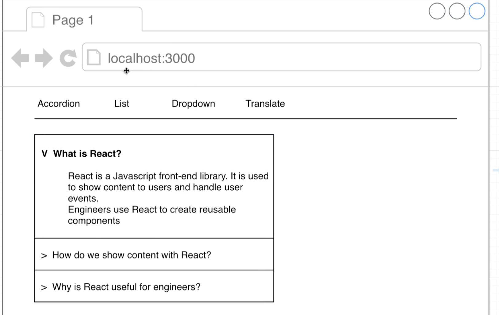

## Navigation in React

- Navigation: Showing different sets of components when the URL changes




## Basic Component Routing


- input `http://localhost:3000/translate`

- under chrome, input `window.location`


- go back to `widgets/App.js`


```js
import React, { useState } from 'react';
import Accordion from './components/Accordion';
import Search from './components/Search';
import Dropdown from './components/Dropdown';
import Translate from './components/Translate';

const items = [
    {
        title: 'What is React?',
        content: 'React is a front end javascript framework',
    },
    {
        title: 'Why use React?',
        content: 'React is a favorite JS library among engineers',
    },
    {
        title: 'How do you use React?',
        content: 'You use React by creating components',
    }
];

const options = [
    {
        label: 'The Color Red',
        value: 'red'
    },
    {
        label: 'The Color Green',
        value: 'green'
    },
    {
        label: 'The Color Blue',
        value: 'blue'
    }
];

const showAccordion = () => {
    if (window.location.pathname === '/') {
        return <Accordion items={items} />;
    }
}

const showList = () => {
    if (window.location.pathname === '/list') {
        return <Search />;
    }
}

const showDropdown = () => {
    if (window.location.pathname === '/dropdown') {
        return <Dropdown />;
    }
}

const showTranslate = () => {
    if (window.location.pathname === '/translate') {
        return <Translate />;
    }
}

export default () => {

    return (
        <div>
            {showAccordion()}
            {showList()}
            {showDropdown()}
            {showTranslate()}
            {/* <Translate /> */}
        </div>
    );
};
```

---

- NOW we test all routers


- if input '/dropdown', we get error message


