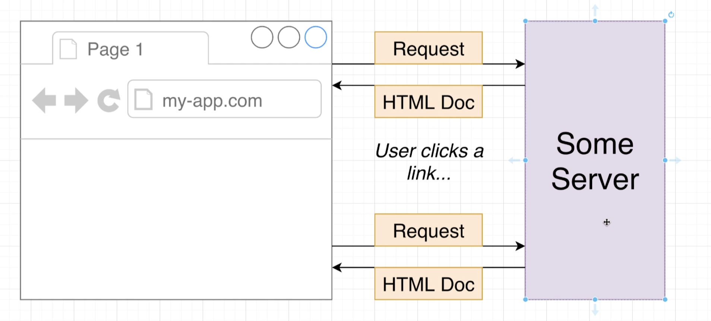
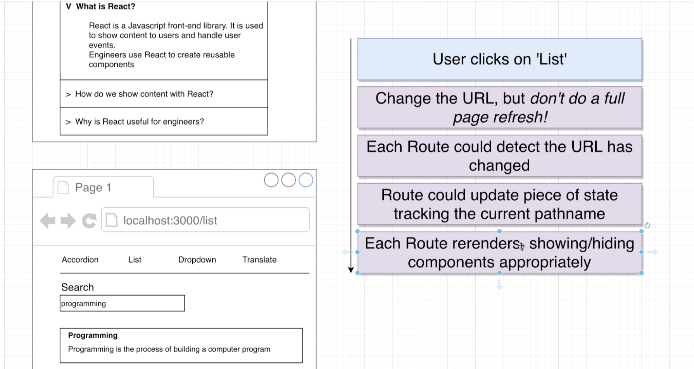

## Handling Navigation




## Building a Link


- create `components/Link.js`

```js
import React from 'react';

const Link = ({ className, href, children }) => {
    const onClick = (event) => {
        event.preventDefault();
    };

    return (
        <a onClick={onClick} className={className} href={href}>
            {children}
        </a>
    );
}

export default Link;
```

- Now, change the URL, but don't do a full page refresh!


## Changing the URL

- update `Link.js`

```js
import React from 'react';

const Link = ({ className, href, children }) => {
    const onClick = (event) => {
        event.preventDefault();
        window.history.pushState({}, '', href);
    };

    return (
        <a onClick={onClick} className={className} href={href}>
            {children}
        </a>
    );
}

export default Link;
```

- click `Search` :
  


- click `Translate` :


---

## Detecting Navigation




- update `Route.js`

```js
import React from 'react';
import { useEffect } from 'react';

const Route = ({ path, children }) => {
    useEffect(() => {
        const onLocationChange = () => {
            console.log('Location Change');
        };

        window.addEventListener('popstate', onLocationChange);
        return () => {
            window.removeEventListener('popstate', onLocationChange);
        };
    }, []);


    return window.location.pathname === path ? children : null;
};


export default Route;
```


---

## Updating the Route

- update `Route.js`


```js
import React from 'react';
import { useEffect, useState } from 'react';

const Route = ({ path, children }) => {
    const [currentPath, setCurrentPath] = useState(window.location.pathname);

    useEffect(() => {
        const onLocationChange = () => {
            setCurrentPath(window.location.pathname);
        };

        window.addEventListener('popstate', onLocationChange);
        return () => {
            window.removeEventListener('popstate', onLocationChange);
        };
    }, []);

    return currentPath === path ? children : null;
};

export default Route;
```


---

## Handling Command Clicks


- for widows, `ctrlKey`
- for macos, `metakey`

- open a new tab

- update `Link.js`

```js
import React from 'react';

const Link = ({ className, href, children }) => {
    const onClick = (event) => {
        //macos for metaKey,  windows for ctrlKey
        if (event.metaKey || event.ctrlKey) {
            return;
        }

        event.preventDefault();
        window.history.pushState({}, '', href);

        const navEvent = new PopStateEvent('popstate');
        window.dispatchEvent(navEvent);
    };

    return (
        <a onClick={onClick} className={className} href={href}>
            {children}
        </a>
    );
}

export default Link;
```


- click `command`, open a new tab


