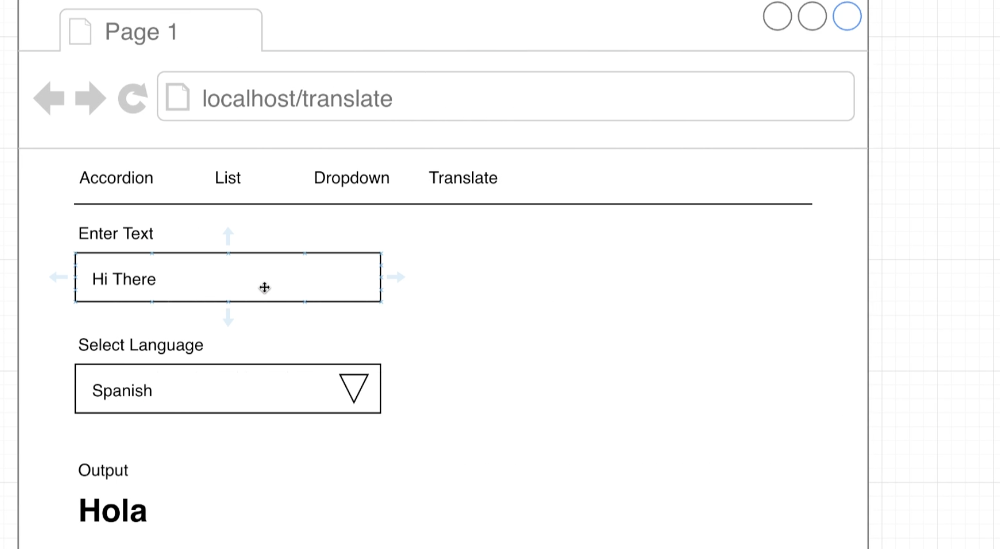
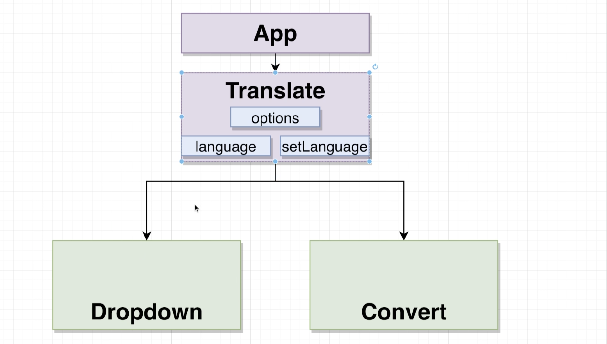
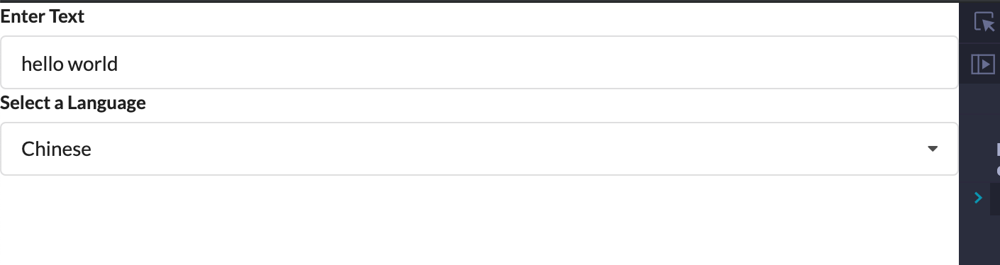
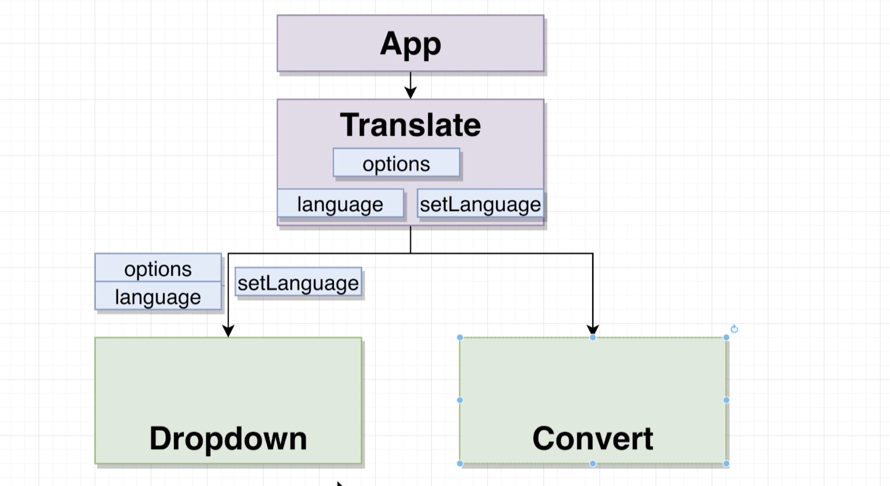
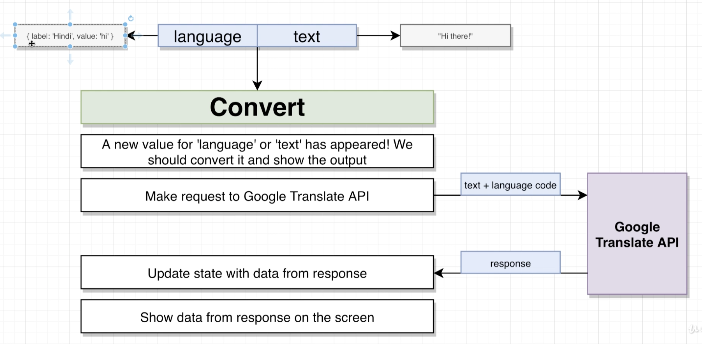
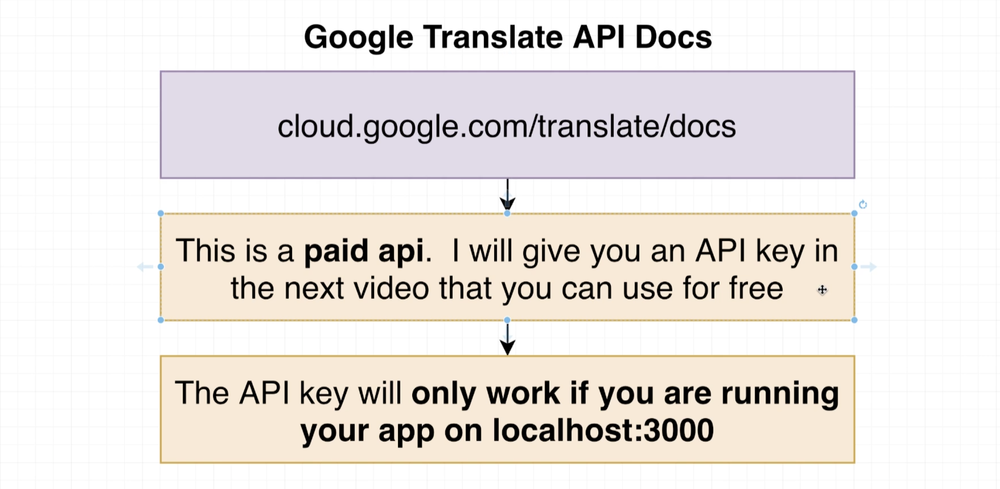
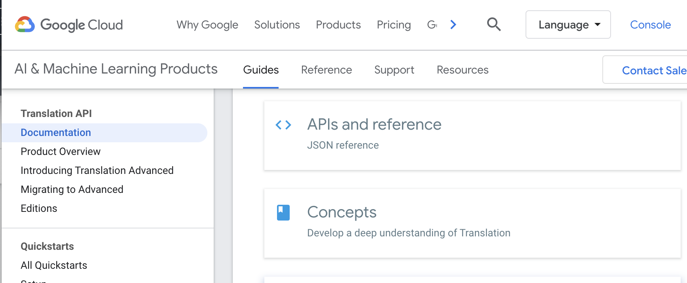
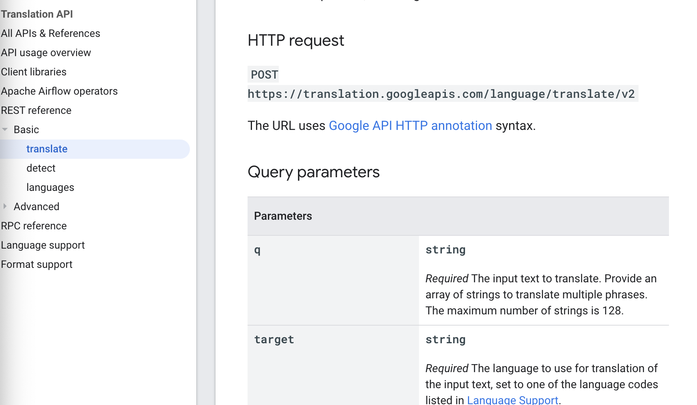

## The Tranlate Widget






## Scaffolding the Translate Component

- create `components/Translate.js`

```js
import React, { useState } from 'react';
import Dropdown from './Dropdown';

const options = [
    {
        label: 'Chinese',
        value: 'ch'
    },
    {
        label: 'Afrikaans',
        value: 'af'
    },
    {
        label: 'Arabic',
        value: 'ar'
    },
    {
        label: 'Hindi',
        value: 'hi'
    }
];

const Translate = () => {
    const [language, setLanguage] = useState(options[0]);

    return (
        <div>
            <Dropdown
                label="Select a Language"
                selected={language}
                onSelectedChange={setLanguage}
                options={options}
            />
        </div>
    );
}

export default Translate;
```

## Adding the Language Input

- update `Translate.js`

```js
const Translate = () => {
    const [language, setLanguage] = useState(options[0]);
    const [text, setText] = useState('');

    return (
        <div>
            <div className="ui form">
                <div className="field">
                    <label>Enter Text</label>
                    <input value={text} onChange={(e) => { setText(e.target.value) }} />
                </div>
            </div>

            <Dropdown
                label="Select a Language"
                selected={language}
                onSelectedChange={setLanguage}
                options={options}
            />
        </div>
    );
}

export default Translate;
```



---

## Understanding the Convert Component

- reacall:





#### How to use Google Translate API



- but this  is `paid API`, it only work on `localhost:3000`
  - that means, we must run on `localhost:3000`, otherwise it doesn't work


- input `cloud.google.com/translate/docs`



- click `APIs and reference` -> `REST reference` -> `Basic` -> `translate`



---


## Google Translate API key

- 具体看我的印象笔记


