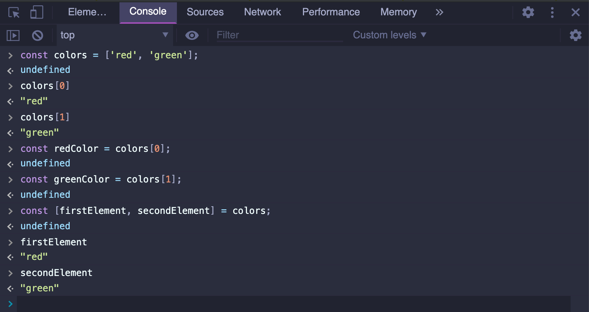

## Understanding useState


- javascript `destructure`




```js
const Accordion = ({ items }) => {
    // const things = useState(null);
    // const activeIndex = things[0];
    // const setActiveIndex = things[1];

    const [activeIndex, setActiveIndex] = useState(null);

    const onTitleClick = (index) => {
        setActiveIndex(index);
    };
```

---

```js
    const things = useState(null);
    const activeIndex = things[0];
    const setActiveIndex = things[1];


    //以上这三句，是等价于 
    const [activeIndex, setActiveIndex] = useState(null);
```


- example 1:
  


- example 2:


- `Class Components` VS `Function Components`


- example:


---

## Setter Function

- `const [activeIndex, setActiveIndex] = useState(null);`
  - Anytime we call `useState(null)`, we get back that array, 
  - And the second argument inside of it is always going to be `setter`


