## Create Additional Widgets

- project overview:

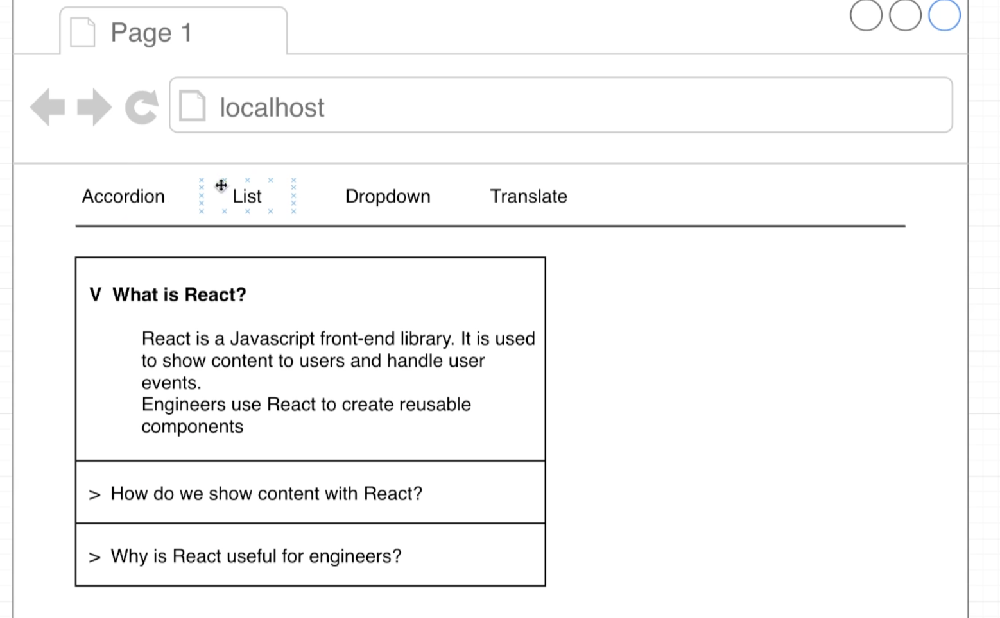

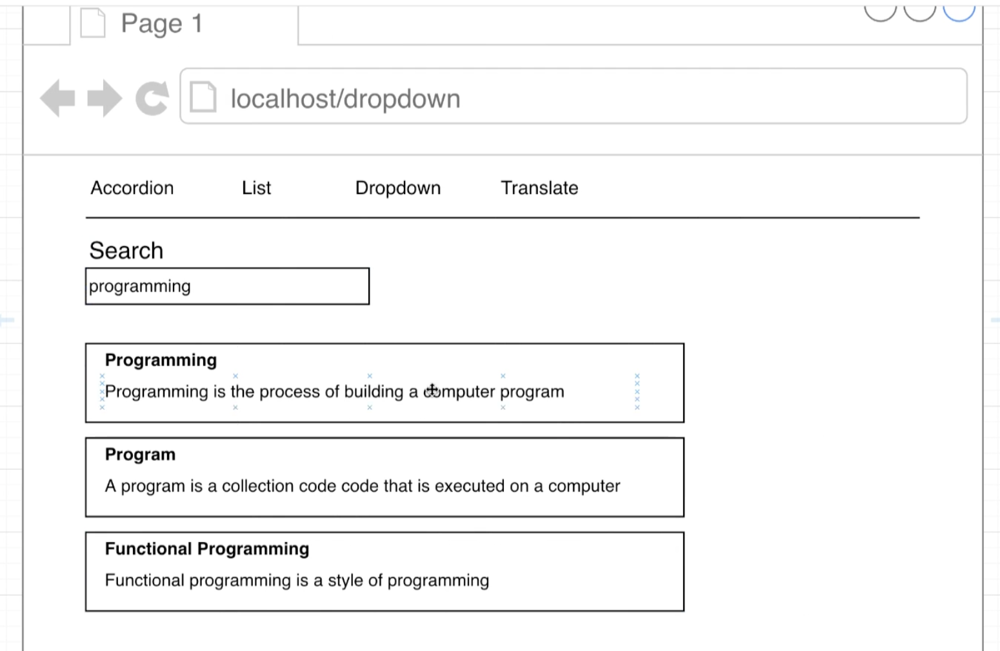

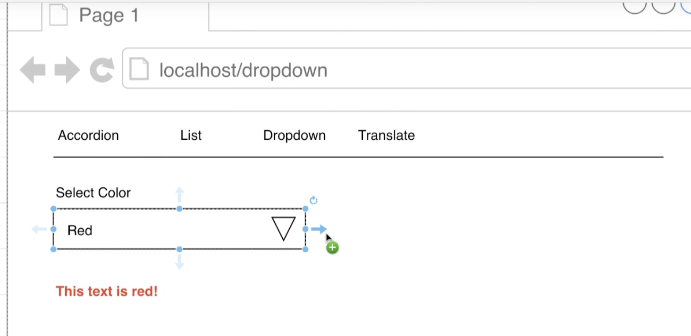

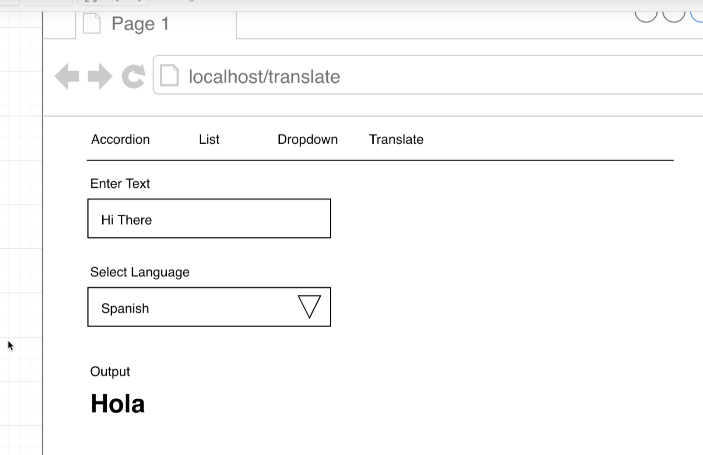

---

## The Search Widget Architecture(架构) 

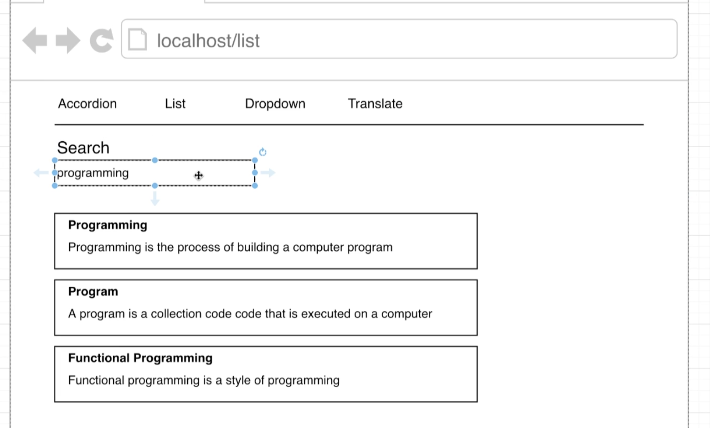

- import `wiki API`

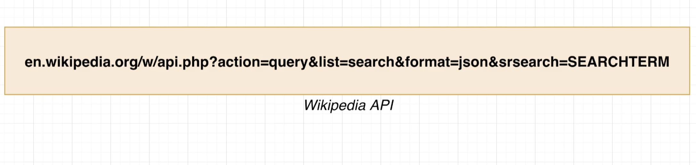

- first, how do we use the `Wikipedia API` ?
  - this is probably the easiest API that we're going to use in this entire course because
    it doesn't require any authentication, any API keys 

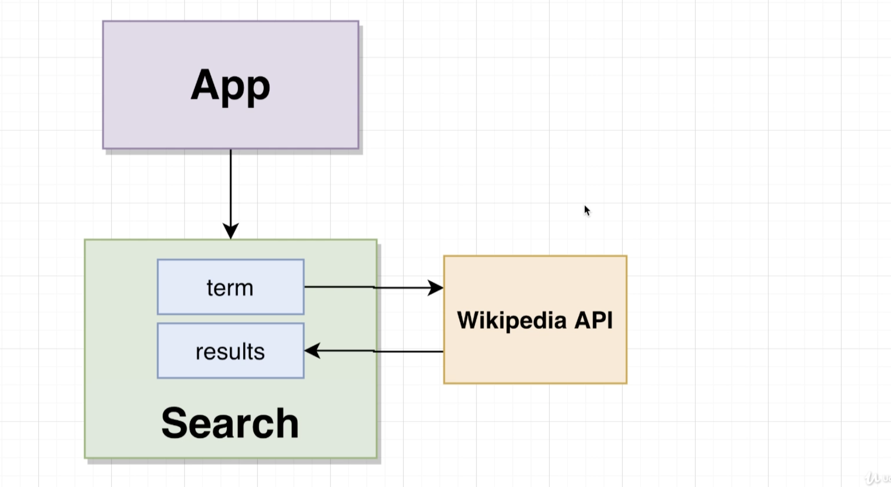

- we're going to build everything inside of one single search component

- the search component itself will have two pieces of state:
  - first, we'll have a term which is whatever user is typing into that text input, 
    we're going to send that to the `Wiki API` and do a search, that's going to 
    give us back some results. 

---

## Scaffolding(脚手架) [ˈskæfəldɪŋ]  the Widget

- create `components/Search.js`

```js
import React from 'react';

const Search = () => {
    return <h1>Search</h1>;
};

export default Search;
```

- update `App`

```js
import React from 'react';

import Search from './components/Search';

export default () => {
    return (
        <div>
            {/* <Accordion items={items} /> */}
            <Search />
        </div>
    );
};
```


---

## Text Inputs with Hooks

- update `Search.js`

```js
import React from 'react';

const Search = () => {
    return (
        <div>
            <div className="ui form">
                <div className="field">
                    <label>Enter Search Term</label>
                    <input className="input" />
                </div>
            </div>
        </div>
    );
};
export default Search;
```

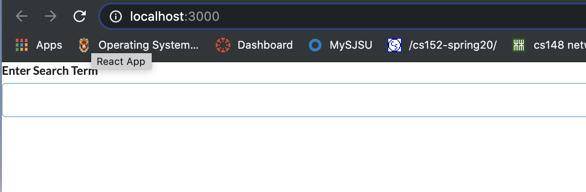


---

## Text Inputs with Hooks

- update Search.js

```js
import React, { useState } from 'react';

const Search = () => {
    const [term, setTerm] = useState('');

    return (
        <div>
            <div className="ui form">
                <div className="field">
                    <label>Enter Search Term</label>
                    <input
                        value={term}
                        onChange={(e) => setTerm(e.target.value)}
                        className="input"
                    />
                </div>
            </div>
        </div>
    );
};
export default Search;
```

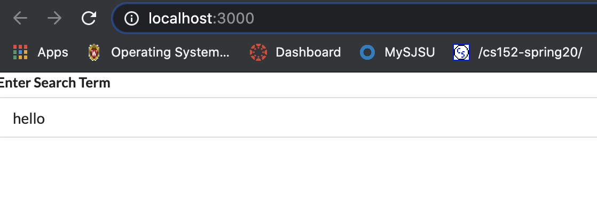

---

## When do we Search?

## The useEffect Hook

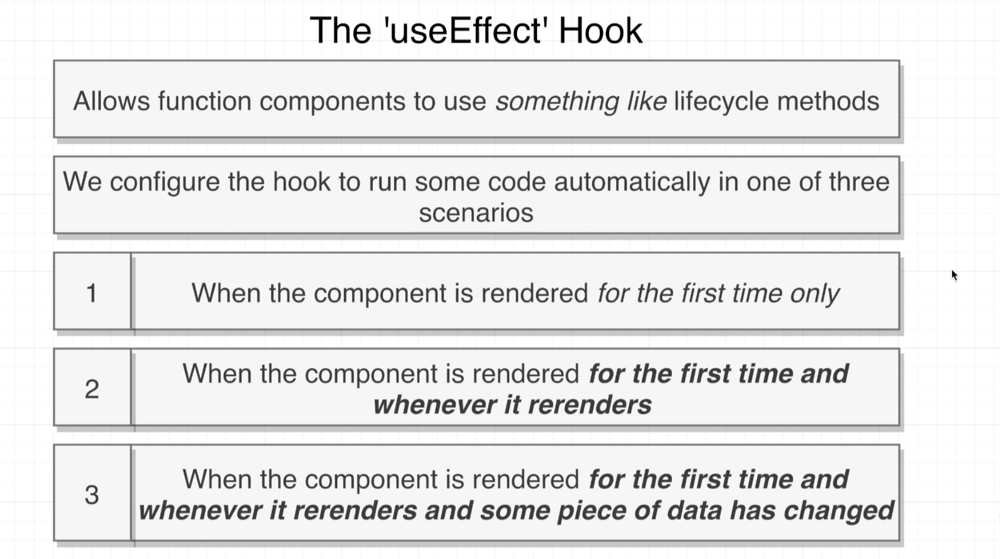

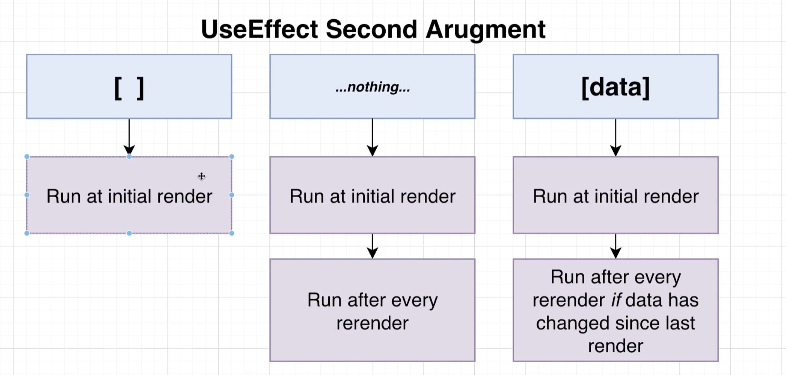


## Testing Exceution


