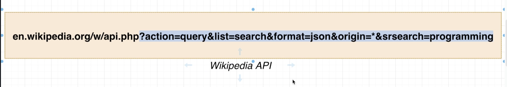
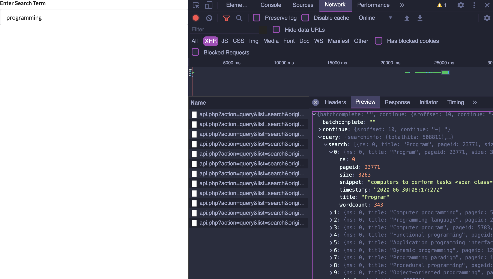
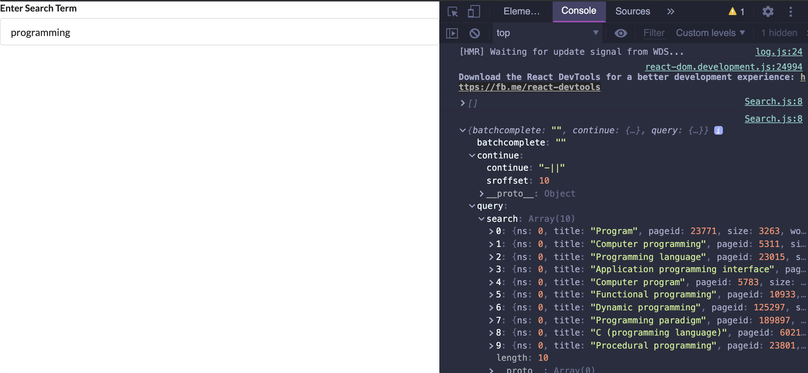
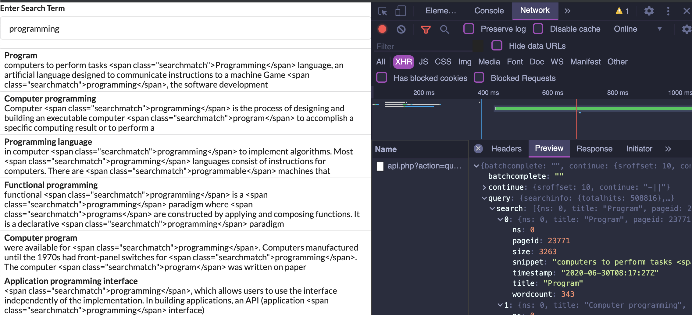
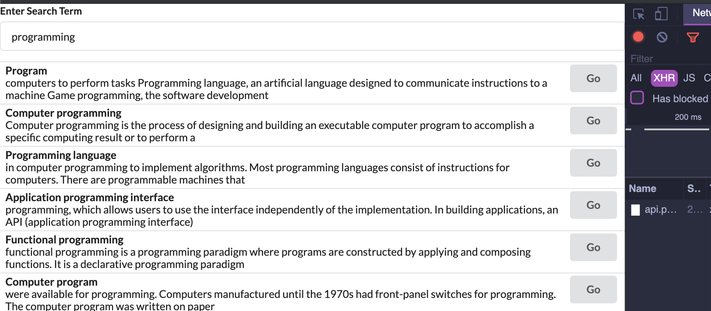
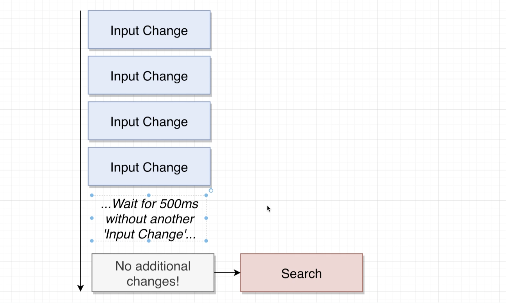

## Async Code in useEffect

- `npm install axios ` for widgets project


## Executing the Request from useEffect




- update `Search.js`

```js
import React, { useState, useEffect } from 'react';
import axios from 'axios';

const Search = () => {
    const [term, setTerm] = useState('');

    useEffect(() => {
        const search = async () => {
            await axios.get('https://en.wikipedia.org/w/api.php', {
                params: {
                    action: 'query',
                    list: 'search',
                    origin: '*',
                    format: 'json',
                    srsearch: term
                }
            });
        }
        search();
    }, [term]);

    return (
        <div>
            <div className="ui form">
                <div className="field">
                    <label>Enter Search Term</label>
                    <input
                        value={term}
                        onChange={(e) => setTerm(e.target.value)}
                        className="input"
                    />
                </div>
            </div>
        </div>
    );
};
export default Search;
```


- 我们到这里获取了 `wiki API`




---

## Default Search Terms

- update `Search.js`


```js
import React, { useState, useEffect } from 'react';
import axios from 'axios';

const Search = () => {
    const [term, setTerm] = useState('programming');
    const [results, setResults] = useState([]);

    console.log(results);

    useEffect(() => {
        const search = async () => {
            const { data } = await axios.get('https://en.wikipedia.org/w/api.php', {
                params: {
                    action: 'query',
                    list: 'search',
                    origin: '*',
                    format: 'json',
                    srsearch: term
                }
            });
            setResults(data);
        };

        search();
    }, [term]);

    return (
        <div>
            <div className="ui form">
                <div className="field">
                    <label>Enter Search Term</label>
                    <input
                        value={term}
                        onChange={(e) => setTerm(e.target.value)}
                        className="input"
                    />
                </div>
            </div>
        </div>
    );
};
export default Search;
```



---

## List Building 

- update Search.js

```js
import React, { useState, useEffect } from 'react';
import axios from 'axios';

const Search = () => {
    const [term, setTerm] = useState('programming');
    const [results, setResults] = useState([]);

    // console.log(results);

    useEffect(() => {
        const search = async () => {
            const { data } = await axios.get('https://en.wikipedia.org/w/api.php', {
                params: {
                    action: 'query',
                    list: 'search',
                    origin: '*',
                    format: 'json',
                    srsearch: term
                }
            });
            setResults(data.query.search);
        };

        search();
    }, [term]);

    const renderedResults = results.map((result) => {
        return (
            <div key={result.pageid} className="item">
                <div className="content">
                    <div className="header">
                        {result.title}
                    </div>
                    {result.snippet}
                </div>
            </div>
        );
    });

    return (
        <div>
            <div className="ui form">
                <div className="field">
                    <label>Enter Search Term</label>
                    <input
                        value={term}
                        onChange={(e) => setTerm(e.target.value)}
                        className="input"
                    />
                </div>
            </div>
            <div className="ui celled list">
                {renderedResults}
            </div>
        </div>
    );
};
export default Search;
```



---

## XSS Attacks in React


---

## Linking to a Wikipedia Page


- update `search.js`

```js
import React, { useState, useEffect } from 'react';
import axios from 'axios';

const Search = () => {
    const [term, setTerm] = useState('programming');
    const [results, setResults] = useState([]);

    // console.log(results);

    useEffect(() => {
        const search = async () => {
            const { data } = await axios.get('https://en.wikipedia.org/w/api.php', {
                params: {
                    action: 'query',
                    list: 'search',
                    origin: '*',
                    format: 'json',
                    srsearch: term
                }
            });
            setResults(data.query.search);
        };

        search();
    }, [term]);

    const renderedResults = results.map((result) => {
        return (
            <div key={result.pageid} className="item">
                <div className="right floated content">
                    <a
                        className="ui button"
                        href={`https://en.wikipedia.org?curid=${result.pageid}`}
                    >Go</a>
                </div>
                <div className="content">
                    <div className="header">
                        {result.title}
                    </div>
                    <span dangerouslySetInnerHTML={{ __html: result.snippet }}></span>
                </div>
            </div>
        );
    });

    return (
        <div>
            <div className="ui form">
                <div className="field">
                    <label>Enter Search Term</label>
                    <input
                        value={term}
                        onChange={(e) => setTerm(e.target.value)}
                        className="input"
                    />
                </div>
            </div>
            <div className="ui celled list">
                {renderedResults}
            </div>
        </div>
    );
};
export default Search;
```



- now, we can click one of the buttons, then it will linking to `wiki page`

---

## Only Search with a term

```js
        if (term) {
            search();
        }
```


---

## Throttling API request




