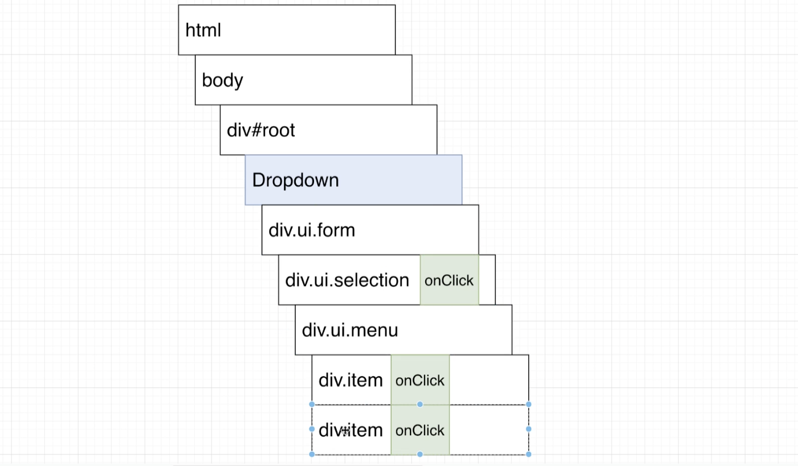
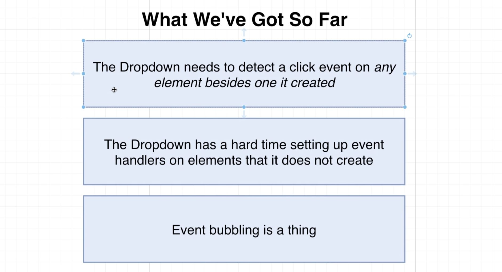
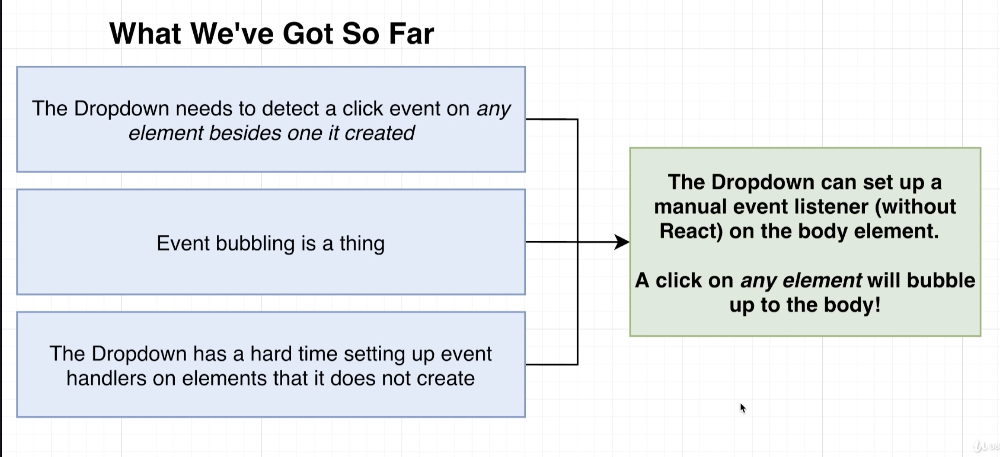
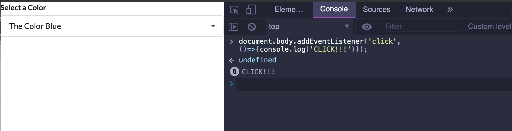
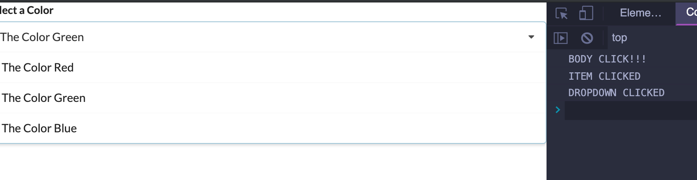
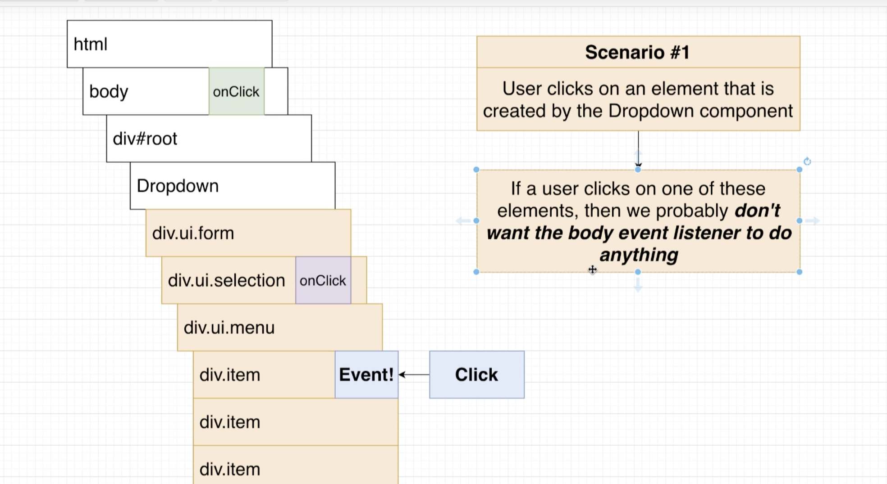
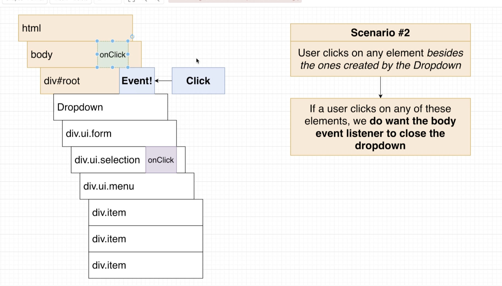
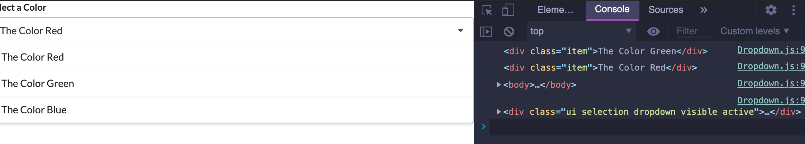

## Dropdown (可折叠的) Architecture | widgets


---

## Scaffolding(脚手架) the Dropdown

- create `components/Dropdown.js`

```js
import React from 'react';

const Dropdown = () => {
    return <h1>Dropdown</h1>;
};

export default Dropdown;
```

- update `App.js`

```js
import React from 'react';
import Accordion from './components/Accordion';
import Search from './components/Search';
import Dropdown from './components/Dropdown';

const items = [
    {
        title: 'What is React?',
        content: 'React is a front end javascript framework',
    },
    {
        title: 'Why use React?',
        content: 'React is a favorite JS library among engineers',
    },
    {
        title: 'How do you use React?',
        content: 'You use React by creating components',
    }
];

const options = [
    {
        label: 'The Color Red',
        value: 'red'
    },
    {
        label: 'The Color Green',
        value: 'green'
    },
    {
        label: 'The Color Blue',
        value: 'blue'
    }
];

export default () => {
    return (
        <div>
            {/* <Accordion items={items} /> */}
            {/* <Search /> */}
            <Dropdown options={options} />
        </div>
    );
};
```

---

## A lot of JSX

- update `Dropdown.js`

```js
import React from 'react';

const Dropdown = ({ options }) => {
    const renderedOptions = options.map((option) => {
        return (
            <div key={option.value} className="item">
                {option.label}
            </div>
        );
    });
    return (
        <div className="ui form">
            <div className="field">
                <label className="label">Select a Color</label>
                <div className="ui selection dropdown visible active">
                    <i className="dropdown icon"></i>
                    <div className="text">Select Color</div>
                    <div className="menu visible transition">
                        {renderedOptions}
                    </div>
                </div>
            </div>
        </div>
    );
};

export default Dropdown;
```


---

## Selection State | Filtering the Option List

- update `App.js`

```js
import React, { useState } from 'react';
import Accordion from './components/Accordion';
import Search from './components/Search';
import Dropdown from './components/Dropdown';

const items = [
    {
        title: 'What is React?',
        content: 'React is a front end javascript framework',
    },
    {
        title: 'Why use React?',
        content: 'React is a favorite JS library among engineers',
    },
    {
        title: 'How do you use React?',
        content: 'You use React by creating components',
    }
];

const options = [
    {
        label: 'The Color Red',
        value: 'red'
    },
    {
        label: 'The Color Green',
        value: 'green'
    },
    {
        label: 'The Color Blue',
        value: 'blue'
    }
];

export default () => {
    const [selected, setSelected] = useState(options[0]);
    return (
        <div>
            {/* <Accordion items={items} /> */}
            {/* <Search /> */}
            <Dropdown
                selected={selected}
                onSelectedChange={setSelected}
                options={options}
            />
        </div>
    );
};
```

- update `Dropdown.js`

```js
import React from 'react';

const Dropdown = ({ options, selected, onSelectedChange }) => {
    if (options.value === selected.value) {
        return null;
    }

    const renderedOptions = options.map((option) => {
        return (
            <div
                key={option.value}
                className="item"
                onClick={() => { onSelectedChange(option) }}
            >
                {option.label}
            </div>
        );
    });
    return (
        <div className="ui form">
            <div className="field">
                <label className="label">Select a Color</label>
                <div className="ui selection dropdown visible active">
                    <i className="dropdown icon"></i>
                    <div className="text">{selected.label}</div>
                    <div className="menu visible transition">
                        {renderedOptions}
                    </div>
                </div>
            </div>
        </div>
    );
};
export default Dropdown;
```


---

## Hiding and Showing the Option List

- 我们可以通过 `Hook` system, useState 给 当前组件添加 boolean 值， 默认为 `false`
  如果，点击则为 `true`

- update `Dropdown.js`

```js
import React from 'react';

const Dropdown = ({ options, selected, onSelectedChange }) => {
    const [open, setOpen] = useState(false);

    if (options.value === selected.value) {
        return null;
    }

    const renderedOptions = options.map((option) => {
        return (
            <div
                key={option.value}
                className="item"
                onClick={() => { onSelectedChange(option) }}
            >
                {option.label}
            </div>
        );
    });
    return (
        <div className="ui form">
            <div className="field">
                <label className="label">Select a Color</label>
                <div
                    onClick={() => { setOpen(!open) }}
                    className={`ui selection dropdown ${open ? 'visible active' : ''}`}
                >
                    <i className="dropdown icon"></i>
                    <div className="text">{selected.label}</div>
                    <div className={`menu ${open ? 'visible transition' : ''}`}>
                        {renderedOptions}
                    </div>
                </div>
            </div>
        </div>
    );
};
export default Dropdown;
```


- now it works!

---

## Reminder on Event Bubbling







- First, try to set up an event listener on the body element without using react



- click `label`, `body`, everywhere, you see the result.

---

## Binding an Event Handler

- we use `useEffect` and `useState` to make sure this thing only runs once

- update `Dropdown.js`

```js
import React, { useState, useEffect } from 'react';

const Dropdown = ({ options, selected, onSelectedChange }) => {
    const [open, setOpen] = useState(false);

    useEffect(() => {
        document.body.addEventListener('click', () => {
            console.log('BODY CLICK!!!');
            setOpen(false);
        });
    }, []);

    if (options.value === selected.value) {
        return null;
    }

    const renderedOptions = options.map((option) => {
        return (
            <div
                key={option.value}
                className="item"
                onClick={() => {
                    console.log('ITEM CLICKED');
                    onSelectedChange(option);
                }}
            >
                {option.label}
            </div>
        );
    });
    return (
        <div className="ui form">
            <div className="field">
                <label className="label">Select a Color</label>
                <div
                    onClick={() => {
                        console.log('DROPDOWN CLICKED');
                        setOpen(!open);
                    }}
                    className={`ui selection dropdown ${open ? 'visible active' : ''}`}
                >
                    <i className="dropdown icon"></i>
                    <div className="text">{selected.label}</div>
                    <div className={`menu ${open ? 'visible transition' : ''}`}>
                        {renderedOptions}
                    </div>
                </div>
            </div>
        </div>
    );
};
export default Dropdown;
```



- 因为，`BODY CLICK` 总是初始化时候就渲染，紧接着点击 item, 最后是 Dropdown

---

## Which Element Was Clicked?





- `Dropdown.js`

```js
const Dropdown = ({ options, selected, onSelectedChange }) => {
    const [open, setOpen] = useState(false);

    useEffect(() => {
        document.body.addEventListener('click', (event) => {
            // console.log('BODY CLICK!!!');
            console.log(event.target);
            setOpen(false);
        });
    }, []);

```




