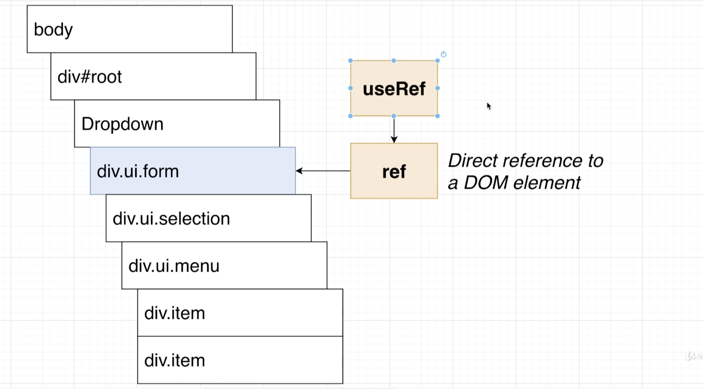

## use another Hook `useRef`



## Making use of useRef

- update `Dropdown.js`

```js
import React, { useState, useEffect, useRef } from 'react';

const Dropdown = ({ options, selected, onSelectedChange }) => {
    const [open, setOpen] = useState(false);
    const ref = useRef();

    useEffect(() => {
        document.body.addEventListener('click', (event) => {
            // console.log('BODY CLICK!!!');
            // console.log(event.target);
            if (ref.current.contains(event.target)) {
                return;
            }
            setOpen(false);
        });
    }, []);

    if (options.value === selected.value) {
        return null;
    }

    const renderedOptions = options.map((option) => {
        return (
            <div
                key={option.value}
                className="item"
                onClick={() => {
                    // console.log('ITEM CLICKED');
                    onSelectedChange(option);
                }}
            >
                {option.label}
            </div>
        );
    });

    // console.log(ref.current);

    return (
        <div ref={ref} className="ui form">
            <div className="field">
                <label className="label">Select a Color</label>
                <div
                    onClick={() => {
                        // console.log('DROPDOWN CLICKED');
                        setOpen(!open);
                    }}
                    className={`ui selection dropdown ${open ? 'visible active' : ''}`}
                >
                    <i className="dropdown icon"></i>
                    <div className="text">{selected.label}</div>
                    <div className={`menu ${open ? 'visible transition' : ''}`}>
                        {renderedOptions}
                    </div>
                </div>
            </div>
        </div>
    );
};
export default Dropdown;
```

- 现在点击 element, 如果已经被选择过了，do nothing, 不会再重新渲染 element


- 所以再选一次 `Green`, 还是 do nothing

---

## Body Event Listerner Cleanup

- update `App.js`

```js
import React, { useState } from 'react';
import Accordion from './components/Accordion';
import Search from './components/Search';
import Dropdown from './components/Dropdown';

const items = [
    {
        title: 'What is React?',
        content: 'React is a front end javascript framework',
    },
    {
        title: 'Why use React?',
        content: 'React is a favorite JS library among engineers',
    },
    {
        title: 'How do you use React?',
        content: 'You use React by creating components',
    }
];

const options = [
    {
        label: 'The Color Red',
        value: 'red'
    },
    {
        label: 'The Color Green',
        value: 'green'
    },
    {
        label: 'The Color Blue',
        value: 'blue'
    }
];

export default () => {
    const [selected, setSelected] = useState(options[0]);
    const [showDropdown, setShowDropdown] = useState(true);

    return (
        <div>
            {/* <Accordion items={items} /> */}
            {/* <Search /> */}
            <button onClick={() => setShowDropdown(!showDropdown)}>Toggle Dropdown</button>
            {showDropdown ?
                < Dropdown
                    selected={selected}
                    onSelectedChange={setSelected}
                    options={options}
                /> : null
            }
        </div>
    );
};
```

- look at `<button onClick={() => setShowDropdown(!showDropdown)}>`, since the default
  of `showDropdown` is true, when click button, `showDropdown` = false， after 
  Ternary Operators, `showDropdown` = null


- so we need to use `cleanUp` function

- update `Dropdown.js`

```js
import React, { useState, useEffect, useRef } from 'react';

const Dropdown = ({ options, selected, onSelectedChange }) => {
    const [open, setOpen] = useState(false);
    const ref = useRef();

    useEffect(() => {
        const onBodyClick = (event) => {
            if (ref.current.contains(event.target)) {
                return;
            }
            setOpen(false);
        };
        document.body.addEventListener('click', onBodyClick);

        return () => {
            document.body.removeEventListener('click', onBodyClick);
        };

    }, []);
```

- 到这里我们点击 网页上的 body 部分不再显示错误


