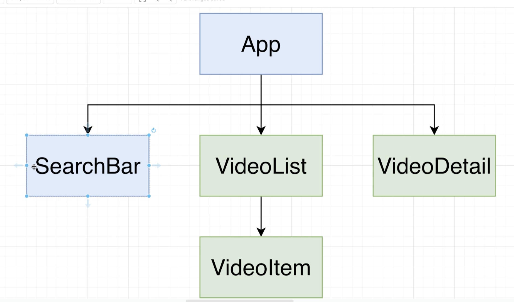

## Rebuild the Youtube Videos App with Hooks


- copy videos project, change name to **videos-hooks**

---

### Refactor the SearchBar





- Remember, Use effect is usually inside of a function component to kind of simulate the use of a lifecycle method.


- searchBar


```js
// Putting it ALL Together
import React, { useState } from 'react';

const SearchBar = ({ onFormSubmit }) => {
    const [term, setTerm] = useState('');

    const onFunctionSubmit = (event) => {
        event.preventDefault();

        //TODO: Make sure we call
        //callback from parent component
        onFormSubmit(term);
    };

    return (
        <div className="search-bar ui segment">
            <form onSubmit={onFunctionSubmit} className="ui form">
                <div className='field'>
                    <label>Video Search</label>
                    <input type="text"
                        value={term}
                        onChange={(event) => setTerm(event.target.value)}
                    />
                </div>
            </form>
        </div>
    );
};

export default SearchBar;
```


- testing, still working

-----

## Refactor App.js


- let's use function component again


```js
//Defaulting Video Selection
import React, { useState, useEffect } from 'react';
import SearchBar from './SearchBar';
import youtube from '../apis/youtube';
import VideoList from './VideoList';
import VideoDetail from './VideoDetail';

const App = () => {
    const [videos, setVideos] = useState([]);
    const [selectedVideo, setSelectedVideo] = useState(null);

    useEffect(() => {
        onTermSubmit('buildings');
    }, []);

    const onTermSubmit = async (term) => {
        const response = await youtube.get('/search', {
            params: {
                q: term
            }
        });
        // console.log(response);
        setVideos(response.data.items);
        setSelectedVideo(response.data.items[0]);
    };

    const onVideoSelect = (video) => {
        setSelectedVideo(video);
    };

    return (
        <div className="ui container">
            <SearchBar onFormSubmit={onTermSubmit} />
            <div className="ui grid">
                <div className="ui row">
                    <div className="eleven wide column">
                        <VideoDetail video={selectedVideo} />
                    </div>
                    <div className="five wide column">
                        <VideoList
                            onVideoSelect={onVideoSelect}
                            videos={videos}
                        />
                    </div>

                </div>
            </div>
        </div>
    );
};

export default App;
```


-----


## Removing a callback


