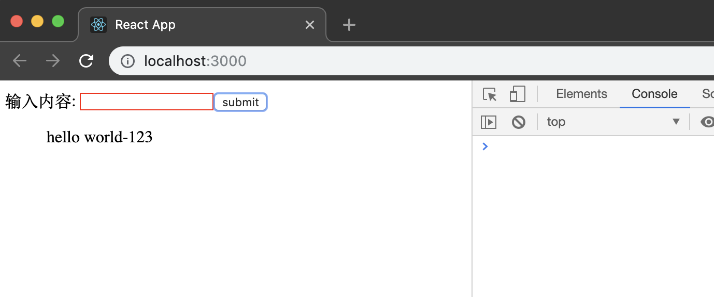
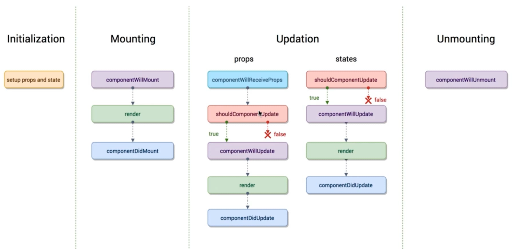
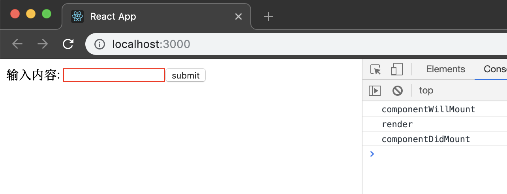
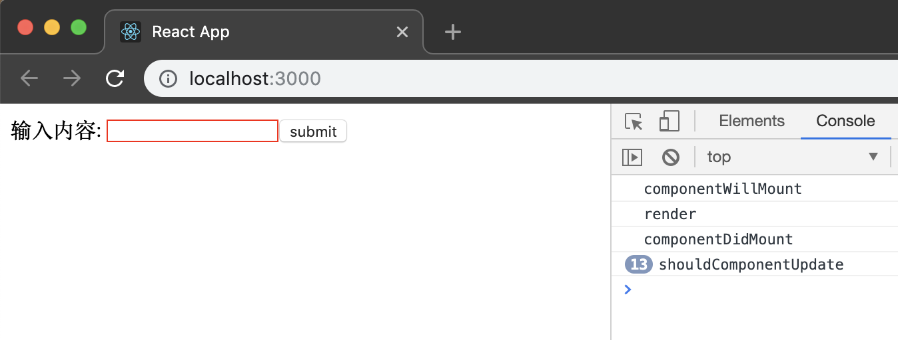
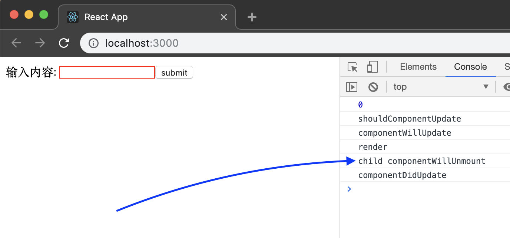
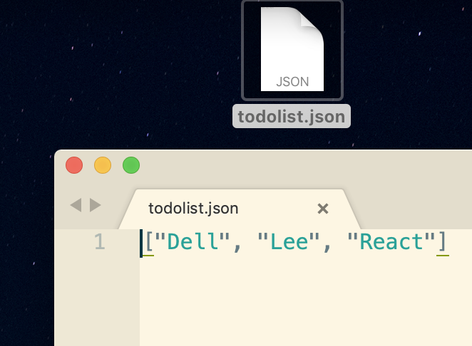
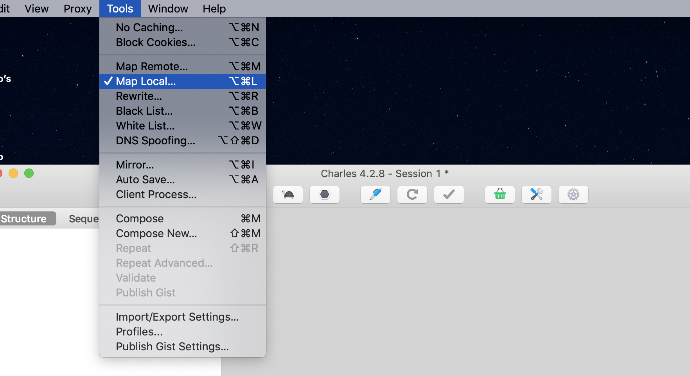
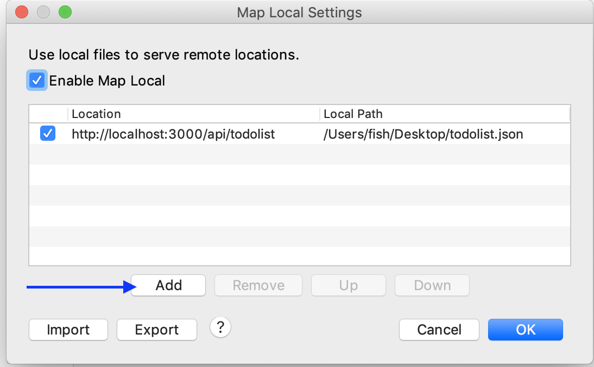
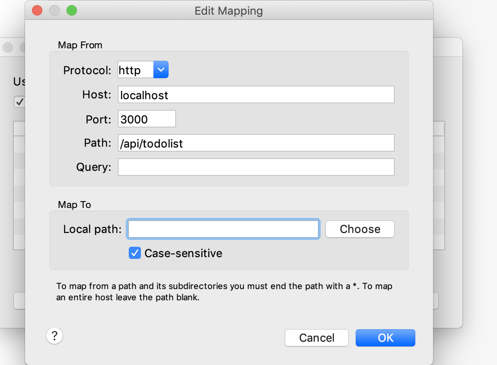
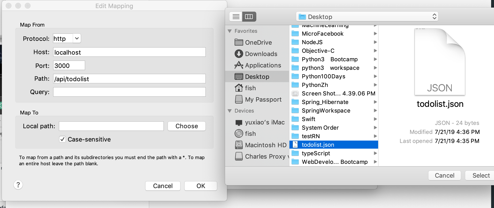

# 2. react Advanced

### `深入了解虚拟DOM`


### `React中ref的使用`

- 原先的PropTypes, 

```js
TodoItem.propTypes = {
    test: PropTypes.string.isRequired,
    content: PropTypes.oneOfType(PropTypes.number, PropTypes.string),
    itemDelete: PropTypes.func,
    index: PropTypes.number
}
```
- content 可以是number, 也可以是string

`updating TodoList.js`

```js
    handleInputChange = (e) => {
        console.log(e.target);
        this.setState({
            inputValue: e.target.value
        })

    }
```


- `e.target`我们可以看到打印出了节点

### `我们也可以用ref`

- 在es6中 我们可以用ref 等于一个箭头函数

`updating TodoList`

```js
    render() {
        return (
            <Fragment>
                <div>
                    <label htmlFor="insertArea">输入内容: </label>
                    <input
                        id="insertArea"
                        className='input'
                        value={this.state.inputValue}
                        // onChange={this.handleInputChange.bind(this)}
                        onChange={this.handleInputChange}
                        ref={(tempInput) => { this.input = tempInput }}
                    />
                    <button onClick={this.handleBtnClick}>submit</button>
                </div>
                <ul>
                    {this.getTodoItem()}
                </ul>
            </Fragment>
        )
    }

//*************************************
    handleInputChange = () => {
        // console.log(e.target);
        this.setState({
            inputValue: this.input.value
        })

    }
```



- still working


### `react中的生命周期函数`



- 生命周期函数在某一时刻组件会自动调用执行的函数

- render() 就是一个生命周期函数

- `componentWillMount and componentDidMount` 也是一个

`TodoList added a componentWillMount`

```js
    // //在组件即将被挂载到页面的时刻自动执行（还没挂载）
    componentWillMount() {
        console.log('componentWillMount');
    }

    //组件被挂载到页面之后，自动被执行
    componentDidMount() {
        console.log('componentDidMount')
    }


    render() {
        console.log('render');
        return (
            <Fragment>
        ...
        ...
        ...
```



- 很明显 componentWillMount 在render() 之前被执行

```js
    //组件被更新之前，会自动被执行
    shouldComponentUpdate = () => {
        console.log('shouldComponentUpdate')
        return true;
    }
```

- `组件会被更新`


```js
    //组件被更新之前，会自动被执行
    shouldComponentUpdate = () => {
        console.log('shouldComponentUpdate')
        return false;
    }
```

- `组件不会被更新`



```js
//组件被更新之前，它会自动执行，但是他在shouldComponentUpdate之后被执行，
    //如果shouldComponentUpdate 返回true， 它才被执行
    //如果return false， 这个函数就不会被执行
    componentWillUpdate = () => {
        console.log('componentWillUpdate')
    }
```


```js
    //组件更新完成之后，它会被执行
    componentDidUpdate = () => {
        console.log('componentDidUpdate');
    }
```


- 现在来看 `componentWillReceiveProps`函数，由于`TodoList`是parent, 所以无法接收Props, 
  这也就意味着`componentWillReceiveProps`无法被执行

```js
    //当一个组件要从parent接收参数，
    //只要父组件的render() 被重新执行了，子组件的这个生命周期函数就会被执行
    //如果这个组件第一次存在于父组件中，不会被执行
    //如果这个组件之前已经存在于父组件中，才会被执行
    componentWillReceiveProps = () => {
        console.log('child componentWillReceiveProps')
    }
```

- componentWillUnmount

```JS
    //当这个组件即将被从页面中剔除的时候，会被执行
    componentWillUnmount = () => {
        console.log('child componentWillUnmount');
    }
```





### `react 生命周期函数的使用场景`

`现在精简一下代码，恢复到没有添加周期函数之前`

```js
//TodoList
//生命周期使用场景

//import React from 'react';
import React, { Component, Fragment } from 'react';
import './style.css';
import TodoItem from './TodoItem';

class TodoList extends Component {

    constructor(props) {
        super(props);
        //when the component's state or props are changing, render() function will reset
        this.state = {
            inputValue: '',
            list: []
        }
    }
    handleInputChange = () => {
        // console.log(e.target);
        this.setState({
            inputValue: this.input.value
        })

    }
    handleBtnClick = () => {
        this.setState({
            list: [...this.state.list, this.state.inputValue],
            inputValue: ''
        })
    }
    handleItemDelete = (index) => {
        const templist = [...this.state.list];
        templist.splice(index, 1);
        this.setState({
            list: templist
        })
        console.log(index);
    }
    getTodoItem = () => {
        return (
            this.state.list.map((item, index) => {
                return (
                    <TodoItem
                        key={index}
                        content={item}
                        index={index}
                        // itemDelete={this.handleItemDelete.bind(this)}
                        itemDelete={this.handleItemDelete}
                    />
                )
            })
        )
    }

    render() {
        return (
            <Fragment>
                <div>
                    <label htmlFor="insertArea">输入内容: </label>
                    <input
                        id="insertArea"
                        className='input'
                        value={this.state.inputValue}
                        // onChange={this.handleInputChange.bind(this)}
                        onChange={this.handleInputChange}
                        ref={(tempInput) => { this.input = tempInput }}
                    />
                    <button onClick={this.handleBtnClick}>submit</button>
                </div>
                <ul>
                    {this.getTodoItem()}
                </ul>
            </Fragment>
        )
    }
}
export default TodoList;


//生命周期函数使用场景
import React, { Component } from 'react';
import PropTypes from 'prop-types';

class TodoItem extends Component {
    constructor(props) {
        super(props);
        this.handleClick = this.handleClick.bind(this);
    }
    handleClick = () => {
        const { itemDelete, index } = this.props;
        itemDelete(index);
    }

    render() {
        const { content } = this.props;
        return (
            <div onClick={this.handleClick}>
                {content}
            </div>
        )
    }
}
TodoItem.propTypes = {

    content: PropTypes.oneOfType([PropTypes.number, PropTypes.string]),
    itemDelete: PropTypes.func,
    index: PropTypes.number
}

export default TodoItem;
```

### `每一次父组件的state发生变化 => render() 重新渲染，紧接着子组件的render()也重新渲染，这样就造成了性能损耗，假如不希望性能损耗，可以调用 生命周期函数`

`updating TodoItem.js`

```js
    shouldComponentUpdate = (nextProps, nextState) => {
        if (nextProps.content !== this.props.content) {
            return true;
        } else {
            return false;
        }
    }
```
- 添加`shouldComponentUpdate`这个函数，可以停止子组件不断更新


### `ajax请求 的放置位置`

- 那如何在 react 里放置ajax请求呢，（react并不像jQuery那样帮我们封装了ajax请求）

- 这里我们可以引进一个module: axios 

`npm add axios`

- 在TodoList.js 下

`import axios from 'axios';`    

`TodoList.js`

```js
    componentDidMount = () => {
        axios.get('/api/todolist')     //这里的地址随便写
            .then(() => { alert('success') })
            .catch(() => { alert('error') })
    }
```


### `使用 charles 进行接口数据模拟`

- 先去charles 官网下载安装包 => 安装

- 现在desktop 配置一个.json 文件



- 然后安装流程配置







### `React中CSS过渡动画`

### `现在删除 todolist.js todoItem.js`

`altering index.js`

```js
import React from 'react';
import ReactDOM from 'react-dom';
import App from './App';

ReactDOM.render(<App />, document.getElementById('root'));
```

`added App.js`

```js
import React, { Component, Fragment } from 'react';
import './style.css';
class App extends Component {
    constructor(props) {
        super(props);
        this.state = {
            show: true
        }
    }
    render() {
        return (
            <Fragment>
                <div className={this.state.show ? 'show' : 'hide'}>Hello</div>
                <button onClick={this.handleToggle}>toggle</button>
            </Fragment>
        )

    }

    handleToggle = () => {
        this.setState({
            show: this.state.show ? false : true
        })
    }
}
export default App;
```

`adding a style.css`

```css
.show{
    opacity: 1;
    transition: all 1s ease-in;
}
.hide{
    opacity: 0;
    transition: all 1s ease-in;
}
```


### `css动画效果`

`style.css`

```css
.show{
    animation: show-item 2s ease-in forwards;
}
.hide{
    animation: hide-item 2s ease-in forwards;
}

@keyframes show-item{
    0%{
        opacity: 0;
        color:red;
    }
    50%{
        opacity: 0.5;
        color: green;
    }
    100%{
        opacity: 1;
        color: blue;
    }
}

@keyframes hide-item{
    0%{
        opacity: 1;
        color:red;
    }
    50%{
        opacity: 0.5;
        color: green;
    }
    100%{
        opacity: 0;
        color: blue;
    }
}
```


### `使用 react-transition-group 实现动画`

- 我们先添加 react-transition-group module

- github 上搜索 react-transition-group

[react-transition-group](https://reactcommunity.org/react-transition-group/)

```ruby
# npm
npm install react-transition-group --save
```

- 点击 `CSSTransition`


`import { CSSTransition } from 'react-transition-group';`

- CSSTransition 实际上是一个动画组件

- 当我们使用 CSSTransition 组件，我们就不需要自己添加移除样式

- 我们可以清除style.css 的样式，因为 CSSTransition 组件可以帮我们做我们想做的工作

### `在官方文档有这些预留的class name:`

```ruby
fade-appear, fade-appear-active, fade-appear-done, fade-enter, fade-enter-active, fade-enter-done, fade-exit,  fade-exit-active, and fade-exit-done
```

- 我们可以更改前缀的名字，操纵 clasNames赋值

- `第一次，我们先让 classNames = 'fade'`

- 现在我们开始更新代码：

```js
import { CSSTransition } from 'react-transition-group';
import './style.css';
class App extends Component {
    constructor(props) {
        super(props);
        this.state = {
            show: true
        }
    }
    render() {
        return (
            <Fragment>
                <CSSTransition
                    in={this.state.show}
                    timeout={1000}
                    classNames='fade'
                >
                    <div>Hello</div>
                </CSSTransition>
                <button onClick={this.handleToggle}>toggle</button>
            </Fragment>
        )

    }

    handleToggle = () => {
        this.setState({
            show: this.state.show ? false : true
        })
    }
}
```

`style.css`

```css
/* fade-appear 应对 appear={true} */
.fade-enter, .fade-appear{
    opacity: 0;
}

/* fade-appear-active 应对 appear={true} */
.fade-enter-active, .fade-appear-active{
    opacity: 1;
    transition: opacity 1s ease-in;
}

.fade-enter-done{
    opacity: 1;
}

.fade-exit{
    opacity: 1;
}

.fade-exit-active{
    opacity: 0;
    transition: opacity 1s ease-in;
}

.fade-exit-done{
    opacity: 0;
}
```

### `以上我们通过react组件 实现了渐退 渐进 功能，但是目前看并没有比原先css3简单多少，但是我们通过组件可以实现以前js无法实现的新功能`

- for example:

- 我们可以增加 unmountOnExit 功能，以及钩子函数（当一个事件结束时), appear={true} 具体可以查阅官方文档

```js
    render() {
        return (
            <Fragment>
                <CSSTransition
                    in={this.state.show}
                    timeout={1000}
                    classNames='fade'
                    unmountOnExit
                    onEntered={(el) => { el.style.color = 'blue' }}
                    appear={true}
                >
                    <div>Hello</div>
                </CSSTransition>
                <button onClick={this.handleToggle}>toggle</button>
            </Fragment>
        )

    }
```


### `到目前为止，我们只能针对一个dom元素做切换， 我们希望可以针对多个dom元素进行切换`

- import TransitionGroup

- <TransitionGroup> 写在所有react 组件外部

```js
//react-transition-group 的使用（2）

import React, { Component, Fragment } from 'react';
import { CSSTransition, TransitionGroup } from 'react-transition-group';
import './style.css';
class App extends Component {
    constructor(props) {
        super(props);
        this.state = {
            list: []
        }
    }
    render() {
        return (

            <Fragment>
                <TransitionGroup>
                    {
                        this.state.list.map((item, index) => {
                            return (
                                <CSSTransition
                                    timeout={1000}
                                    classNames='fade'
                                    unmountOnExit
                                    onEntered={(el) => { el.style.color = 'blue' }}
                                    appear={true}
                                    key={index}
                                >
                                    <div>{item}</div>
                                </CSSTransition>

                            )
                        })
                    }
                    <button onClick={this.handleAddItem}>toggle</button>
                </TransitionGroup>
            </Fragment>
        )

    }

    handleAddItem = () => {
        this.setState((prevState) => {
            return { list: [...prevState.list, 'item'] }
        })
    }
}
export default App;
```

- css 用前面的代码，依然不变，效果一样


### `到这里，react的基础算是过了一遍，接下来： Redux概念简述`