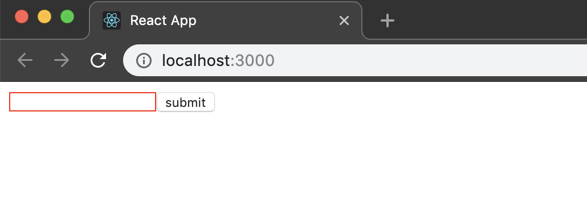
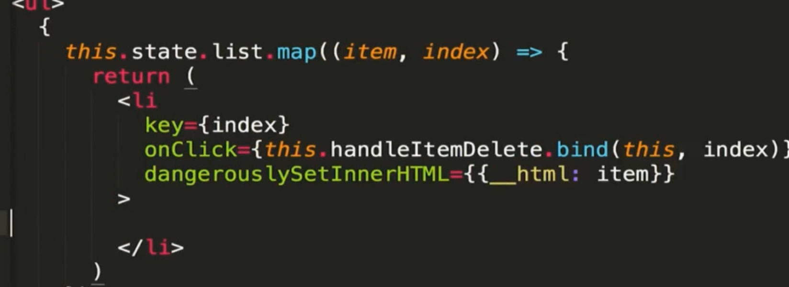
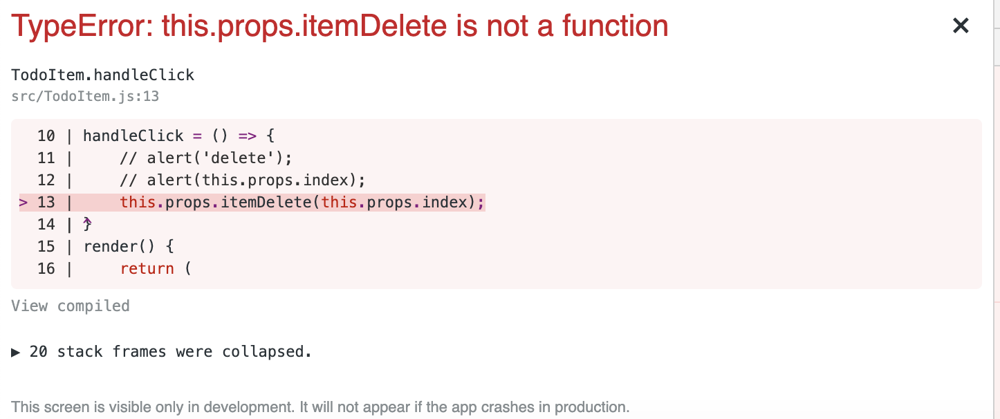

# Chapter5：React

### `index.js`

- 全部文件的入口

```js

//jsx syntax
ReactDOM.render(<App />, document.getElementById('root'));
```

### `if we using jsx syntax, we must import React`

```js
import React from 'react';
```

### `<App />` 在引入组件时候，第一个字母必须大写


### `Now implementing a toDo-list functioning`

- we hope to import a our own component

    1. delete App.js

    2. create a TodoList component

`updating the index.js`

```js
import React from 'react';
import ReactDOM from 'react-dom';
import './index.css';
import TodoList from './TodoList';
import * as serviceWorker from './serviceWorker';

ReactDOM.render(<TodoList />, document.getElementById('root'));
```

- now we creating a todolist component

```js
import React from 'react';
//or:  import React, {Component} from 'react';
class TodoList extends React.Component {
    render() {
        return (
            <div><input /><button>提交</button></div>
            <ul>
                <li>study English</li>
                <li>lea</li>
                <li>学英语</li>
            </ul>
        )
    }
}
export default TodoList;
```


- 这里提示错误，因为render -> return 的组件必须包含在一个大的 container

```js
import React from 'react';
//or:  import React, {Component} from 'react';
class TodoList extends React.Component {
    render() {
        return (
            <div>
                <div><input /><button>提交</button></div>
                <ul>
                    <li>study English</li>
                    <li>learning React</li>
                </ul>
            </div>
        )
    }
}
export default TodoList;
```


- 但是如果我们希望用一个 container 包裹，同时在element里又不被显示

```js
import React, { Component, Fragment } from 'react';
class TodoList extends Component {
    render() {
        return (
            <Fragment>
                <div><input /><button>提交</button></div>
                <ul>
                    <li>学英语</li>
                    <li>learning React</li>
                </ul>
            </Fragment>
        )
    }
}
export default TodoList;
```


### `React 中的响应式设计思想和事件绑定`

- 我们希望点击提交按钮，可以现实添加一个新条目

- create a constructor

- add a state

```js
import React from 'react';
//or:  import React, {Component} from 'react';
class TodoList extends React.Component {

    constructor(props) {
        super(props);
        this.state = {
            inputValue: '',
            list: []
        }
    }
    render() {
        return (
            <div>
                <div>
                    <input
                        value={this.state.inputValue}
                        onChange={this.handleInputChange}
                    />
                    <button>submit</button>
                </div>
                <ul>
                    <li>study English</li>
                    <li>learning React</li>
                </ul>
            </div>
        )
    }
}
export default TodoList;
```

- adding a on change event

- implemented a handleInputChange() function

```js
    handleInputChange(e) {
        console.log(e.target.value);
    }
```


- 现在可以看到console's content, but we still can't see the reponse on the browser

- if we hope to change the input's value on the browser, we should alter the `state`

```js
    handleInputChange(e) {
        this.state.inputValue = e.target.value;
    }
```


`here's an error => undefined, add a console.log(this)`

```js
    handleInputChange(e) {
        console.log(this);
        // this.state.inputValue = e.target.value;
    }
```
- we can see the `undefined` on the console

### `we can use the ES6's function bind(), and setState to change the inputValue`

```js
    handleInputChange(e) {
        this.setState({
            inputValue: e.target.value
        })  
    }

    render() {
        return (
            <div>
                <div>
                    <input
                        value={this.state.inputValue}
                        onChange={this.handleInputChange.bind(this)}
                    // onChange={this.handleInputChange}
                    />
                    <button>submit</button>
                </div>
                <ul>
                    <li>study English</li>
                    <li>learning React</li>
                </ul>
            </div>
        )
    }
```


## `if we don't want to use bind(), we can use ES6 arrow function`

```js
    handleInputChange = (e) => {
        this.setState({
            inputValue: e.target.value
        })
    }

/* ****************************************** */
    render() {
        return (
            <div>
                <div>
                    <input
                        value={this.state.inputValue}
                        // onChange={this.handleInputChange.bind(this)}
                        onChange={this.handleInputChange}
                    />
                    <button>submit</button>
                </div>
                <ul>
                    <li>study English</li>
                    <li>learning React</li>
                </ul>
            </div>
        )
    }
```

### `现在来实现添加事件`
`但我们先回顾一下 constructor's content`
```js
    constructor(props) {
        super(props);
        this.state = {
            inputValue: '',
            list: []
        }
    }
```

- we have a array  `list: []`

- now we can altering the ul's child element

```js
import React, { Component, Fragment } from 'react';
class TodoList extends Component {
    constructor(props) {
        super(props);
        this.state = {
            inputValue: '',
            list: []
        }
    }
    render() {
        return (
            <Fragment>
                <div>
                    <input
                        value={this.state.inputValue}
                        onChange={this.handleInputChange}
                    />
                    <button onClick={this.handleBtnClick}>提交</button></div>
                <ul>
                    {
                        this.state.list.map((item, index) => {
                            return <li key={index}>{item}</li>
                        })
                    }
                </ul>
            </Fragment>
        )
    }

    handleInputChange = (e) => {
        this.setState({
            inputValue: e.target.value
        })
    }
    handleBtnClick = () => {
        this.setState({
            list: [...this.state.list, this.state.inputValue],
            inputValue: ''
        })
    }
}
export default TodoList;
```

`index.js`

```js
import React from 'react';
import ReactDOM from 'react-dom';
import TodoList from './TodoList';

ReactDOM.render(<TodoList />, document.getElementById('root'));
```
- we have imported `TodoList` component
- therefore, we can implement adding functioning


### `added handle button click event`

```js
    handleBtnClick() {
        this.setState({
            list: [...this.state.list, this.state.inputValue]
        })
    }
```


- we should clear the input text filed's value:
```js
    handleBtnClick = () => {
        this.setState({
            list: [...this.state.list, this.state.inputValue],
            inputValue: ''
        })
    }
```
### `但是我们依然还有一个问题： 我们必须给每一个map的元素 添加一个key, 尽管这只是一个警告`


- so we should add a key to li element

```js
                <ul>
                    {
                        this.state.list.map((item, index) => {
                            return <li key={index}>{item}</li>
                        })
                    }
                </ul>
```

### `实际上用index作为key， 是一个不好的行为，但是我们暂时先这么做`

###  `now we hope to delete every corresponding li element, when we clicking the remove btn`
  
    1. binding a onClick event with li elment
  
    2. a handleItemDelete function binding this and corresponding index

```js
    handleItemDelete = (index) => {
        const templist = [...this.state.list];
        templist.splice(index, 1);
        this.setState({
            list: templist
        })
        // console.log(index);
    }
    render() {
        return (
            <div>
                <div>
                    <input
                        value={this.state.inputValue}
                        // onChange={this.handleInputChange.bind(this)}
                        onChange={this.handleInputChange}
                    />
                    <button onClick={this.handleBtnClick}>submit</button>
                </div>
                <ul>
                    {
                        this.state.list.map((item, index) => {
                            return (
                                <li
                                    key={index}
                                    onClick={this.handleItemDelete.bind(this, index)}
                                >
                                    {item}
                                </li>
                            )
                        })
                    }
                </ul>
            </div>
        )
    }
```


### `也许到这里，有人会有疑问 可以简化 .splice(index,1)`

```js
    handleItemDelete = (index) => {
        this.state.list.splice(index, 1);
        this.setState({
            list: this.state.list
        })
    }
```

- **Warning!** `这样做也可以，但是这不是推荐的办法，这样使用是错误的`

- react， 有一个 inmutable mechanism

- state, 不允许我们直接去修改this.state里的内容


### `还记得我们之前提过在，render() 里， 最外层都有一个容器包裹着`

- `<Fragment>`(first capital letter) 是JSX里的一个组件 我们也可以将最外层的`<div>`给替代掉：

```js
render() {
        return (
            <Fragment>  
                <div>
                    <input
                        value={this.state.inputValue}
                        // onChange={this.handleInputChange.bind(this)}
                        onChange={this.handleInputChange}
                    />
                    <button onClick={this.handleBtnClick}>submit</button>
                </div>
        ...
            ...
                ...
```

### `现在我们尝试给 input text filed 增加样式`

`style.css`

```css
.input{
    border: 1px solid red;
}
```

- import a style.css

`TodoList.js`

```js
import './style.css';
```
- 然后我们给 input 增加一个 class, 在JSX里 叫className

```js
                <div>
                    <input
                        className='input'
                        value={this.state.inputValue}
                        // onChange={this.handleInputChange.bind(this)}
                        onChange={this.handleInputChange}
                    />
                    <button onClick={this.handleBtnClick}>submit</button>
                </div>
```



- if we input `<h1>hello world</h1>`, 我们不希望它被转译:




### `有时候我们希望给input 增加一个label, 在html中它的作用是绑定到text(扩大作用域):`

```html
                <div>
                    <label for="insertArea">输入内容: </label>
                    <input
                        id="insertArea"
                        className='input'
                        value={this.state.inputValue}
                        // onChange={this.handleInputChange.bind(this)}
                        onChange={this.handleInputChange}
                    />
```

### `但是由于，react里是jsx语法，所以我们用 htmlFor, 这是因为在.js 里如果用for 会和for语句产生歧义`


### `拆分组件与组件之间的传值`


- 我们希望可以把每一个li元素拆分成小组件

- create a TodoItem.js

```js
import React from 'react';

class TodoItem extends React.Component {
    reander() {
        return <div>item</div>
    }
}
export default TodoItem;
```

- 然后我们在TodoList.js 里， import TodoItem

```js
import TodoItem from './TodoItem';
```

- 现在我可以 comment `list.map() 里的li attribute`

```js
    render() {
        return (
            <div>
                <div>
                    <label htmlFor="insertArea">输入内容: </label>
                    <input
                        id="insertArea"
                        className='input'
                        value={this.state.inputValue}
                        // onChange={this.handleInputChange.bind(this)}
                        onChange={this.handleInputChange}
                    />
                    <button onClick={this.handleBtnClick}>submit</button>
                </div>
                <ul>
                    {
                        this.state.list.map((item, index) => {
                            return (
                                <TodoItem />
                                {/* <li
                                    key={index}
                                    onClick={this.handleItemDelete.bind(this, index)}
                                    dangerouslySetInnerHTML={{ __html: item }}
                                >
                                </li> */}
                            )
                    })
                }
                </ul>
            </div>
        )
    }
```

- 但是这样做: this.state.list.map() 会把 `<TodoItem />`组件，以及{...} 当成两个内容来for loop


- 所以我们可以在两个组件外围包裹一个 <div></div> container

```js
                <ul>
                    {
                        this.state.list.map((item, index) => {
                            return (
                                <div>
                                    <TodoItem />
                                    {/* <li
                                    key={index}
                                    onClick={this.handleItemDelete.bind(this, index)}
                                    dangerouslySetInnerHTML={{ __html: item }}
                                >
                                </li> */}
                                </div>
                            )
                        })
                    }
                </ul>
```

- 但现在 Toditem 组件里的内容 `<div>Item</div>` 是固定的

- 我们希望可以改变div里的内容

- we assign `{item}` to the TodoItem

```js
                <ul>
                    {
                        this.state.list.map((item, index) => {
                            return (
                                <div>
                                    <TodoItem content={item}/>
                                </div>
                            )
                        })
                    }
                </ul>
``` 

- parent conponent pass data into child component

```js
class TodoItem extends React.Component {
    render() {
        return <div>{this.props.content}</div>
    }
}
```


### `但是现在我们又无法删除新增加的 item`

- 由于我们新添加的item是 chilid component TodoItem 所渲染， 因为给它绑定事件

```js
import React from 'react';
class TodoItem extends React.Component {
    handleClick = () => {
        // alert('delete');
        
    }
    render() {
        return <div onClick={this.handleClick}>{this.props.content}</div>
    }
}
export default TodoItem;
```

### `如果我们希望修改 parent component's list[] 数据, 实际上不允许子组件直接去修改parent's content`

- 但是我们依然可以通过 parent passing data into child component, even, we can passing the index to the chiild component

`TodoList.js`

```js
                <ul>
                    {
                        this.state.list.map((item, index) => {
                            return (
                                <div>
                                    <TodoItem content={item} index={index}/>
                                </div>
                            )
                        })
                    }
                </ul>
``` 

### 现在我们可以重复之前的固定模式， creating a constructor for child component

```js
class TodoItem extends Component {
    constructor(props) {
        super(props);
        this.handleClick = this.handleClick;
        // this.handleClick = this.handleClick.bind(this);
    }

    handleClick = () => {
        // alert('delete');
        alert(this.props.index);
    }
    render() {
        return (
            <div onClick={this.handleClick}>
                {this.props.content}
            </div>
        )
    }
}
```


- 现在我们已经可以获得从parent 获得的index

- 现在子组件如何调用parent's handleItemDelete method? passing this method to the child component

`TodoList.js`

```js
                <ul>
                    {
                        this.state.list.map((item, index) => {
                            return (
                                <div>
                                    <TodoItem
                                        content={item}
                                        index={index}
                                        itemDelete={this.handleItemDelete}
                                    />
                                </div>
                            )
                        })
                    }
                </ul>
```

- now inside child component we call the function `handleItemDelete` which we receive from parent;

`TodoItem.js`

```js
class TodoItem extends Component {
    constructor(props) {
        super(props);
        this.handleClick = this.handleClick;
        // this.handleClick = this.handleClick.bind(this);
    }

    handleClick = () => {
        // alert('delete');
        // alert(this.props.index);
        this.props.itemDelete(this.props.index);
    }
    render() {
        return (
            <div onClick={this.handleClick}>
                {this.props.content}
            </div>
        )
    }
}
```


- there is an error, the reason is that todoItem's this pointer cannot point to parent's handleItemDelete function

- So we need to pass parent's handleItemDelete

`TodoList.js`
```js
                <ul>
                    {
                        this.state.list.map((item, index) => {
                            return (
                                <div>
                                    <TodoItem
                                        content={item}
                                        index={index}
                                        itemDelete={this.handleItemDelete.bind(this)}
                                    />
                                </div>
                            )
                        })
                    }
                </ul>
```

- Thus, inside parent, we call the bind(this) function to bind the parent' handleItemDelete,
  then we passing this function to child component

###  `现在我们已经实现了删除的功能`

###  `总结： 如果child component 想要调用 parent's function, 务必要对函数进行this绑定`


---

### `现在我们将对代码进行优化`

`TodoList.js`

```js
//import React from 'react';
import React, { Component, Fragment } from 'react';
import './style.css';
import TodoItem from './TodoItem';
class TodoList extends Component {

    constructor(props) {
        super(props);
        this.state = {
            inputValue: '',
            list: []
            // list: ['Html', 'Css', 'javascript', 'bootstrap', 'jQuery']
        }
    }
    handleInputChange = (e) => {
        this.setState({
            inputValue: e.target.value
        })

    }
    handleBtnClick = () => {
        this.setState({
            list: [...this.state.list, this.state.inputValue],
            inputValue: ''
        })
    }
    handleItemDelete = (index) => {
        const templist = [...this.state.list];
        templist.splice(index, 1);
        this.setState({
            list: templist
        })
        console.log(index);
    }
    getTodoItem = () => {
        return (
            this.state.list.map((item, index) => {
                return (
                    <TodoItem
                        key={index}
                        content={item}
                        index={index}
                        // itemDelete={this.handleItemDelete.bind(this)}
                        itemDelete={this.handleItemDelete}
                    />
                )
            })
        )
    }
    render() {
        return (
            <Fragment>
                <div>
                    <label htmlFor="insertArea">输入内容: </label>
                    <input
                        id="insertArea"
                        className='input'
                        value={this.state.inputValue}
                        // onChange={this.handleInputChange.bind(this)}
                        onChange={this.handleInputChange}
                    />
                    <button onClick={this.handleBtnClick}>submit</button>
                </div>
                <ul>
                    {this.getTodoItem()}
                </ul>
            </Fragment>
        )
    }
}
export default TodoList;
```

`TodoItem.js`

```js
import React, { Component } from 'react';
class TodoItem extends Component {
    constructor(props) {
        super(props);
        this.handleClick = this.handleClick.bind(this);
    }
    handleClick = () => {
        // alert('delete');
        // alert(this.props.index);
        const { itemDelete, index } = this.props;
        itemDelete(index);
        // this.props.itemDelete(this.props.index);
    }
    render() {
        const { content } = this.props;
        return (
            <div onClick={this.handleClick}>
                {content}
            </div>
        )
    }
}
export default TodoItem;
```

### `到这里，上面的功能实现正常(不在示意动图)，代码已经优化`


## `propTypes`

### `其作用是校对父组件传递的变量类型`

`TodoItem.js`

```js
import PropTypes from 'prop-types';
//先import 包

TodoItem.propTypes = {
    content: PropTypes.string,
    itemDelete: PropTypes.func,
    index: PropTypes.number
}
```

`完整代码`

```js
import React, { Component } from 'react';
import PropTypes from 'prop-types';

class TodoItem extends Component {
    constructor(props) {
        super(props);
        this.handleClick = this.handleClick.bind(this);
    }
    handleClick = () => {
        const { itemDelete, index } = this.props;
        itemDelete(index);
    }
    render() {
        const { content, test } = this.props;
        return (
            <div onClick={this.handleClick}>
                {test}-{content}
            </div>
        )
    }
}
TodoItem.propTypes = {
    test: PropTypes.string.isRequired,    //要求必须传递，并且是string类型
    content: PropTypes.string,
    itemDelete: PropTypes.func,
    index: PropTypes.number
}
export default TodoItem;
```


### `之所以报错，是因为propTypes 要求其必须传值并且是string, 解决办法是defaultProps`

```js
TodoItem.defaultProps = {
    test: 'hello world'
}
```


- 很明显已经不再报错


## `Props, State, and render() `

- when the component's state or props are changing, render() function will reset

- 页面是由reander 函数渲染


## `virtual DOM`

- state 数据

- jsx 模版

- 数据 + 模版 结合， 生成真实的dom， 来显示

- state 发生改变

- 数据 + 模版 结合， 生成真实的dom, 替换原始的dom

### `缺陷：`

- 第一次生成了一个完整的dom 片段

- 第二次生成了一个完整的dom 片段

- 第二次的dom替换成第一次的dom， 非常耗费性能

1. state 数据

2. jsx 模版

3. 数据 + 模版 结合， 生成真实的dom， 来显示

4. state 发生改变

5.  数据 + 模版 结合， 生成真实的dom， 并不直接替换原始的dom

6.  新的dom (DocumentFragment)和原始的dom 做对比，找差异

7.  找出input框发生的变化

8.  只用新的dom中的input元素，替换掉老的dom中的input元素

### `缺陷`

- 性能的提升并不明显

1. state 数据

2. jsx 模版

3. 数据 + 模版 结合， 生成真实的dom， 来显示

`<div id='abc'><span>hello world</span></div>`

4. 生成虚拟dom （虚拟dom就是一个js对象，用它来描述真实的dom）(损耗了性能)[实际上是用数组表述]

['div', {id: 'abc'},['span', {}, 'hello world']]

5. state 发生变化

6. 数据+模版 生成新的虚拟dom （极大的提升了性能）

['div', {id: 'abc'},['span', {}, 'Good morning']]

7. 比较原始虚拟dom 和 新的虚拟dom的区别，找到区别是span中的内容(极大提升性能)

8. 直接操作dom，改变span中的内容


