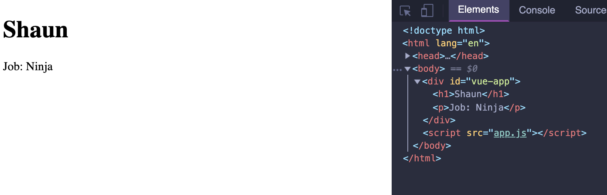
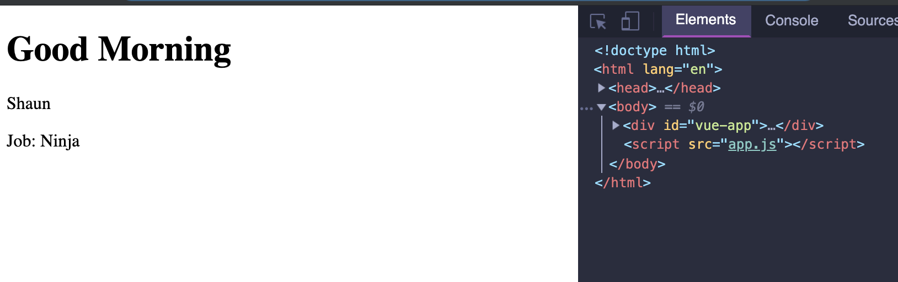
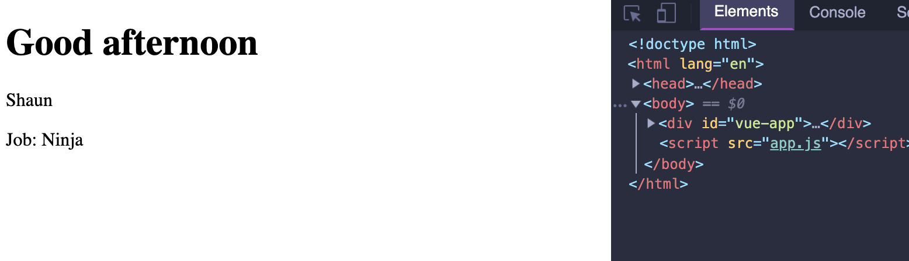
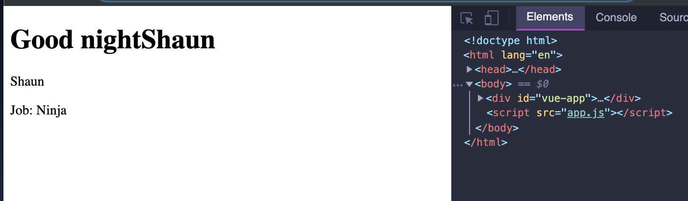

# 2. Data | Method

- update app.js

```js
new Vue({
    el: '#vue-app',
    data: {
        name: 'Shaun',
        job: 'Ninja'
    }
});
```

- update html

```html
<body>
    <div id="vue-app">
        <h1>{{name}}</h1>
        <p>Job: {{job}}</p>
    </div>

    <script src="app.js"></script>
</body>
```



- update html

```html
<body>
    <div id="vue-app">
        <h1>{{greet()}}</h1>
        <p>{{name}}</p>
        <p>Job: {{job}}</p>
    </div>

    <script src="app.js"></script>
</body>
```

- update app.js; add a new method

```js
new Vue({
    el: '#vue-app',
    data: {
        name: 'Shaun',
        job: 'Ninja'
    },
    methods: {
        greet: function () {
            return 'Good Morning'
        }
    }
});
```



## passing parameter into method
- html

```html
<body>
    <div id="vue-app">
        <h1>{{greet('afternoon')}}</h1>
        <p>{{name}}</p>
        <p>Job: {{job}}</p>
    </div>

    <script src="app.js"></script>
</body>
```

- app.js

```js
new Vue({
    el: '#vue-app',
    data: {
        name: 'Shaun',
        job: 'Ninja'
    },
    methods: {
        greet: function (time) {
            return 'Good ' + time;
        }
    }
});
```


## This reference to Vue

```js
new Vue({
    el: '#vue-app',
    data: {
        name: 'Shaun',
        job: 'Ninja'
    },
    methods: {
        greet: function (time) {
            return 'Good ' + time + ' ' + this.name;
        }
    }
});
```

