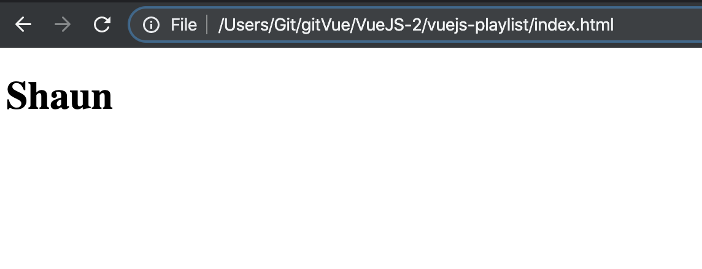
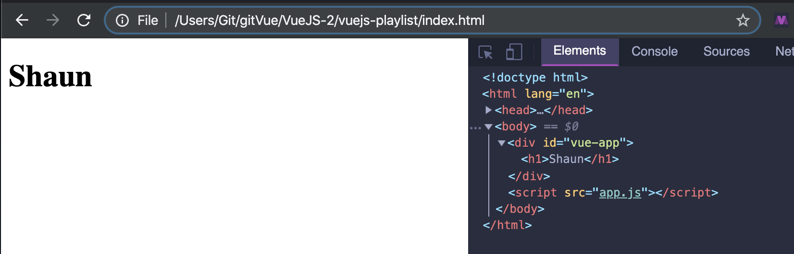

# 1. Instance

## guide
- https://vuejs.org/v2/guide/

- index.html

```html
<!DOCTYPE html>
<html lang="en">
<head>
    <meta charset="UTF-8">
    <meta name="viewport" content="width=device-width, initial-scale=1.0">
    <title>VueJS Tutorials</title>
    <link rel="stylesheet" href="styles.css">
    <script src="https://cdn.jsdelivr.net/npm/vue/dist/vue.js"></script>
</head>
<body>
    <div id="vue-app">
        <h1>{{name}}</h1>
    </div>

    <script src="app.js"></script>
</body>
</html>
```

- create app.js

```js
new Vue({
    el: '#vue-app',
    data: {
        name: 'Shaun'
    }
});
```



- we don't see {{name}} ,   we see `Shaun`