# 5. configure React environment

### install react

```js
npx create-react-app my-app
cd my-app
npm start
```

- create a folder `react-hooks`

- we focus on react-hooks

- npx directly call node_modules's .bin/

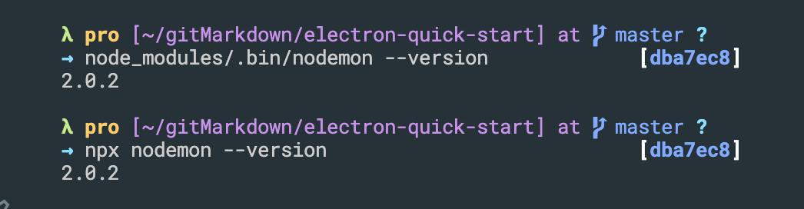

- cd react-hooks

- run `npm start`
---


### implement an example: calculate numbers of Like 👍

- create a new folder `components` inside src

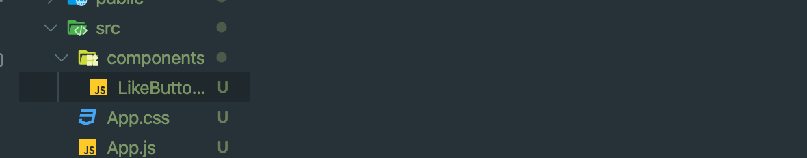  

- LikeButton.js

```js
import React, { useState } from 'react'
const LikeButton = () => {
    const [like, setLike] = useState(0);
    return (
        <button>
            {like} 👍
        </button>
    )
}
export default LikeButton;
```

- update App.js

```js
import React from 'react';
import logo from './logo.svg';
import './App.css';
import LikeButton from './components/LikeButton';

function App() {
  return (
    <div className="App">
      <header className="App-header">
        
        <LikeButton />
        <a
          className="App-link"
          href="https://reactjs.org"
          target="_blank"
          rel="noopener noreferrer"
        >
          Learn React
        </a>
      </header>
    </div>
  );
}

export default App;
```

- import LikeButton into App.js

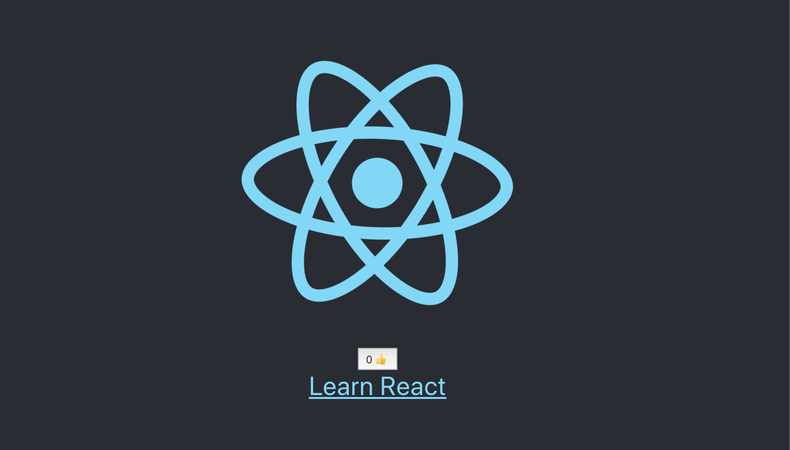
---

### adding a onClick event

```js
const LikeButton = () => {
    const [like, setLike] = useState(0);
    return (
        <button onClick={() => { setLike(like + 1) }}>
            {like} 👍
        </button>
    )
}
```

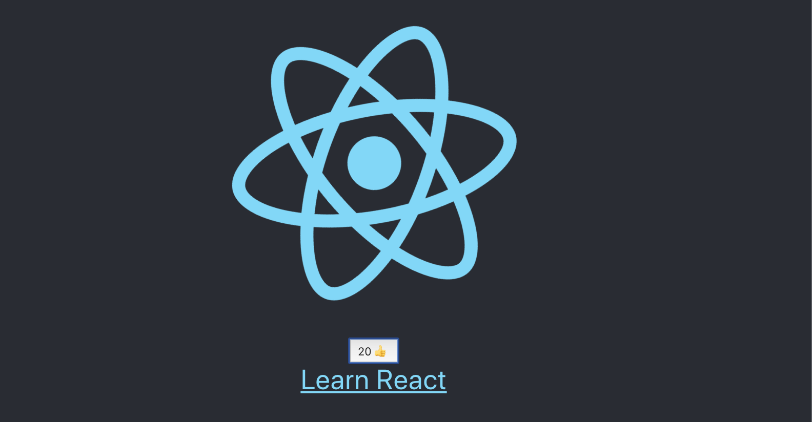

- the numbers of Like is 20

---

### Adding a switch buttons event

- LikeButton.js

```js
//Adding a switch buttons event
import React, { useState } from 'react'

const LikeButton = () => {
    const [like, setLike] = useState(0);
    const [on, setOn] = useState(true);
    return (
        <>
            <button onClick={() => { setLike(like + 1) }}>
                {like} 👍
            </button>
            <button onClick={() => { setOn(!on) }}>
                {on ? 'On' : 'Off'}
            </button>
        </>
    )
}

export default LikeButton;
```

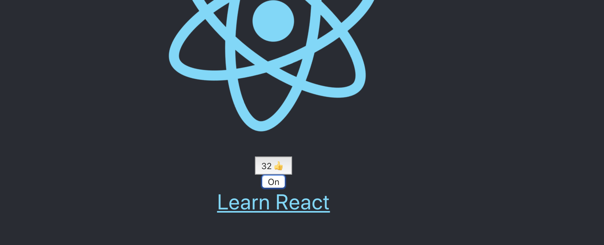
---

- 总结： useState, 它可以改变函数内组件状态,并且每次组件更新的时候，都记录这个状态值

---

## Effect Hook


## useEffect, 不需要清除的effect

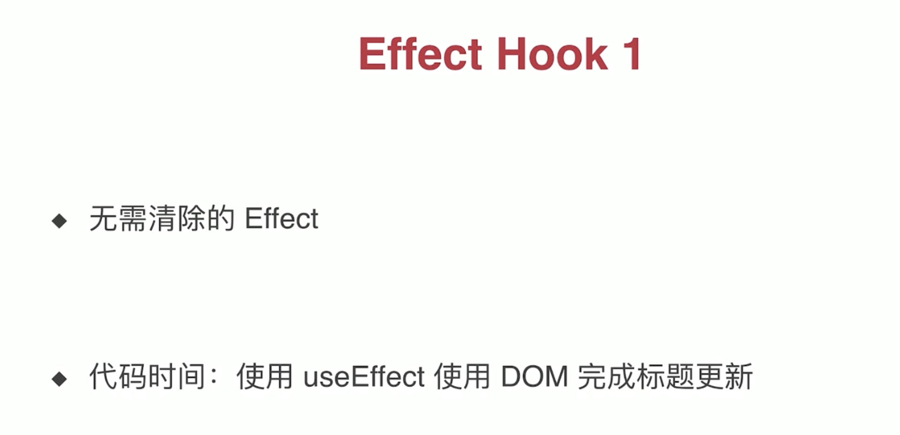
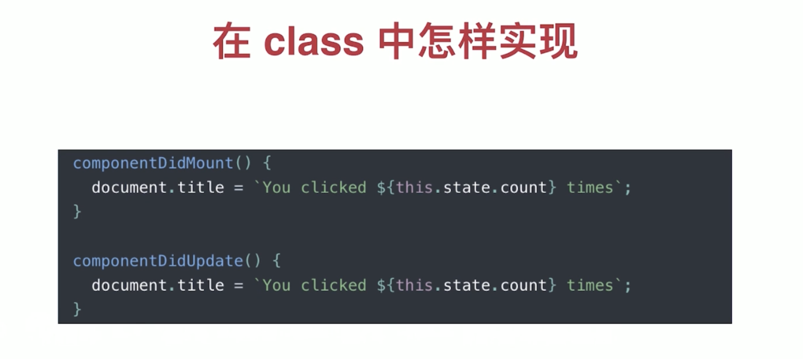

- update LikeButton.js

```js
//Adding a switch buttons event
import React, { useState, useEffect } from 'react'

const LikeButton = () => {
    const [like, setLike] = useState(0);
    const [on, setOn] = useState(true);
    useEffect(() => {
        document.title = `Clicked ${like} times`
    })
    return (
        <>
            <button onClick={() => { setLike(like + 1) }}>
                {like} 👍
            </button>
            <button onClick={() => { setOn(!on) }}>
                {on ? 'On' : 'Off'}
            </button>ls

        </>
    )
}

export default LikeButton;
```

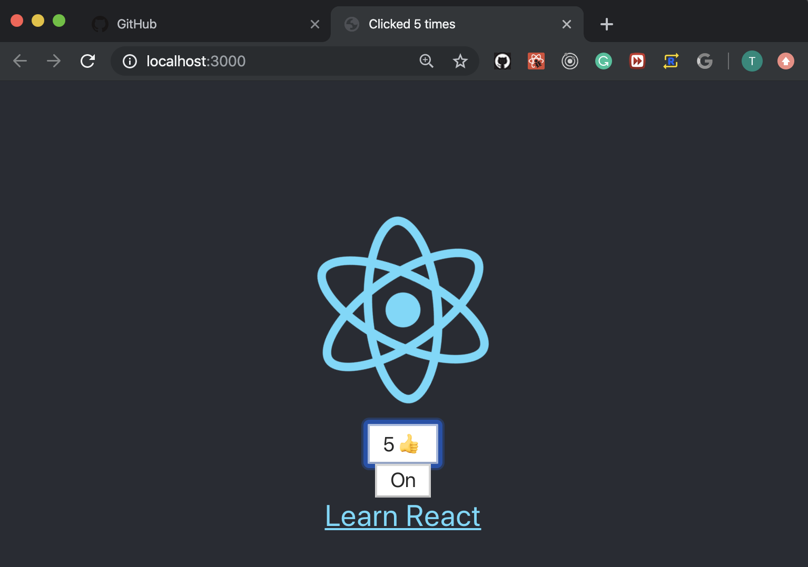
---

## 需要清除的useEffect()

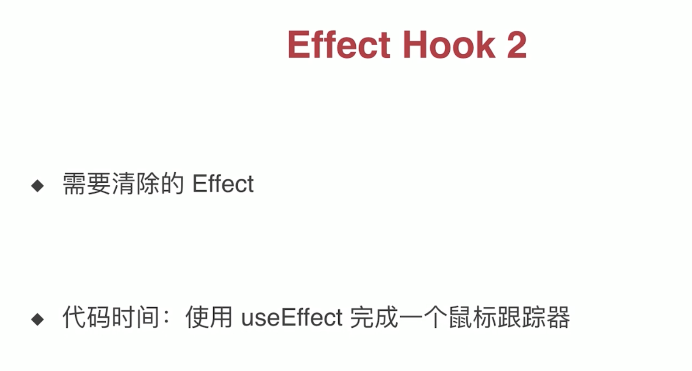
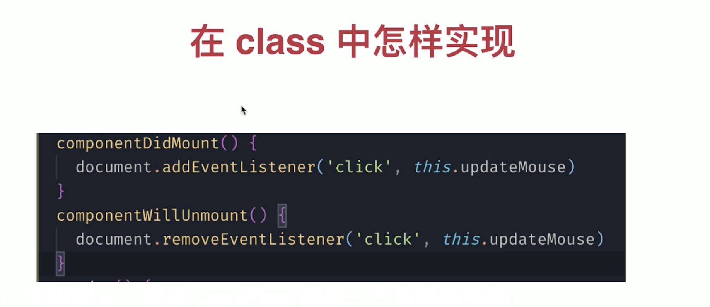

- create a MouseTracker.js into components foler

- create MouseTracker.js

```js
import React, { useState, useEffect } from 'react'

const MouseTracker = () => {
    const [positions, setPositions] = useState({ x: 0, y: 0 });
    useEffect(() => {
        const updateMouse = (event) => {
            console.log('inner');
            setPositions({ x: event.clientX, y: event.clientY });
        }
        console.log('add listener');
        document.addEventListener('click', updateMouse);
        return () => {
            console.log('remove listener');
            document.removeEventListener('click', updateMouse);
        }
    })
    return (
        <p>X:{positions.x}, Y:{positions.y}</p>
    )
}

export default MouseTracker;
```

- update App.js

```html
import React from 'react';
import logo from './logo.svg';
import './App.css';
import LikeButton from './components/LikeButton';
import MouseTracker from './components/MouseTracker';

function App() {
  return (
    <div className="App">
      <header className="App-header">
        
        <MouseTracker />
        <LikeButton />
        <a
          className="App-link"
          href="https://reactjs.org"
          target="_blank"
          rel="noopener noreferrer"
        >
          Learn React
        </a>
      </header>
    </div>
  );
}

export default App;
```

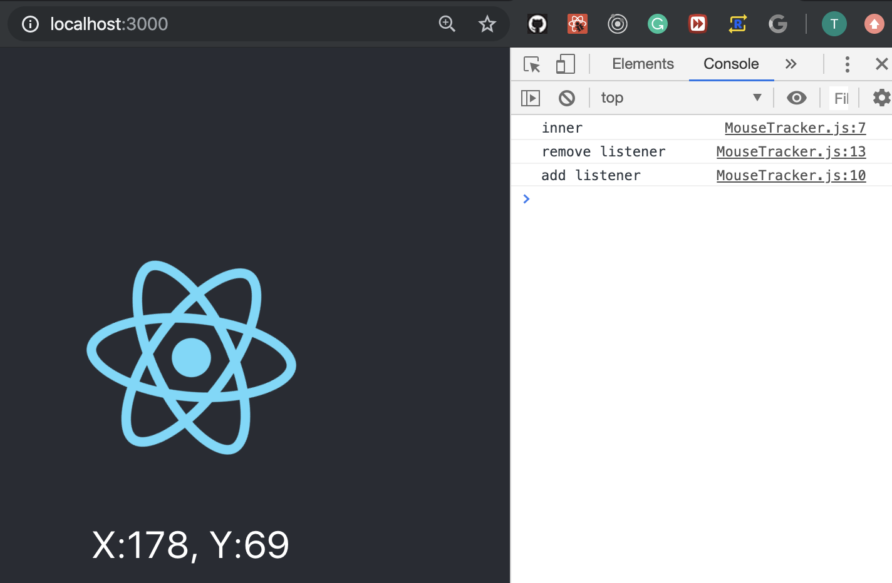
