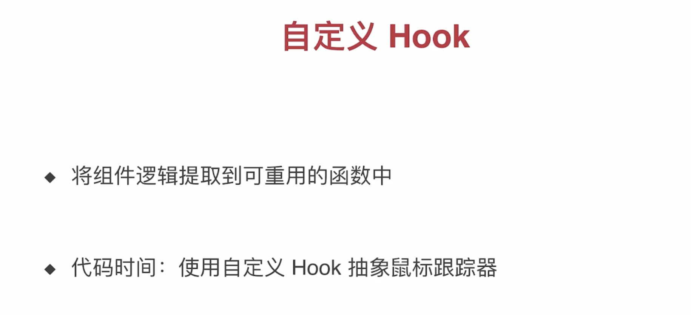
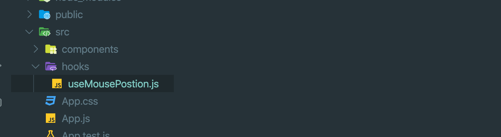
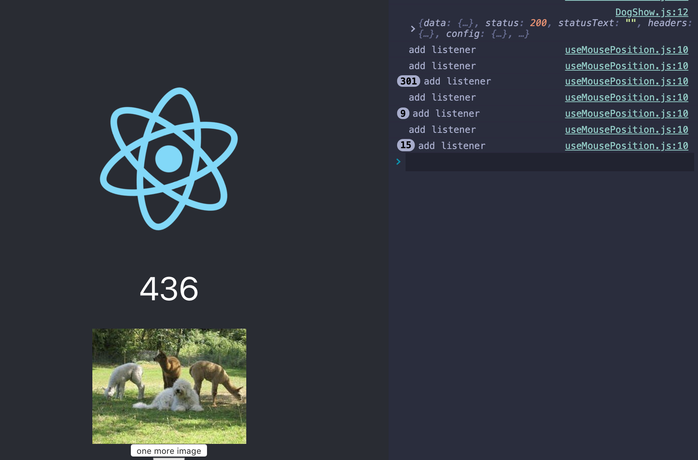

# Customize Hook



- create a new folder `hooks/useMousePosition.js`, hooks 文件夹底下的名称最好用use 开头

- Warning: 必须以 `use` 开头写函数，不遵守的话，无法判断是否调用 hook



- useMousePosition.js

```js
import Reat, { useState, useEffect } from 'react';

const useMousePosition = () => {
    const [positions, setPositions] = useState({ x: 0, y: 0 });
    useEffect(() => {
        const updateMouse = (event) => {
            // console.log('inner');
            setPositions({ x: event.clientX, y: event.clientY });
        }
        console.log('add listener');
        document.addEventListener('mousemove', updateMouse);
        return () => {
            // console.log('remove listener');
            document.removeEventListener('mousemove', updateMouse);
        }
    })
    return positions;
}

export default useMousePosition;
```

- update app.js

```js
import React from 'react';
import logo from './logo.svg';
import './App.css';
import LikeButton from './components/LikeButton';
import MouseTracker from './components/MouseTracker';
import DogShow from './components/DogShow';
import useMousePosition from './hooks/useMousePosition';

function App() {
  const position = useMousePosition(); //import useMousePosition() from './hooks/useMousePosition';
  return (
    <div className="App">
      <header className="App-header">
        
        <h1>{position.x}</h1>               //display position that return from useMousePosition.js
                                            //const [positions, setPositions] = useState({ x: 0, y: 0 });
                                            //setPositions() can change positions' value
        <MouseTracker />
        <DogShow />
        <LikeButton />
        <a
          className="App-link"
          href="https://reactjs.org"
          target="_blank"
          rel="noopener noreferrer"
        >
          Learn React
        </a>
      </header>
    </div>
  );
}

export default App;

```



---

### try useMousePosition() in other component

- update LikeButton.js

```js
//Customize Hook
import React, { useState, useEffect } from 'react'
import useMousePosition from '../hooks/useMousePosition';

const LikeButton = () => {
    const position = useMousePosition();
    const [like, setLike] = useState(0);
    const [on, setOn] = useState(true);
    useEffect(() => {
        document.title = `Clicked ${like} times`
    })
    return (
        <>
            <p>{position.y}</p>
            <button onClick={() => { setLike(like + 1) }}>
                {like} 👍
            </button>
            <button onClick={() => { setOn(!on) }}>
                {on ? 'On' : 'Off'}
            </button>
        </>
    )
}

export default LikeButton;
```