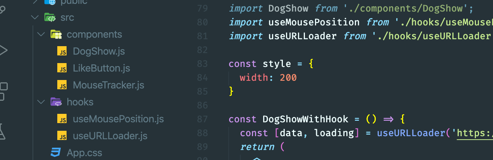
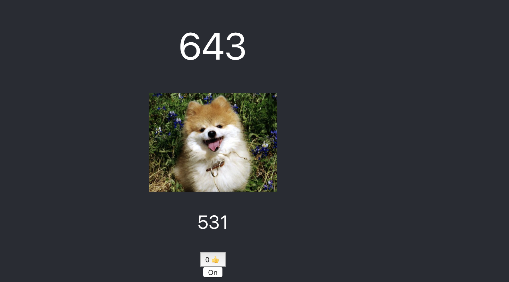
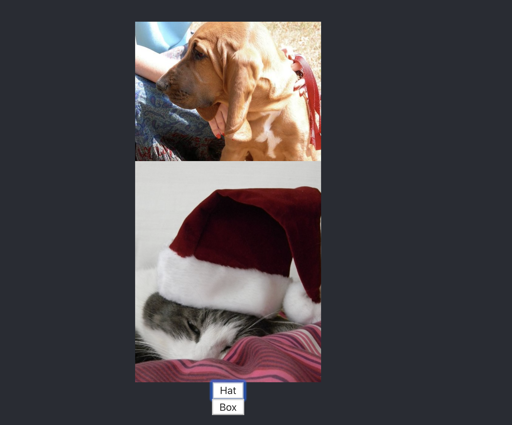
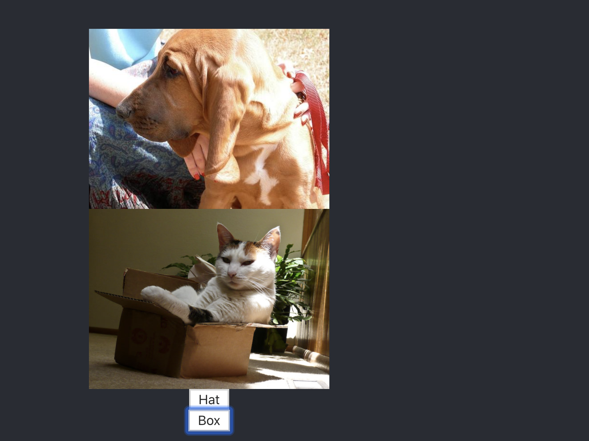

# Customize2 Hook



- create a `useURLLoader.js`

```js
import React, { useState, useEffect } from 'react';
import axios from 'axios';

const useURLLoader = (url) => {
    const [data, setData] = useState(null);
    const [loading, setLoading] = useState(false);
    useEffect(() => {
        setLoading(true);
        axios.get(url).then(result => {
            console.log(result);
            setData(result.data);
            setLoading(false);
        })
    }, [url]) //if, url is valued, rerender

    return [data, loading];
}
export default useURLLoader;
```


- update app.js

```js
//customize 2
import React from 'react';
import logo from './logo.svg';
import './App.css';
import LikeButton from './components/LikeButton';
import MouseTracker from './components/MouseTracker';
import DogShow from './components/DogShow';
import useMousePosition from './hooks/useMousePosition';
import useURLLoader from './hooks/useURLLoader';
import { useState} from 'react';

const style = {
  width: 200
}

const DogShowWithHook = () => {
  const [data, loading] = useURLLoader('https://dog.ceo/api/breeds/image/random')
  return (
    <>
      {loading ? <p>🐶 image is loading...</p> : }
    </>
  )
}

function App() {
  const position = useMousePosition();
  return (
    <div className="App">
      <header className="App-header">
        
        <h1>{position.x}</h1>
        {/* <MouseTracker /> */}
        {/* <DogShow /> */}
        <DogShowWithHook />
        <LikeButton />
        <a
          className="App-link"
          href="https://reactjs.org"
          target="_blank"
          rel="noopener noreferrer"
        >
          Learn React
        </a>
      </header>
    </div>
  );
}

export default App;

```

- still working



---


## add a new functionality, for cat show

- cat api

- `https://api.thecatapi.com/v1/images/search?category_ids=1`

- create a new function for app.js

- update app

```js
//customize 2

import React from 'react';
import logo from './logo.svg';
import './App.css';
import LikeButton from './components/LikeButton';
import MouseTracker from './components/MouseTracker';
import DogShow from './components/DogShow';
import useMousePosition from './hooks/useMousePosition';
import useURLLoader from './hooks/useURLLoader';
import { useState} from 'react';

const style = {
  width: 200
}

const DogShowWithHook = () => {
  const [data, loading] = useURLLoader('https://dog.ceo/api/breeds/image/random')
  return (
    <>
      {loading ? <p>🐶 image is loading...</p> : }
    </>
  )
}

const CatShowWithHook = () => {
  const [category, setCategory] = useState('1');
  const [data, loading] = useURLLoader(`https://api.thecatapi.com/v1/images/search?limit=1&category_ids=${category}`)
  return (
    <>
      {loading ? <p>🐱 image is loading...</p> : }
      <button onClick={() => { setCategory('1') }}>Hat</button>
      <button onClick={() => { setCategory('5') }}>Box</button>
    </>
  )
}

function App() {
  const position = useMousePosition();
  return (
    <div className="App">
      <header className="App-header">
        
        <h1>{position.x}</h1>
        {/* <MouseTracker /> */}
        {/* <DogShow /> */}
        <DogShowWithHook />
        <CatShowWithHook />
        <LikeButton />
        <a
          className="App-link"
          href="https://reactjs.org"
          target="_blank"
          rel="noopener noreferrer"
        >
          Learn React
        </a>
      </header>
    </div>
  );
}

export default App;

```

- click Hat button



- click box button



