# 3. Interprocess Communication

### Interprocess Communication (进程之间的通讯方式)

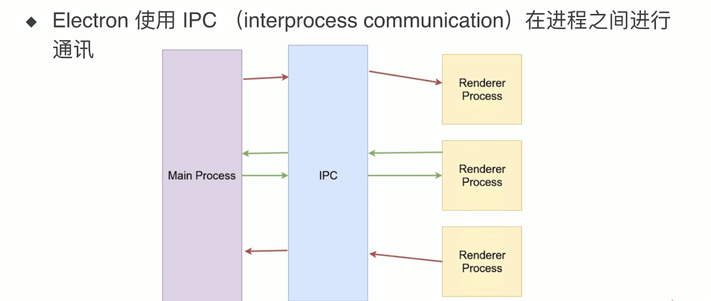

### install DEVTRON

- `https://electronjs.org/devtron`
 
- `cd electron-quick-start`

- `npm install --save-dev devtron`

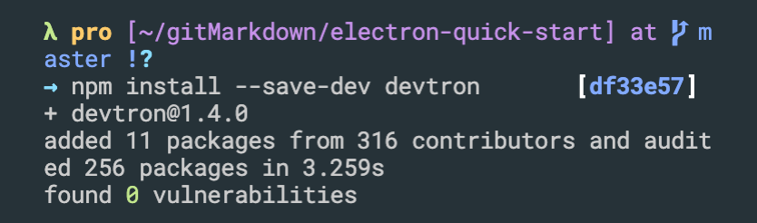

```js
// Run the following from the Console tab of your app's DevTools
require('devtron').install()
// You should now see a Devtron tab added to the DevTools
```

- update main.js

```js
//演示 Devtron, a extension of Electron
const { app, BrowserWindow } = require('electron');


app.on('ready', () => {
  require('devtron').install();
  let mainWindow = new BrowserWindow({
    width: 1600,
    height: 1200,
    webPreferences: {
      nodeIntegration: true
      //intergration 集合
    }
  })

  mainWindow.loadFile('index.html');
  //shortcut open
  mainWindow.webContents.openDevTools();


  // let secondWindow = new BrowserWindow({
  //   width: 400,
  //   height: 300,
  //   webPreferences: {
  //     nodeIntegration: true
  //     //intergration 集合
  //   },
  //   parent: mainWindow
  // })

  // secondWindow.loadFile('second.html');
})
```

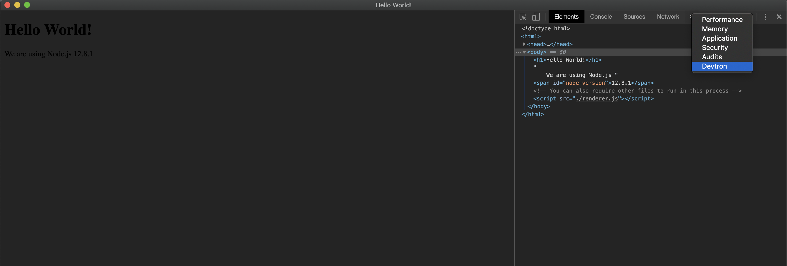

- switch to Devtron

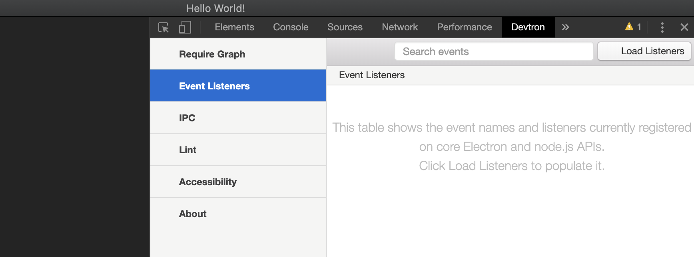

- Load Listeners

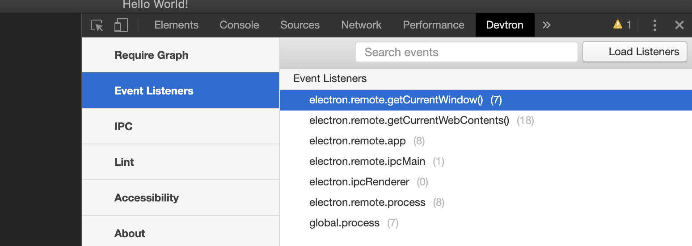

- we can see these Event Listeners
---

### implement IPC event

- on web, adding some buttons

- click button, sending this event to subprocess

- main process, call back

- render process, rendering homepage
 

1. update index.html

```html
<!DOCTYPE html>
<html>
  <head>
    <meta charset="UTF-8">
    <title>Hello World!</title>
  </head>
  <body>
    <h1>Hello World!</h1>
    We are using Node.js <span id="node-version"></span>

    <button id="send">Send to main process</button>

    <!-- You can also require other files to run in this process -->
    <script src="./renderer.js"></script>
  </body>
</html>
```

- npm start

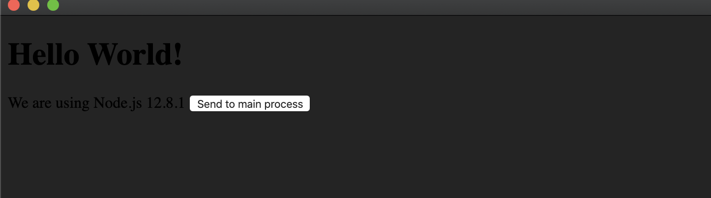
---

### update renderer.js

```js
const { ipcRenderer } = require('electron');//import ipcRenderer

window.addEventListener('DOMContentLoaded', () => {
    document.getElementById('node-version').innerHTML = process.versions.node;
    document.getElementById('send').addEventListener('click', () => {
        ipcRenderer.send('message', 'hello from renderer'); //send message to main process
    })
})
```

### main process import `ipcMain` from electron

- update main.js

```js
//演示 Devtron, a extension of Electron
const { app, BrowserWindow, ipcMain } = require('electron');
//import ipcMain from main process

app.on('ready', () => {
  require('devtron').install();
  let mainWindow = new BrowserWindow({
    width: 1600,
    height: 1200,
    webPreferences: {
      nodeIntegration: true
      //intergration 集合
    }
  })

  mainWindow.loadFile('index.html');
  //shortcut open
  mainWindow.webContents.openDevTools();
  ipcMain.on('message', (event, arg) => {
    console.log(event);  
    console.log(arg);
  })

  // let secondWindow = new BrowserWindow({
  //   width: 400,
  //   height: 300,
  //   webPreferences: {
  //     nodeIntegration: true
  //     //intergration 集合
  //   },
  //   parent: mainWindow
  // })

  // secondWindow.loadFile('second.html');
})
```

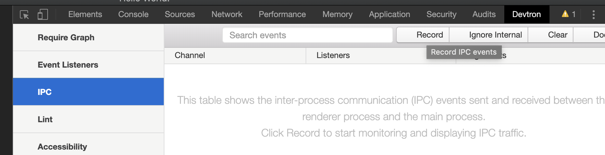

- click `Record`

- click `Send to mian process`

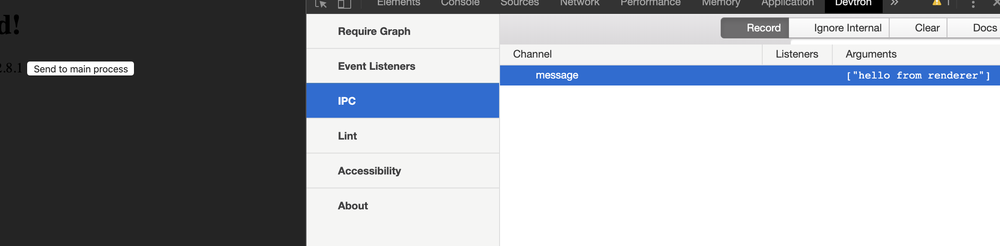

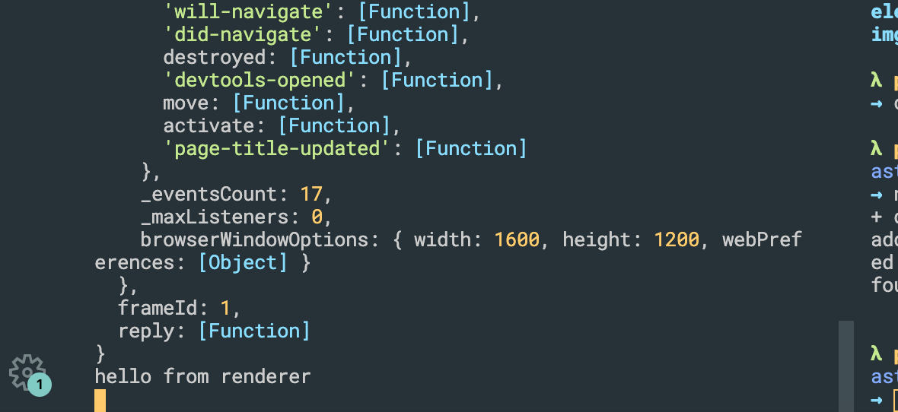
---

### So far, we implement the event that we send message from render process to main process.

### Now, we try to implement the event that we send message back to render process from main process

- update main.js

```js
  ipcMain.on('message', (event, arg) => {
    console.log(event);
    console.log(arg);
    event.reply('reply', 'Hello from main process');
    //send back to render process
  })
```

### we add a span into our index.html

```html
  <body>
    <h1>Hello World!</h1>
    We are using Node.js <span id="node-version"></span>

    <button id="send">Send to main process</button>

    <span id="message"></span>
    <!-- You can also require other files to run in this process -->
    <script src="./renderer.js"></script>
  </body>
</html>
```

- update renderer.js

```js
const { ipcRenderer } = require('electron');

window.addEventListener('DOMContentLoaded', () => {
    document.getElementById('node-version').innerHTML = process.versions.node;
    document.getElementById('send').addEventListener('click', () => {
        ipcRenderer.send('message', 'hello from renderer');
    })

    ipcRenderer.on('reply', (event, arg) => {
        document.getElementById('message').innerHTML = arg;
    })
})
```

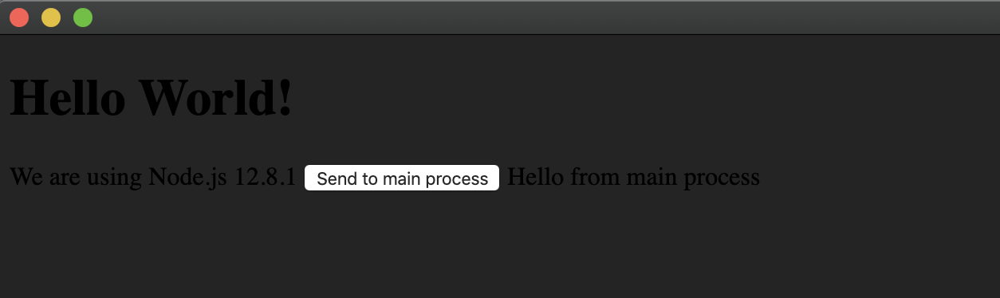

- after click button, we can see the message that main process replied

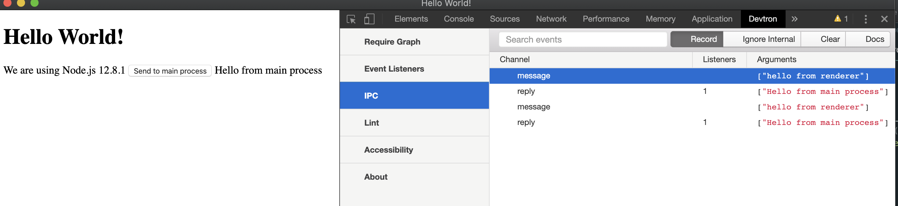

