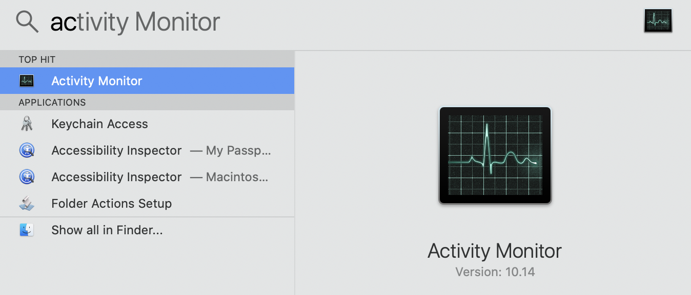
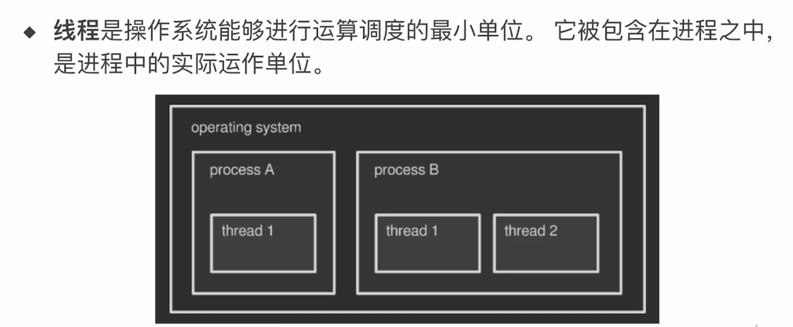
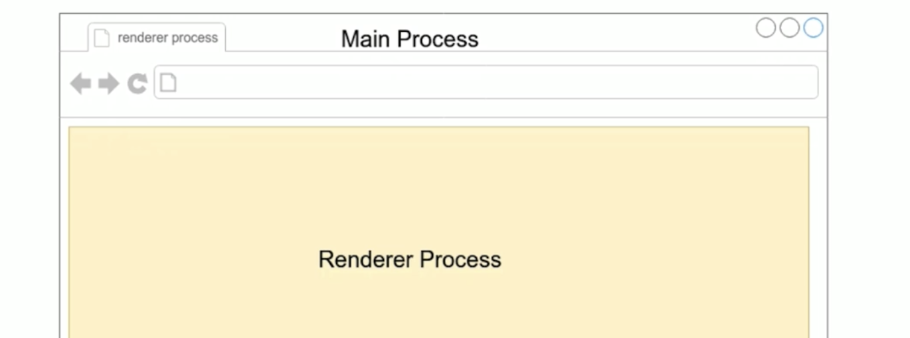
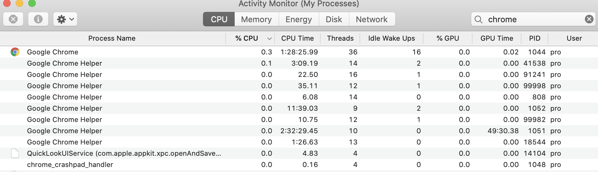
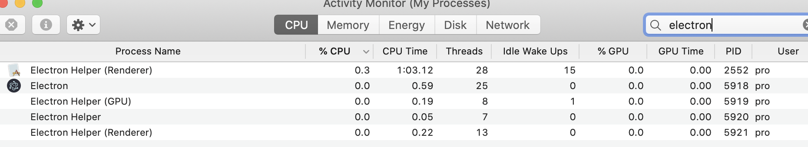
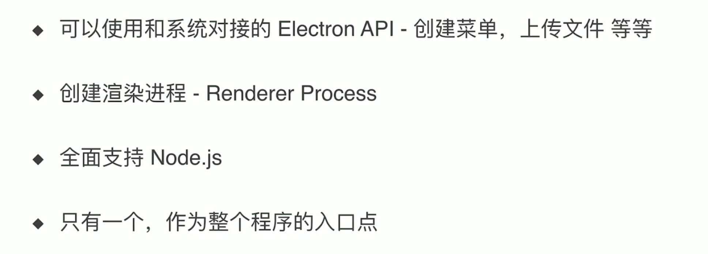
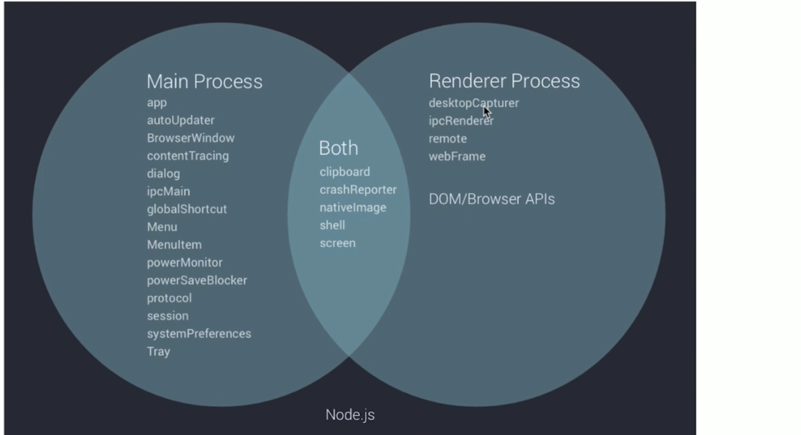

# Cross-Platform-Desktop Online Markdown

# Process

### concept: An instance of a computer program that is being executed

## spotlight search

- `command + space`

# Thread

### concept:

---

## For Electron use multiprocess

- 我们知道chrome 是多进程，内存消耗大户

- cd `electron-quick-start`

- running `npm start` again 

- spotlight search Electron

- electron is same as google chrome

### Main Process 祝进程

---

### Renderer Process 渲染进程

---

### Main Process && Render Process

---