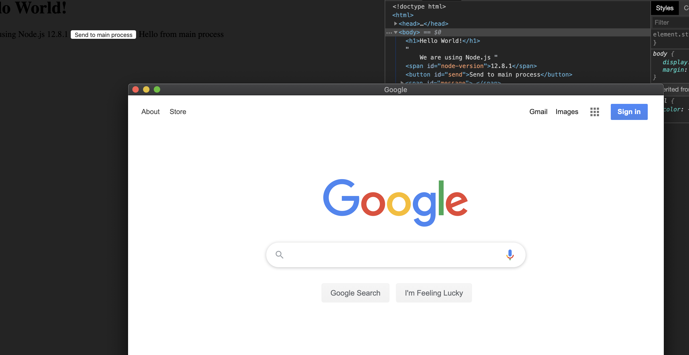

# 4. remote module

### import remote module

- https://electronjs.org/docs/api/remote

- The `remote` module provides a simple way to do inter-process communication 
  (IPC) between the renderer process (web page) and the main process.

- now, click a button, create a new window

### update renderer.js

```js
//Remote module
const { ipcRenderer } = require('electron');
const { BrowserWindow } = require('electron').remote;//Use main process modules from the renderer process.

window.addEventListener('DOMContentLoaded', () => {
    document.getElementById('node-version').innerHTML = process.versions.node;
    document.getElementById('send').addEventListener('click', () => {
        ipcRenderer.send('message', 'hello from renderer');
        let win = new BrowserWindow({ width: 800, height: 600 });
        win.loadURL('https://www.google.com');
    })

    ipcRenderer.on('reply', (event, arg) => {
        document.getElementById('message').innerHTML = arg;
    })
})
```

- click button:

