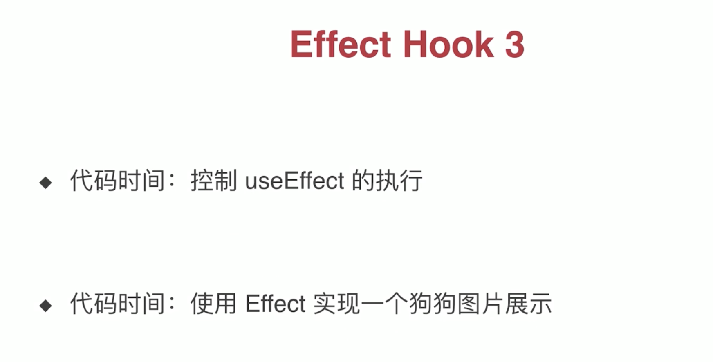
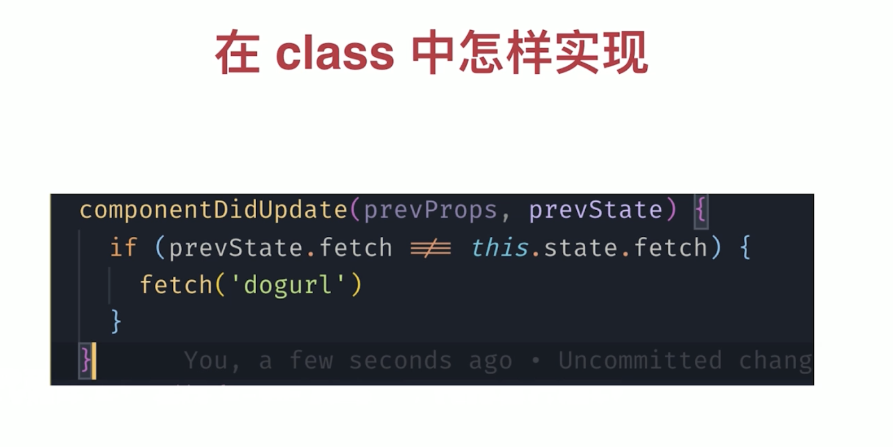
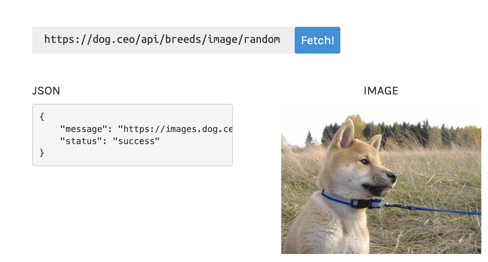
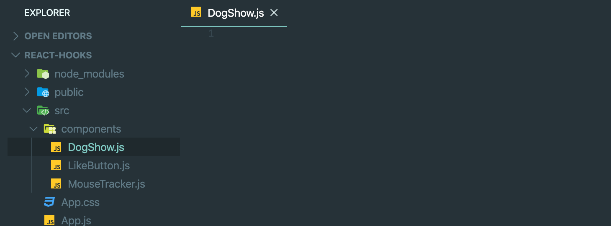
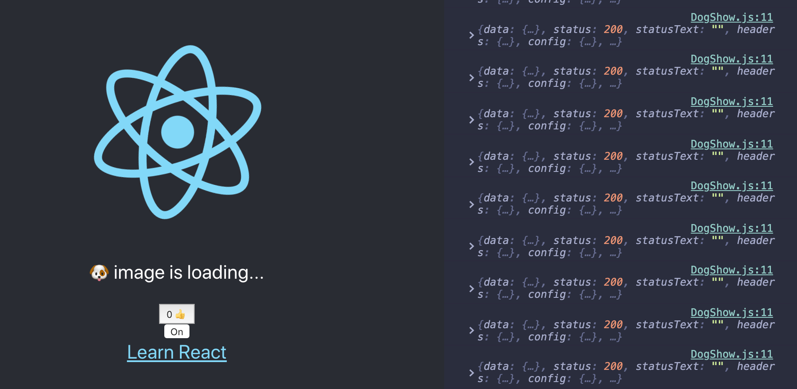
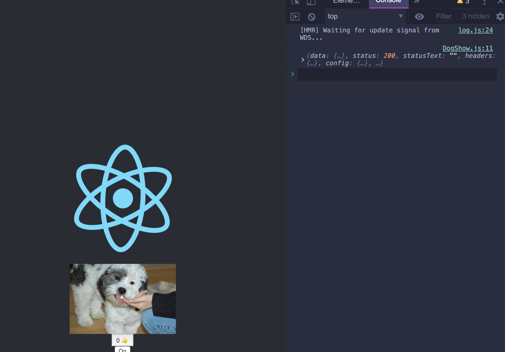

# useEffect may control





### Dog API

- `https://dog.ceo/api/breeds/image/random`



- install axios

- `npm install axios --save`

- create a DogShow.js



- import axios,

```js
import React, { useState, useEffect } from 'react';
import axios from 'axios';

const DogShow = () => {
    const [url, setUrl] = useState('');
    const [loading, setLoading] = useState(false);
    const style = { width: 200 }
    useEffect(() => {
        setLoading(true);
        axios.get('https://dog.ceo/api/breeds/image/random').then(result => {
            console.log(result);
            setUrl(result.data.message);
            setLoading(false);
        })
    })
    return (
        <>
            {loading ? <p>🐶 image is loading...</p> : }
        </>
    )
}

export default DogShow;
```

- import DogShow for app.js

- update app.js

```js
import React from 'react';
import logo from './logo.svg';
import './App.css';
import LikeButton from './components/LikeButton';
import MouseTracker from './components/MouseTracker';
import DogShow from './components/DogShow';

function App() {
  return (
    <div className="App">
      <header className="App-header">
        
        {/* <MouseTracker /> */}
        <DogShow />
        <LikeButton />
        <a
          className="App-link"
          href="https://reactjs.org"
          target="_blank"
          rel="noopener noreferrer"
        >
          Learn React
        </a>
      </header>
    </div>
  );
}

export default App;
```



- we see this error, reading data all the time

- the problem is :

```js
    useEffect(() => {
        setLoading(true); // repeatedly call setLoading()
        axios.get('https://dog.ceo/api/breeds/image/random').then(result => {
            console.log(result);
            setUrl(result.data.message); //repeatedly call setUrl and setLoading
            setLoading(false); 
        })
    })
```

- we can fix it, add a second parameter, empty array

```js
import React, { useState, useEffect } from 'react';
import axios from 'axios';

const DogShow = () => {
    const [url, setUrl] = useState('');
    const [loading, setLoading] = useState(false);
    const style = { width: 200 }
    useEffect(() => {
        setLoading(true);// repeatedly call setLoading()
        axios.get('https://dog.ceo/api/breeds/image/random').then(result => {
            console.log(result);
            setUrl(result.data.message);//repeatedly call setUrl and setLoading
            setLoading(false);
        })
    }, [])
    return (
        <>
            {loading ? <p>🐶 image is loading...</p> : }
        </>
    )
}

export default DogShow;
```




- adding a functionality

- update DogShow.js

```js
import React, { useState, useEffect } from 'react';
import axios from 'axios';

const DogShow = () => {
    const [url, setUrl] = useState('');
    const [loading, setLoading] = useState(false);
    const [fetch, setFetch] = useState(false); // pass false to var fetch, setFetch(fetch)
    const style = { width: 200 }
    useEffect(() => {
        setLoading(true);
        axios.get('https://dog.ceo/api/breeds/image/random').then(result => {
            console.log(result);
            setUrl(result.data.message);
            setLoading(false);
        })
    }, [fetch])
    return (
        <>
            {loading ? <p>🐶 image is loading...</p> : }
            <button onClick={() => { setFetch(!fetch) }} >one more image</button>
        </>//call setFetch() => check if boolean value is changed, if changed rerender()
    )
}

export default DogShow;
```


