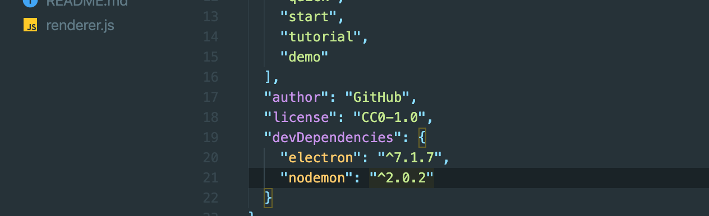
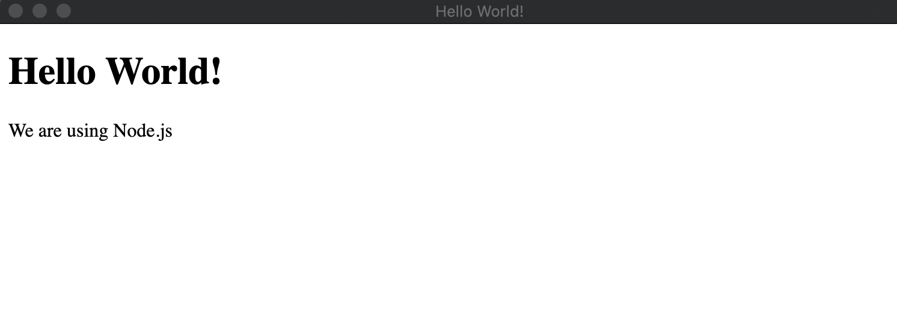
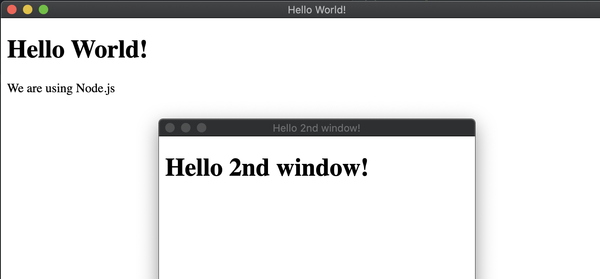
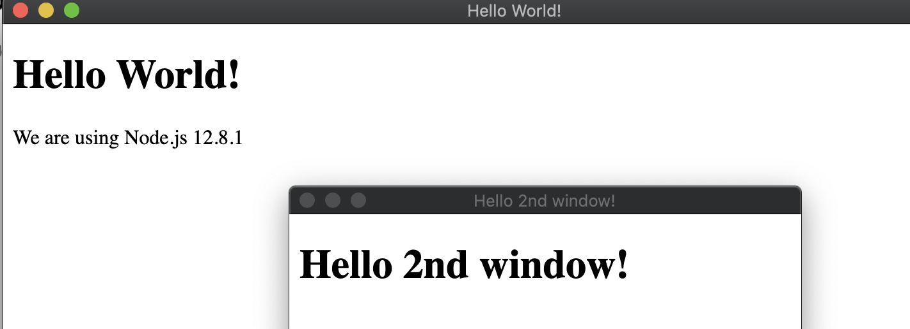

# 2. Create desktop app

## import BrowserWindow

## nodemon

- we hope that we don't need to restart the app everytime

- `cd electron-quick-start`

- `npm install nodemon --save-dev`



- update package.json

```js
 "scripts": {
    "start": "nodemon --watch main.js --exec \"electron .\" "
  },
```
---

## clear all content of main.js

- rebuild it

- update main.js

```js
const { app, BrowserWindow } = require('electron');

app.on('ready', () => {
  let mainWindow = new BrowserWindow({
    width: 800,
    height: 600,
    webPreferences: {
      nodeIntegration: true
      //intergration 集合
    }
  })

  mainWindow.loadFile('index.html');
})
```

- create a new .html

```html
<!DOCTYPE html>
<html>
  <head>
    <meta charset="UTF-8">
    <title>Hello World!</title>
  </head>
  <body>
    <h1>Hello World!</h1>
    We are using Node.js <span id="node-version"></span>

    <!-- You can also require other files to run in this process -->
    <script src="./renderer.js"></script>
  </body>
</html>
```

- npm start



### create another window

```html
<!DOCTYPE html>
<html>
  <head>
    <meta charset="UTF-8">
    <title>Hello 2nd window!</title>
  </head>
  <body>
    <h1>Hello 2nd window!</h1>
  </body>
</html>
```

- update main.js

```js
const { app, BrowserWindow } = require('electron');

app.on('ready', () => {
  let mainWindow = new BrowserWindow({
    width: 800,
    height: 600,
    webPreferences: {
      nodeIntegration: true
      //intergration 集合
    }
  })

  mainWindow.loadFile('index.html');

  let secondWindow = new BrowserWindow({
    width: 400,
    height: 300,
    webPreferences: {
      nodeIntegration: true
      //intergration 集合
    },
    parent: mainWindow
  })

  secondWindow.loadFile('second.html');
})
```


---


### update reander.js

- we can use node.js's syntax

```js
window.addEventListener('DOMContentLoaded', () => {
    document.getElementById('node-version').innerHTML = process.versions.node;
})
```

- refresh



- we see the nodejs's version
---

## We should view `browserWindow`'s offical website


