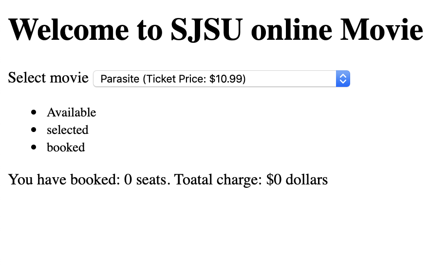
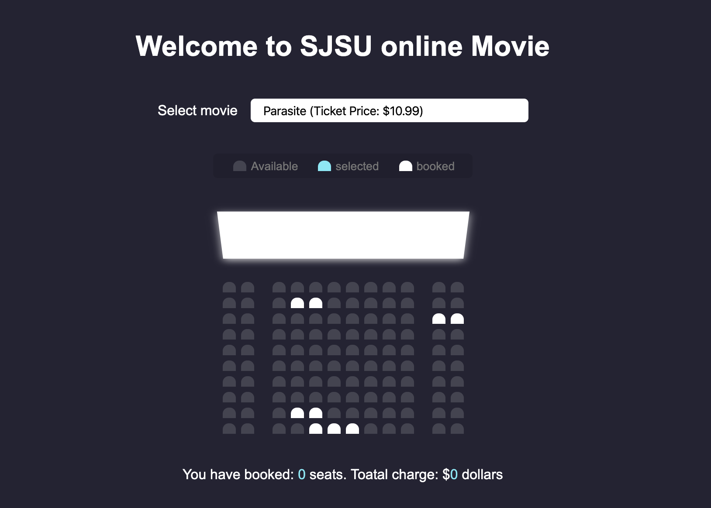

# 1. index.htm & css style

- index.html, style.css, script.js

- build a .html

```html
<!DOCTYPE html>
<html lang="en">
<head>
    <meta charset="UTF-8">
    <meta name="viewport" content="width=device-width, initial-scale=1.0">
    <title>Movie seat booking</title>
</head>
<body>
    <h1>Welcome to SJSU online Movie</h1>
    <div class="movie-container">
        <label>Select movie</label>
        <select id="movie">
            <option value="32">Parasite (Ticket Price: $10.99)</option>
            <option value="35">Joker    (Ticket Price: $12.99)</option>
            <option value="38">Once Upon a Time in Hollywood (Price: $11.99)</option>
            <option value="30">Toy Story (Ticket Price: $9.99)</option>
        </select>
    </div>

    <ul class="showcase">
        <li>
            <div class="seat"></div>
            <small>Available</small>
        </li>
        <li>
            <div class="seat selected"></div>
            <small>selected</small>
        </li>
        <li>
            <div class="seat occupied"></div>
            <small>booked</small>
        </li>
    </ul>

    <div class="container">
        <div class="screen"></div>
        <div class="row">
            <div class="seat"></div>
            <div class="seat"></div>
            <div class="seat"></div>
            <div class="seat"></div>
            <div class="seat"></div>
            <div class="seat"></div>
            <div class="seat"></div>
            <div class="seat"></div>
            <div class="seat"></div>
            <div class="seat"></div>
            <div class="seat"></div>
            <div class="seat"></div>
        </div>
        <div class="row">
            <div class="seat"></div>
            <div class="seat"></div>
            <div class="seat"></div>
            <div class="seat occupied"></div>
            <div class="seat occupied"></div>
            <div class="seat"></div>
            <div class="seat"></div>
            <div class="seat"></div>
            <div class="seat"></div>
            <div class="seat"></div>
            <div class="seat"></div>
            <div class="seat"></div>
        </div>
        <div class="row">
            <div class="seat"></div>
            <div class="seat"></div>
            <div class="seat"></div>
            <div class="seat"></div>
            <div class="seat"></div>
            <div class="seat"></div>
            <div class="seat"></div>
            <div class="seat"></div>
            <div class="seat"></div>
            <div class="seat"></div>
            <div class="seat occupied"></div>
            <div class="seat occupied"></div>
        </div>
        <div class="row">
            <div class="seat"></div>
            <div class="seat"></div>
            <div class="seat"></div>
            <div class="seat"></div>
            <div class="seat"></div>
            <div class="seat"></div>
            <div class="seat"></div>
            <div class="seat"></div>
            <div class="seat"></div>
            <div class="seat"></div>
            <div class="seat"></div>
            <div class="seat"></div>
        </div>
        <div class="row">
            <div class="seat"></div>
            <div class="seat"></div>
            <div class="seat"></div>
            <div class="seat"></div>
            <div class="seat"></div>
            <div class="seat"></div>
            <div class="seat"></div>
            <div class="seat"></div>
            <div class="seat"></div>
            <div class="seat"></div>
            <div class="seat"></div>
            <div class="seat"></div>
        </div>
        <div class="row">
            <div class="seat"></div>
            <div class="seat"></div>
            <div class="seat"></div>
            <div class="seat"></div>
            <div class="seat"></div>
            <div class="seat"></div>
            <div class="seat"></div>
            <div class="seat"></div>
            <div class="seat"></div>
            <div class="seat"></div>
            <div class="seat"></div>
            <div class="seat"></div>
        </div>
        <div class="row">
            <div class="seat"></div>
            <div class="seat"></div>
            <div class="seat"></div>
            <div class="seat"></div>
            <div class="seat"></div>
            <div class="seat"></div>
            <div class="seat"></div>
            <div class="seat"></div>
            <div class="seat"></div>
            <div class="seat"></div>
            <div class="seat"></div>
            <div class="seat"></div>
        </div>
        <div class="row">
            <div class="seat"></div>
            <div class="seat"></div>
            <div class="seat"></div>
            <div class="seat"></div>
            <div class="seat"></div>
            <div class="seat"></div>
            <div class="seat"></div>
            <div class="seat"></div>
            <div class="seat"></div>
            <div class="seat"></div>
            <div class="seat"></div>
            <div class="seat"></div>
        </div>
        <div class="row">
            <div class="seat"></div>
            <div class="seat"></div>
            <div class="seat"></div>
            <div class="seat occupied"></div>
            <div class="seat occupied"></div>
            <div class="seat"></div>
            <div class="seat"></div>
            <div class="seat"></div>
            <div class="seat"></div>
            <div class="seat"></div>
            <div class="seat"></div>
            <div class="seat"></div>
        </div>
        <div class="row">
            <div class="seat"></div>
            <div class="seat"></div>
            <div class="seat"></div>
            <div class="seat"></div>
            <div class="seat occupied"></div>
            <div class="seat occupied"></div>
            <div class="seat occupied"></div>
            <div class="seat"></div>
            <div class="seat"></div>
            <div class="seat"></div>
            <div class="seat"></div>
            <div class="seat"></div>
        </div>

    </div>

    <p class="text">
        You have booked: <span id="count">0</span> seats.
        Toatal charge: $<span id="total">0</span> dollars
    </p>
    <script src="script.js"></script>
</body>
</html>
```

- there are 10 rows, 12 seats per row



---

- style.css

```css
* {
  box-sizing: border-box;
}

body {
  background-color: #242333;
  color: #fff;
  display: flex;
  flex-direction: column;
  align-items: center;
  justify-content: center;
  height: 100vh;
  font-family: Arial, Helvetica, sans-serif;
  margin: 0;
}

.movie-container {
  margin: 20px 0;
}

.movie-container select {
  background-color: #fff;
  border: 0;
  border-radius: 5px;
  font-size: 14px;
  margin-left: 10px;
  padding: 5px 15px;
  -moz-appearance: none;
  -webkit-appearance: none;
  appearance: none;
}

.seat {
  background-color: #444451;
  height: 12px;
  width: 15px;
  margin: 3px;
  border-top-right-radius: 10px;
  border-top-left-radius: 10px;
}

.seat.selected {
  background-color: #6feaf6;
}

.seat.occupied {
  background-color: #fff;
}

.seat:nth-of-type(2) {
  margin-right: 18px;
}

.seat:nth-last-of-type(2) {
  margin-left: 18px;
}

.seat:not(.occupied):hover {
  cursor: pointer;
  transform: scale(1.2);
}

.showcase .seat:not(.occupied):hover {
  cursor: default;
  transform: scale(1);
}

.showcase {
  background-color: rgba(0, 0, 0, 0.1);
  padding: 5px 10px;
  border-radius: 5px;
  color: #777;
  list-style-type: none;
  display: flex;
  justify-content: space-between;
}

.showcase li {
  display: flex;
  align-items: center;
  justify-content: center;
  margin: 0 10px;
}

.showcase li small {
  margin-left: 2px;
}

.container {
  perspective: 1000px;
  margin-bottom: 30px;
}
.screen {
  background-color: #fff;
  height: 70px;
  width: 100%;
  margin: 15px 0;
  transform: rotateX(-45deg);
  box-shadow: 0 3px 10px rgba(255, 255, 255, 0.7);
}
.row {
  display: flex;
}

.text {
  margin: 5px 0;
}

.text span {
  color: #6feaf6;
}
```




