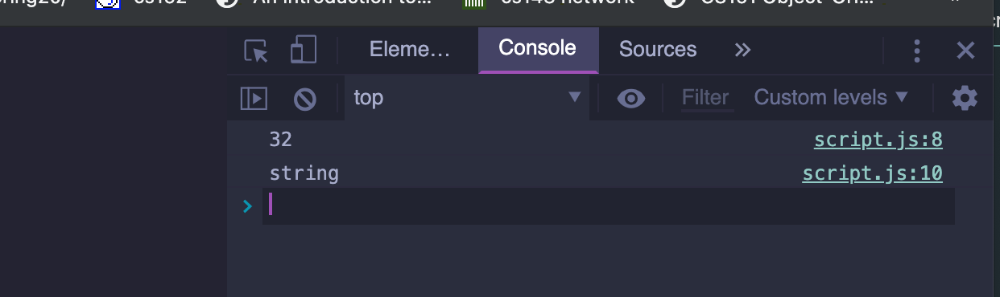
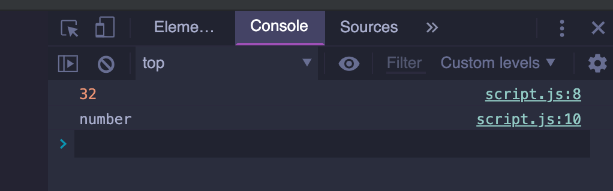
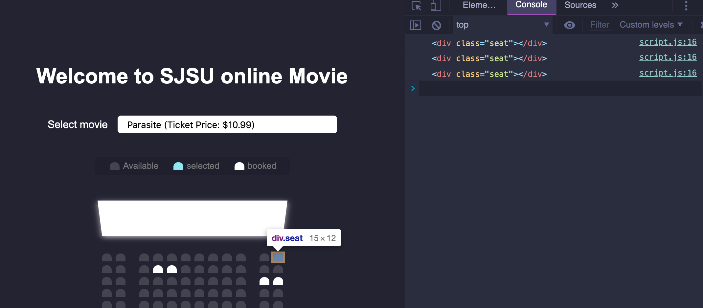
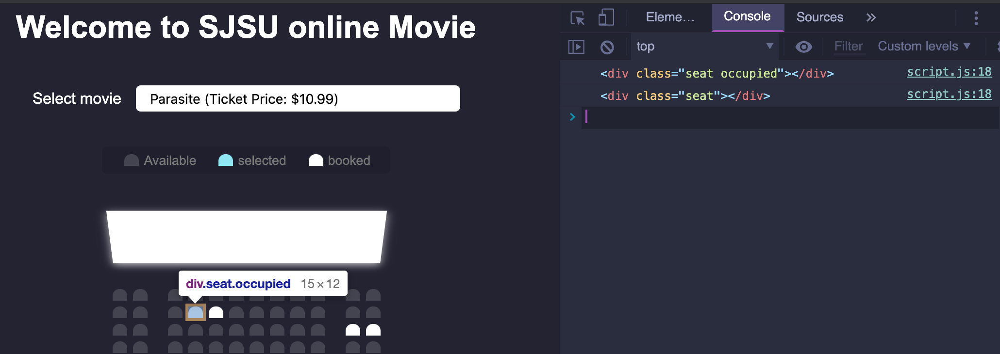
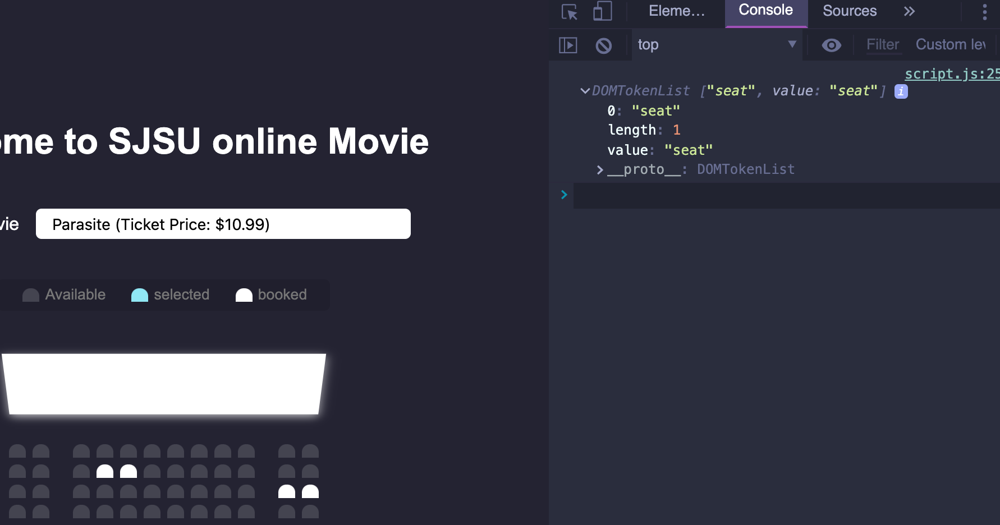
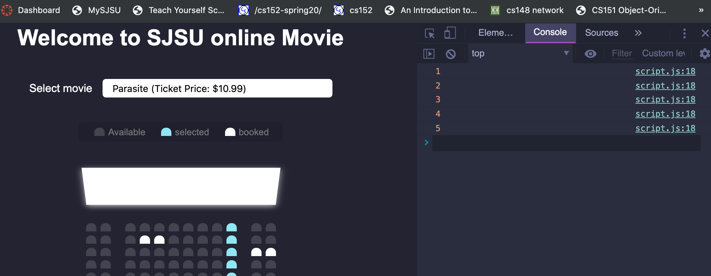
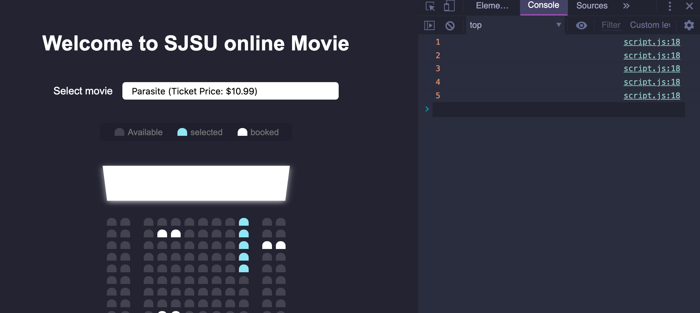
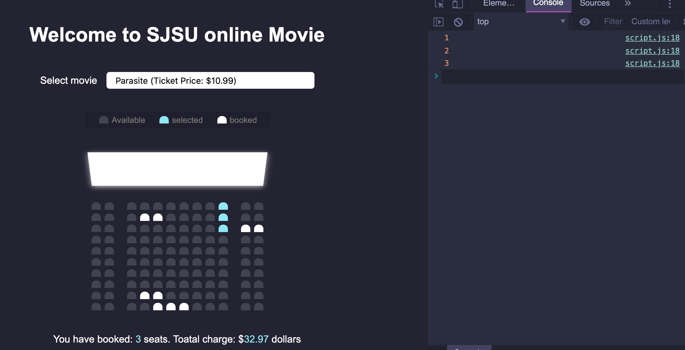
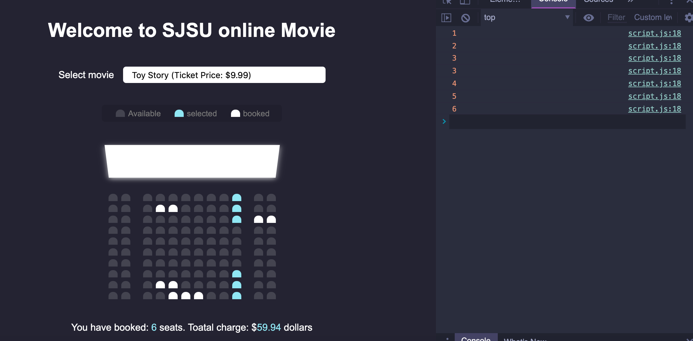

# 2. seats nums & data update

- update `movie_seat_booking/script.js`

```js
const container = document.querySelector('.container');
const seats = document.querySelectorAll('.row .seat:not(.occupied)');
//selected seats which is not occupied
const count = document.getElementById('count');
const total = document.getElementById('total');
const movieSelected = document.getElementById('movie');
const ticketPrice = movieSelected.value;
console.log(ticketPrice);
//we can see the price of '32'
console.log(typeof ticketPrice);
```



- we can convert string to number

```js
const container = document.querySelector('.container');
const seats = document.querySelectorAll('.row .seat:not(.occupied)');
//selected seats which is not occupied
const count = document.getElementById('count');
const total = document.getElementById('total');
const movieSelected = document.getElementById('movie');
const ticketPrice = +movieSelected.value;
console.log(ticketPrice);
//we can see the price of '32'
console.log(typeof ticketPrice);
```




- select seat event

```js
const container = document.querySelector('.container');
const seats = document.querySelectorAll('.row .seat:not(.occupied)');
//selected seats which is not occupied
const count = document.getElementById('count');
const total = document.getElementById('total');
const movieSelected = document.getElementById('movie');
const ticketPrice = +movieSelected.value;

//////////////
// select seat event
container.addEventListener('click', (e) => {
    console.log(e.target);
});
```



- update

```js
const container = document.querySelector('.container');
const seats = document.querySelectorAll('.row .seat:not(.occupied)');
//selected seats which is not occupied
const count = document.getElementById('count');
const total = document.getElementById('total');
const movieSelected = document.getElementById('movie');
const ticketPrice = +movieSelected.value;

//////////////
// select seat event
container.addEventListener('click', (e) => {
    // console.log(e.target);
    if (e.target.classList.contains('seat')) {
        console.log(e.target);
    }
});

```



- update

```js
//////////////
// select seat event
container.addEventListener('click', (e) => {
    console.log(e.target.classList);
});

```



- update

```js
const container = document.querySelector('.container');
const seats = document.querySelectorAll('.row .seat:not(.occupied)');
//selected seats which is not occupied
const count = document.getElementById('count');
const total = document.getElementById('total');
const movieSelected = document.getElementById('movie');
const ticketPrice = +movieSelected.value;


//update seat numbers and total price
function updateSelectedCount() {
    const selectedSeats = document.querySelectorAll('.row .seat.selected');
    // console.log(selectedSeats);
    const selectedSeatsCount = selectedSeats.length;
    console.log(selectedSeatsCount);
}


//////////////
// select seat event
container.addEventListener('click', (e) => {
    if (e.target.classList.contains('seat') &&
        !e.target.classList.contains('occupied')) {
        e.target.classList.toggle('selected');
        // console.log(e.target);

        updateSelectedCount();
    }
});
```




```js
const container = document.querySelector('.container');
const seats = document.querySelectorAll('.row .seat:not(.occupied)');
//selected seats which is not occupied
const count = document.getElementById('count');
const total = document.getElementById('total');
const movieSelected = document.getElementById('movie');
const ticketPrice = +movieSelected.value;


//update seat numbers and total price
function updateSelectedCount() {
    const selectedSeats = document.querySelectorAll('.row .seat.selected');
    // console.log(selectedSeats);
    const selectedSeatsCount = selectedSeats.length;
    console.log(selectedSeatsCount);
    count.innerHTML = selectedSeatsCount;
}


//////////////
// select seat event
container.addEventListener('click', (e) => {
    if (e.target.classList.contains('seat') &&
        !e.target.classList.contains('occupied')) {
        e.target.classList.toggle('selected');
        // console.log(e.target);

        updateSelectedCount();
    }
});
```




- now update `Toatal charge:`

- update

```js
//update seat numbers and total price
function updateSelectedCount() {
    const selectedSeats = document.querySelectorAll('.row .seat.selected');
    // console.log(selectedSeats);
    const selectedSeatsCount = selectedSeats.length;
    console.log(selectedSeatsCount);
    count.innerHTML = selectedSeatsCount;
    total.innerHTML = selectedSeatsCount * ticketPrice;
}
```


- but when we selected other movie, the price won't change

- we need to improve

```js
//movie selected Event: change price
movieSelected.addEventListener('change', (e) => {
    ticketPrice = +e.target.value; // `+` convert to number
    console.log(ticketPrice);
})
```

- here, we generate an error, since we make ticketPrice to be const, so we need to change

- update

```js
const container = document.querySelector('.container');
const seats = document.querySelectorAll('.row .seat:not(.occupied)');
//selected seats which is not occupied
const count = document.getElementById('count');
const total = document.getElementById('total');
const movieSelected = document.getElementById('movie');
let ticketPrice = +movieSelected.value;
// console.log(ticketPrice);
// //we can see the price of '32'
// console.log(typeof ticketPrice);


//update seat numbers and total price
function updateSelectedCount() {
    const selectedSeats = document.querySelectorAll('.row .seat.selected');
    // console.log(selectedSeats);
    const selectedSeatsCount = selectedSeats.length;
    console.log(selectedSeatsCount);
    count.innerHTML = selectedSeatsCount;
    total.innerHTML = selectedSeatsCount * ticketPrice;
}

//movie selected Event: change price
movieSelected.addEventListener('change', (e) => {
    ticketPrice = +e.target.value; // `+` convert to number
    // console.log(ticketPrice);
    updateSelectedCount();
})

//////////////
// select seat event
container.addEventListener('click', (e) => {
    if (e.target.classList.contains('seat') &&
        !e.target.classList.contains('occupied')) {
        e.target.classList.toggle('selected');
        // console.log(e.target);

        updateSelectedCount();
    }
});
```

- update html

```html
<body>
    <h1>Welcome to SJSU online Movie</h1>
    <div class="movie-container">
        <label>Select movie</label>
        <select id="movie">
            <option value="10.99">Parasite (Ticket Price: $10.99)</option>
            <option value="12.99">Joker    (Ticket Price: $12.99)</option>
            <option value="11.99">Once Upon a Time in Hollywood (Price: $11.99)</option>
            <option value="9.99">Toy Story (Ticket Price: $9.99)</option>
        </select>
    </div>
```





