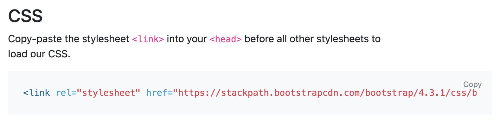
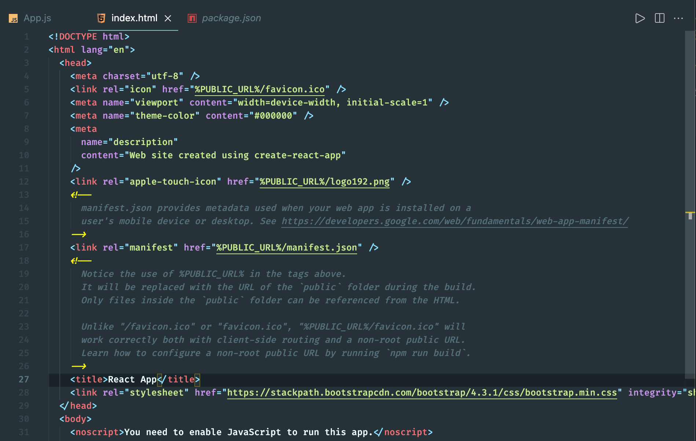
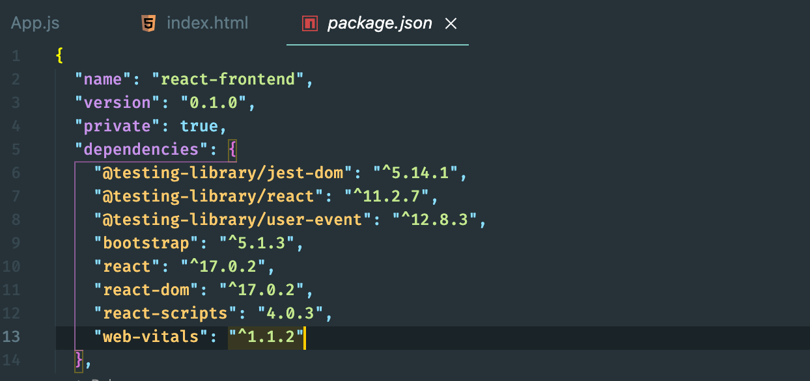
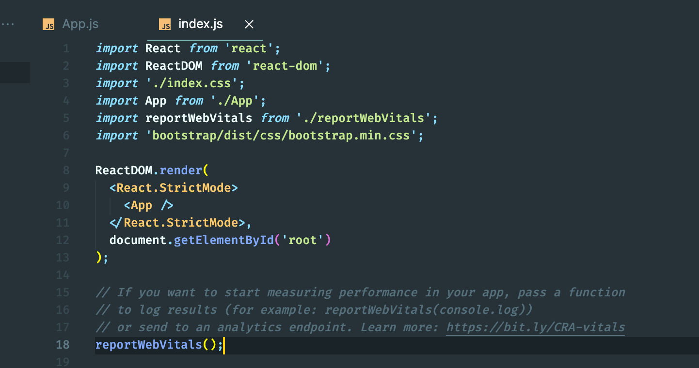

## How to install bootstrap 

- input `bootstrap cdn link` to get the link

- copy 

- copy link into `index.html`

- input `npm install bootstrap --save`, **--save** 可以添加到`package.json` 里的 `dependencies`

---

- import `bootstrp.min.css` into `index.js`

