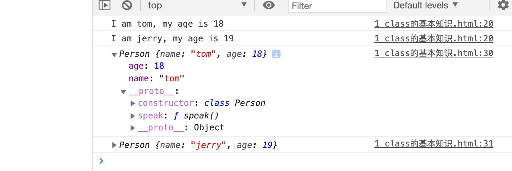
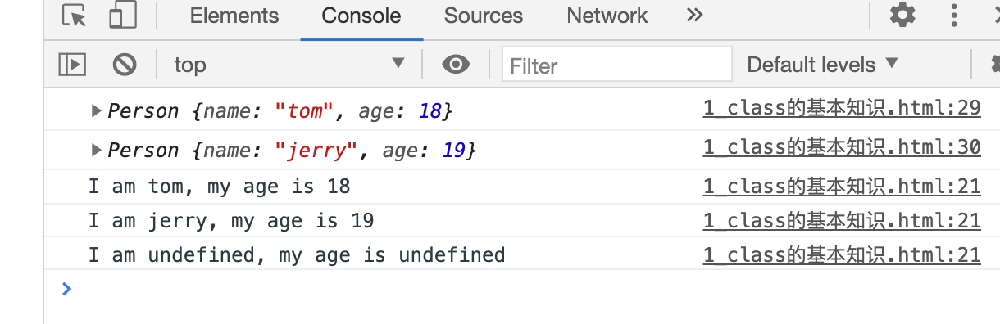
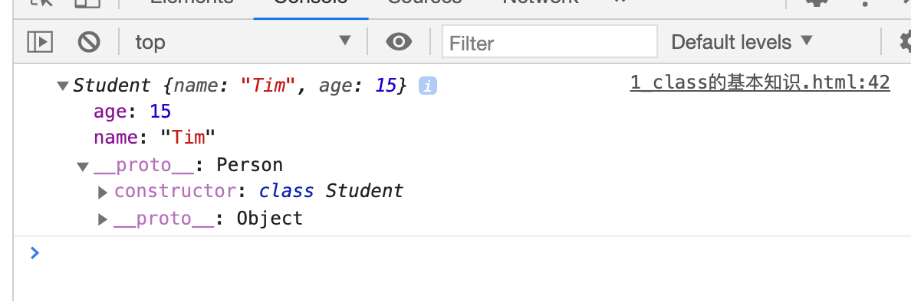
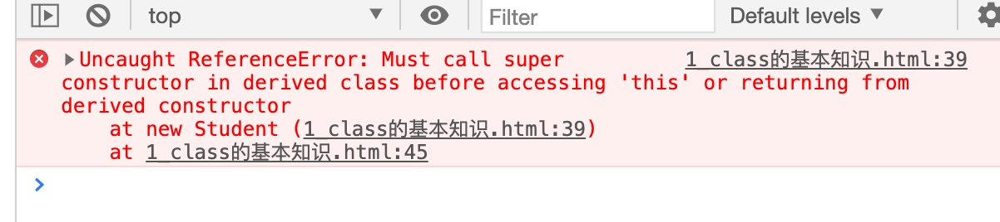
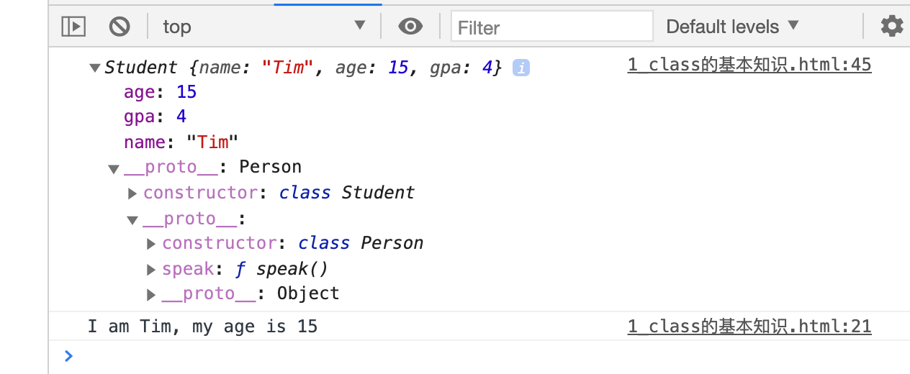
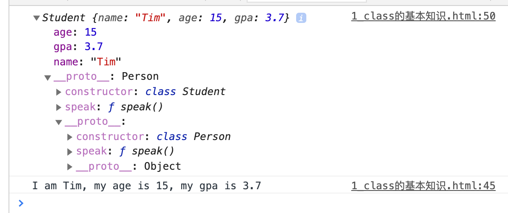
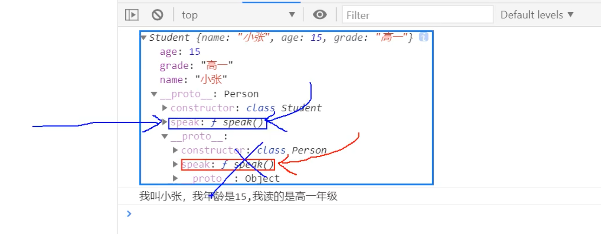

## Review Class

```html
<!DOCTYPE html>
<html lang="en">
<head>
    <meta charset="UTF-8">
    <title>1_class的基础知识</title>
</head>
<body>
    <script type="text/javascript">
        //create a Person Class
        class Person{
            //constructor
            constructor(name, age){
                //constructor中的this是谁？ -- class's 实例对象
                this.name = name;
                this.age = age;
            }
            //general method
            speak(){
                //speak 方法放在了哪里？ -- class的原型对象上，供实例使用
                //通过person实例调用speak时，speak中的this就是person实例
                console.log(`I am ${this.name}, my age is ${this.age}`);
            }
        }

        //create a new person instance:
        const p1 = new Person('tom', 18)
        const p2 = new Person('jerry', 19)

        console.log(p1);
        console.log(p2);
        p1.speak()
        p2.speak()
    </script>
</body>
</html>
```



---


```html
<script type="text/javascript">
    //create a Person Class
    class Person{
        //constructor
        constructor(name, age){
            //constructor中的this是谁？ -- class's 实例对象
            this.name = name;
            this.age = age;
        }
        //general method
        speak(){
            //speak 方法放在了哪里？ -- class的原型对象上，供实例使用
            //通过person实例调用speak时，speak中的this就是person实例
            console.log(`I am ${this.name}, my age is ${this.age}`);
        }
    }

    //create a new person instance:
    const p1 = new Person('tom', 18)
    const p2 = new Person('jerry', 19)

    console.log(p1);
    console.log(p2);
    p1.speak()
    p2.speak()
    p1.speak.call({a:1, b:2}); //call() 的用法是改变this指向
</script>
```



---

- 继承的类，不需要写constructor

```html
<script type="text/javascript">
    //create a Person Class
    class Person{
        //constructor
        constructor(name, age){
            //constructor中的this是谁？ -- class's 实例对象
            this.name = name;
            this.age = age;
        }
        //general method
        speak(){
            //speak 方法放在了哪里？ -- class的原型对象上，供实例使用
            //通过person实例调用speak时，speak中的this就是person实例
            console.log(`I am ${this.name}, my age is ${this.age}`);
        }
    }

    // //create a new person instance:
    // const p1 = new Person('tom', 18)
    // const p2 = new Person('jerry', 19)

    // console.log(p1);
    // console.log(p2);
    // p1.speak()
    // p2.speak()
    // p1.speak.call({a:1, b:2}); //call() 的用法是改变this指向


    //create a student class, inherit
    class Student extends Person{

    }

    const s1 = new Student('Tim', 15);
    console.log(s1);
</script>
```



### 接下来看看 如何给继承的类添加field

```html
<script type="text/javascript">
    //create a Person Class
    class Person{
        //constructor
        constructor(name, age){
            //constructor中的this是谁？ -- class's 实例对象
            this.name = name;
            this.age = age;
        }
        //general method
        speak(){
            //speak 方法放在了哪里？ -- class的原型对象上，供实例使用
            //通过person实例调用speak时，speak中的this就是person实例
            console.log(`I am ${this.name}, my age is ${this.age}`);
        }
    }

    //create a student class, inherit
    class Student extends Person{
        constructor(name, age, gpa){
            this.name = name;
            this.age = age;
            this.gpa = gpa;
        }
    }

    const s1 = new Student('Tim', 15, 4.0);
    console.log(s1);
</script>
```

- 很明显报错: must call super constructor



```js
//create a student class, inherit
class Student extends Person{
    constructor(name, age, gpa){
        super(name, age);
        this.gpa = gpa;
    }
}

const s1 = new Student('Tim', 15, 4.0);
console.log(s1);
```

### 那学生可以调用 speak() 方法吗？

```js
//create a student class, inherit
class Student extends Person{
    constructor(name, age, gpa){
        super(name, age);
        this.gpa = gpa;
    }
}

const s1 = new Student('Tim', 15, 4.0);
console.log(s1);
s1.speak();
```



### 但是我们想让学生的信息，再加上自己的gpa

```html
<script type="text/javascript">
    //create a Person Class
    class Person{
        //constructor
        constructor(name, age){
            //constructor中的this是谁？ -- class's 实例对象
            this.name = name;
            this.age = age;
        }
        //general method
        speak(){
            //speak 方法放在了哪里？ -- class的原型对象上，供实例使用
            //通过person实例调用speak时，speak中的this就是person实例
            console.log(`I am ${this.name}, my age is ${this.age}`);
        }
    }

    // //create a new person instance:
    // const p1 = new Person('tom', 18)
    // const p2 = new Person('jerry', 19)

    // console.log(p1);
    // console.log(p2);
    // p1.speak()
    // p2.speak()
    // p1.speak.call({a:1, b:2}); //call() 的用法是改变this指向


    //create a student class, inherit
    class Student extends Person{
        constructor(name, age, gpa){
            super(name, age);
            this.gpa = gpa;
        }

        //override
        speak(){
            console.log(`I am ${this.name}, my age is ${this.age}, my gpa is ${this.gpa}`);
        }
    }

    const s1 = new Student('Tim', 15, 3.7);
    console.log(s1);
    s1.speak();
</script>
```




- 在它发现student的原型链上有`speak()`，以后它就不再往下查找

---

- 总结看comment

```html
<!DOCTYPE html>
<html lang="en">
<head>
    <meta charset="UTF-8">
    <title>1_class的基础知识</title>
</head>
<body>
    <script type="text/javascript">

        /*
        总结：
            1. 类中的构造器不是必须写的，要对实例进行一些初始化的操作，如添加指定属性时，才写。
            2. 如果A类继承了B类，且A类中写了构造器，那么A类构造器中的super是必须要调用的
            3. 类中所定义的方法，都是放在了类的原型对象上，供实例去使用
        */


        //create a Person Class
        class Person{
            //constructor
            constructor(name, age){
                //constructor中的this是谁？ -- class's 实例对象
                this.name = name;
                this.age = age;
            }
            //general method
            speak(){
                //speak 方法放在了哪里？ -- class的原型对象上，供实例使用
                //通过person实例调用speak时，speak中的this就是person实例
                console.log(`I am ${this.name}, my age is ${this.age}`);
            }
        }

        // //create a new person instance:
        // const p1 = new Person('tom', 18)
        // const p2 = new Person('jerry', 19)

        // console.log(p1);
        // console.log(p2);
        // p1.speak()
        // p2.speak()
        // p1.speak.call({a:1, b:2}); //call() 的用法是改变this指向


        //create a student class, inherit
        class Student extends Person{
            constructor(name, age, gpa){
                super(name, age);
                this.gpa = gpa;
            }

            //override
            speak(){
                console.log(`I am ${this.name}, my age is ${this.age}, my gpa is ${this.gpa}`);
            }

            //study 方法放在了哪里？ -- class的原型对象上，供实例使用
            //通过student实例调用study时，study中的this就是study实例
            study(){
                console.log('self learning C++');
            }
        }

        const s1 = new Student('Tim', 15, 3.7);
        console.log(s1);
        s1.speak();
        s1.study();
    </script>
</body>
</html>
```


