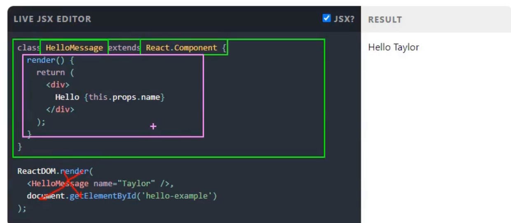
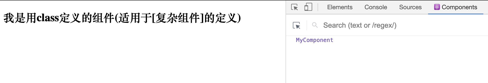
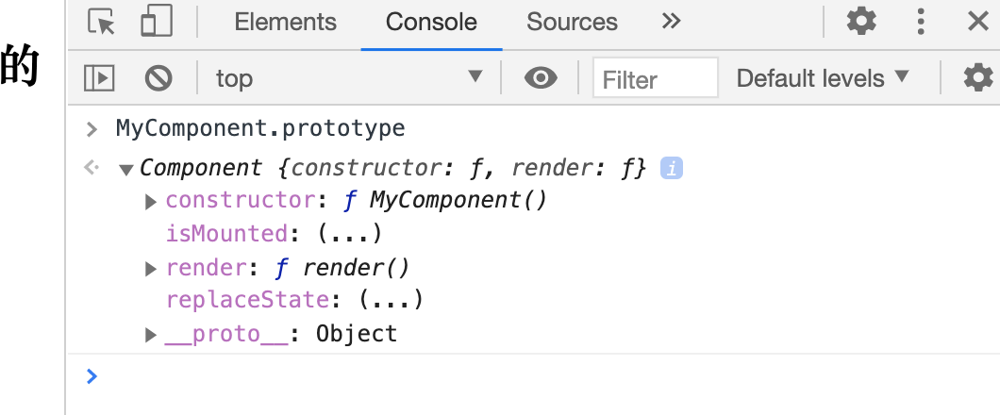
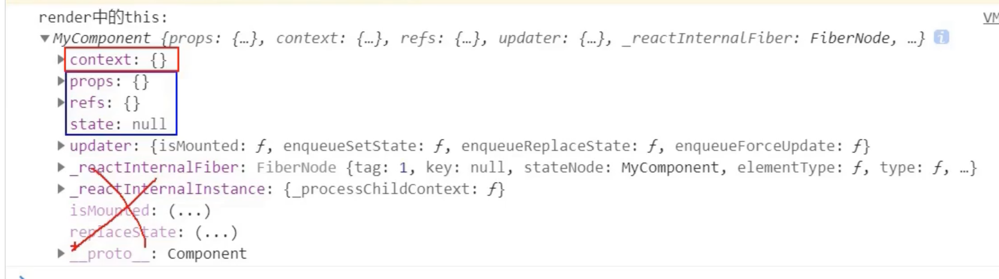

## 类式组件



```html
<!DOCTYPE html>
<html lang="en">
<head>
    <meta charset="UTF-8">
    <title>1_函数式编程</title>
</head>
<body>
    <!-- 准备好一个容器 -->
    <div id="test"></div>

    <!-- import core lirbary -->
    <script type="text/javascript" src="../js/react.development.js"></script>

    <!-- import react-dom, is used to support react to operation on DOM -->
    <script type="text/javascript" src="../js/react-dom.development.js"></script>

    <!-- import babel, jsx => js -->
    <script type="text/javascript" src="../js/babel.min.js"></script>

    <!-- type="text/babel" 表示现在这里写的是jsx, 不再是js -->
    <script type="text/babel">
        //1. create class式组件
        class MyComponent extends React.Component{//React.Component 是react内置的
            render(){
                return <h2>我是用class定义的组件(适用于[复杂组件]的定义)</h2>
            }
        }

        //2. render 组件到页面
        // ReactDOM.render(类组件, Container)
        ReactDOM.render(<MyComponent/>, document.getElementById('test'))
    </script>
    
</body>
</html>
```




---

```js
<script type="text/babel">
    //1. create class式组件
    class MyComponent extends React.Component{//React.Component 是react内置的
        render(){
            //reander是放在了哪里？ -- MyComponent的原型对象上，给实例使用
            return <h2>我是用class定义的组件(适用于[复杂组件]的定义)</h2>
        }
    }

    //2. render 组件到页面
    // ReactDOM.render(类组件, Container)
    ReactDOM.render(<MyComponent/>, document.getElementById('test'))
</script>
```


- 可以看到是在类的原型对象上。

---


```html
<!DOCTYPE html>
<html lang="en">
<head>
    <meta charset="UTF-8">
    <title>1_函数式编程</title>
</head>
<body>
    <!-- 准备好一个容器 -->
    <div id="test"></div>

    <!-- import core lirbary -->
    <script type="text/javascript" src="../js/react.development.js"></script>

    <!-- import react-dom, is used to support react to operation on DOM -->
    <script type="text/javascript" src="../js/react-dom.development.js"></script>

    <!-- import babel, jsx => js -->
    <script type="text/javascript" src="../js/babel.min.js"></script>

    <!-- type="text/babel" 表示现在这里写的是jsx, 不再是js -->
    <script type="text/babel">
        //1. create class式组件
        class MyComponent extends React.Component{//React.Component 是react内置的
            render(){
                //reander是放在了哪里？ -- MyComponent的原型对象上，给实例使用
                //reander中的this是谁？ -- MyComponent的实例对象，MyComponent组件实例对象
                console.log('render 中的this：', this);
                return <h2>我是用class定义的组件(适用于[复杂组件]的定义)</h2>
            }
        }

        //2. render 组件到页面
        // ReactDOM.render(类组件, Container)
        ReactDOM.render(<MyComponent/>, document.getElementById('test'))
        /*
        执行了ReactDOM.render(<MyComponent/>, document.getElementById('test')) 之后，发生了什么？
            1. react解析组件标签，找到了MyComponent组件
            2. 发现组件是适用类定义的，随后调 new 了一个该类的实例，并通过该实例调用到原型上的render方法
            3. 将reander返回的虚拟dom转为真实dom，随后呈现在页面中
        */        
    </script>
    
</body>
</html>
```



- 这三个可以称为**组件三大属性**。
- 这里也可以看出我们并没有写 `constructor()` for `MyComponent`, 所以很明显这是 `React.Component`的属性。


