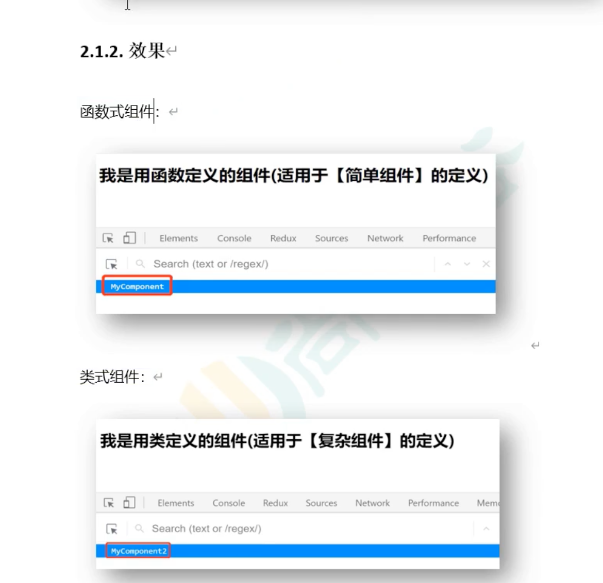
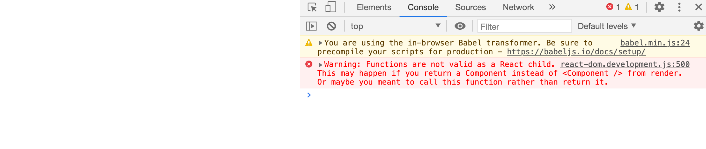
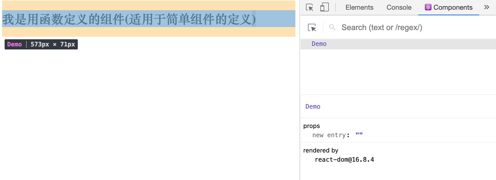

## 函数式编程



- 先学函数式编程

```html
<script type="text/babel">
    //1. create 函数式组件
    function demo(){
        return <h2>我是用函数定义的组件(适用于简单组件的定义)</h2>
    }

    //2. render 组件到页面
    // ReactDOM.render(function(), Container)
    ReactDOM.render(demo, document.getElementById('test'))
</script>
```



- 可以发现报错，就是说

```html
<!-- type="text/babel" 表示现在这里写的是jsx, 不再是js -->
<script type="text/babel">
    //1. create 函数式组件
    function Demo(){
        return <h2>我是用函数定义的组件(适用于简单组件的定义)</h2>
    }

    //2. render 组件到页面
    // ReactDOM.render(function(), Container)
    ReactDOM.render(<Demo/>, document.getElementById('test'))
</script>
```

- 主意函数第一个字要大写

- 现在来看插件



- 1. 组件名： demo, 2. 组件身上的属性， 3. 版本

---

```html
<!DOCTYPE html>
<html lang="en">
<head>
    <meta charset="UTF-8">
    <title>1_函数式编程</title>
</head>
<body>
    <!-- 准备好一个容器 -->
    <div id="test"></div>

    <!-- import core lirbary -->
    <script type="text/javascript" src="../js/react.development.js"></script>

    <!-- import react-dom, is used to support react to operation on DOM -->
    <script type="text/javascript" src="../js/react-dom.development.js"></script>

    <!-- import babel, jsx => js -->
    <script type="text/javascript" src="../js/babel.min.js"></script>

    <!-- type="text/babel" 表示现在这里写的是jsx, 不再是js -->
    <script type="text/babel">
        //1. create 函数式组件
        function MyComponent(){
            console.log(this); //此处的this是undefined, 因为babel编译后开启了'use strict' 模式                                             
            return <h2>我是用函数定义的组件(适用于简单组件的定义)</h2>
        }

        //2. render 组件到页面
        // ReactDOM.render(function(), Container)
        ReactDOM.render(<MyComponent/>, document.getElementById('test'))
        /*
        执行了ReactDOM.render(<MyComponent/>, document.getElementById('test')) 之后，发生了什么？
            1. react解析组件标签，找到了MyComponent组件
            2. 发现组件是适用函数定义的，随后调用该函数，将返回的虚拟dom转为真实dom，随后呈现在页面中
        */
    </script>
    
</body>
</html>
```

---


