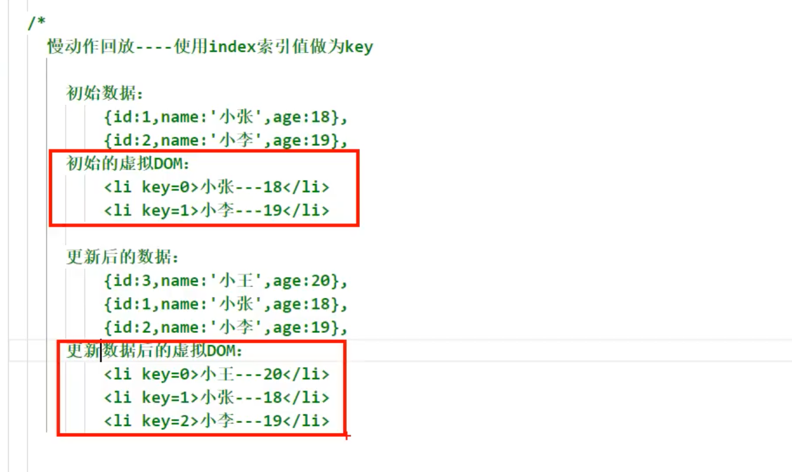

## DOM 的 diffing 算法


- 每一次遍历数据的时候，设置了一个`key`, 那么这个key 到底有什么作用?

---


- 每一次虚拟dom 都会和之前的比较，如果发现之前两条数据，没有发生任何的变化，那么两个真实的dom也不会改变
- 那我们验证一下到底有没有 diffing 算法.


- 由于，每一次都更改state, 让 `date: new Date()`, 所以组件重新render()
- 通过对比，前两行没有发生任何改变，第三行改变，那么真实Dom 前两行不变， 只变了第三行

---


- 通过对比可以发现， 新添加的input 在 `span`标签里，按道理，整个`span`标签里的内容应该重新render()
  - 但我们input , `123`, 数据并没有丢失。

---


- 需要注意的是， **Diffing**算法并没有那么傻， `<input type="text"/>`, 还会和之前虚拟dom 里的内容继续做比较
- 可以看出Diffing 算法也是逐层对比

---

## 虚拟DOM中， key 的作用


```html
<!DOCTYPE html>
<html>
<head>
  <meta charset="UTF-8">
  <title>key的作用</title>
</head>
<body>
<div id="test"></div>
<!-- 引入react核心库 -->
<script type="text/javascript" src="../js/react.development.js"></script>
<!-- 引入react-dom -->
<script type="text/javascript" src="../js/react-dom.development.js"></script>
<!-- 引入babel -->
<script type="text/javascript" src="../js/babel.min.js"></script>

<script type="text/babel">
	class Person extends React.Component{

		state = {
			persons:[
				{id:1,name:'小张',age:18},
				{id:2,name:'小李',age:19},
			]
		}

		add = ()=>{
			const {persons} = this.state
			const p = {id:persons.length+1,name:'小王',age:20}
			this.setState({persons:[p,...persons]})
		}

		render(){
			return (
				<div>
					<h2>展示人员信息</h2>
					<button onClick={this.add}>添加一个小王</button>					
					<ul>
						{
							this.state.persons.map((personObj,index)=>{
								return <li key={index}>{personObj.name}---{personObj.age}</li>
							})
						}
					</ul>
				</div>
			)
		}
	}

	ReactDOM.render(<Person/>,document.getElementById('test'))
</script>
</body>
</html>
```


- 遍历的时候，需要用到key, 我们说过如果用index, 会有潜在危险，但是现在我们就先用index:
- 现在添加一个小王。
  - 现在注意这句 `this.setState({persons:[p,...persons]})`, 原先 `...persons` 是原来的数据，现在加上了一个 `p`
  - 所以最后会得到， p + 之前的数据

---



- 如果用index 作为 key, 我们可以看到 小王的index = 0, 占在第一个位置
  - 也许你会问，**为什么不把小王放在array最后一个，这样做，可以是可以，但之后全部都是逆序操作，效率低, 甚至有可能产生界面问题**
- 我们可以看到 key = 0, 的时候数据内容不一样了，需要用到diff算法的规则，得全部重新渲染真实DOM：


- 如果用index 作为key, 你会把原先的可以复用的data, 全部的顺序打乱，通过diffing 算法重新渲染，效率反而更加低下.
  - 假如 2000 条数据，你用index作为key, 那么你再添加2001条数据的时候，你舍弃了前面2000条重复数据，采取重新渲染！代价极其高昂！

---


```js
	class Person extends React.Component{

		state = {
			persons:[
				{id:1,name:'小张',age:18},
				{id:2,name:'小李',age:19},
			]
		}

		add = ()=>{
			const {persons} = this.state
			const p = {id:persons.length+1,name:'小王',age:20}
			this.setState({persons:[p,...persons]})
		}

		render(){
			return (
				<div>
					<h2>展示人员信息</h2>
					<button onClick={this.add}>添加一个小王</button>					
					<ul>
						{
							this.state.persons.map((personObj,index)=>{
								return <li key={index}>{personObj.name}---{personObj.age}</li>
							})
						}
					</ul>
					<hr/>
					<hr/>
					<h3>使用id（数据的唯一标识）作为key</h3>
					<ul>
						{
							this.state.persons.map((personObj)=>{
								return <li key={personObj.id}>{personObj.name}---{personObj.age}</li>
							})
						}
					</ul>					
				</div>
			)
		}
	}

	ReactDOM.render(<Person/>,document.getElementById('test'))	
```


- 用id, 来作为key, 所以是效率最高的！


- 重构代码：


```js
	class Person extends React.Component{

		state = {
			persons:[
				{id:1,name:'小张',age:18},
				{id:2,name:'小李',age:19},
			]
		}

		add = ()=>{
			const {persons} = this.state
			const p = {id:persons.length+1,name:'小王',age:20}
			this.setState({persons:[p,...persons]})
		}

		render(){
			return (
				<div>
					<h2>展示人员信息</h2>
					<button onClick={this.add}>添加一个小王</button>					
					<ul>
						{
							this.state.persons.map((personObj,index)=>{
								return <li key={index}>{personObj.name}---{personObj.age}<input type="text"/></li>
							})
						}
					</ul>
					<hr/>
					<hr/>
					<h3>使用id（数据的唯一标识）作为key</h3>
					<ul>
						{
							this.state.persons.map((personObj)=>{
								return <li key={personObj.id}>{personObj.name}---{personObj.age}<input type="text"/></li>
							})
						}
					</ul>					
				</div>
			)
		}
	}

	ReactDOM.render(<Person/>,document.getElementById('test'))	
```


- 未点击button 的时候，


- 点击button之后：


