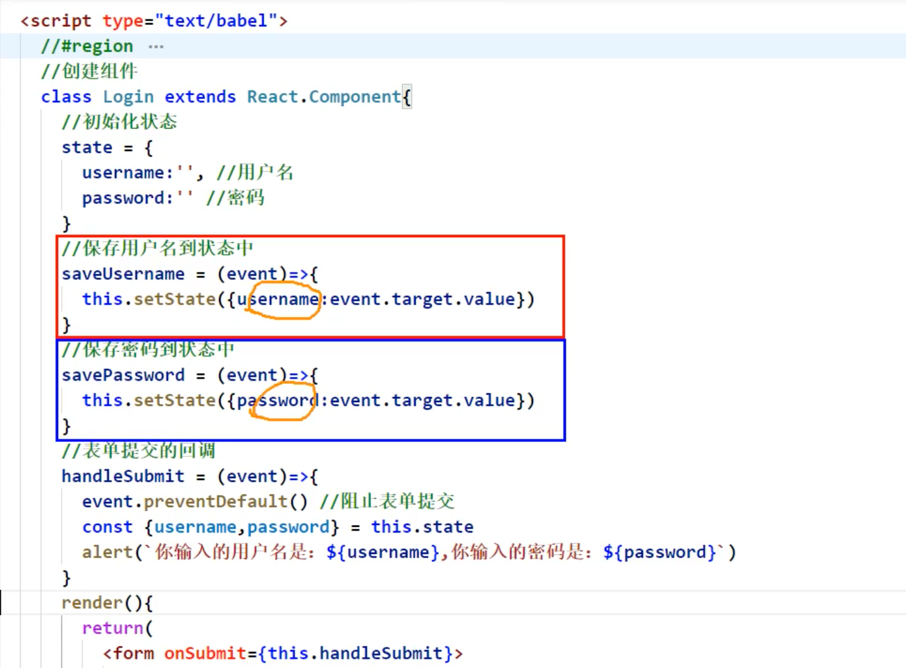
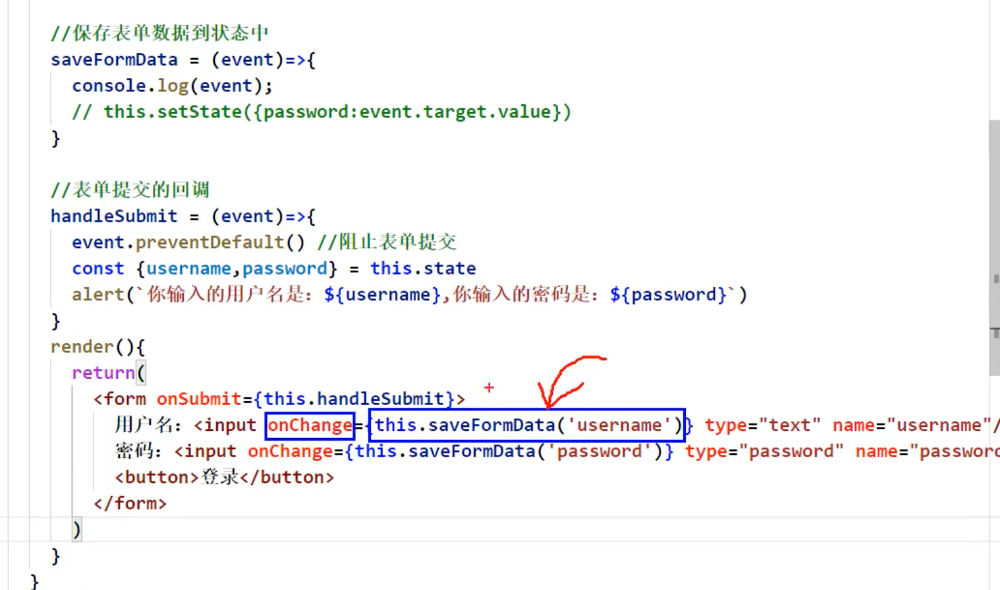

## 高阶函数_函数柯里化




- 原先的代码是有问题的，函数各自做各自的事情，这样会写很多函数，冗余。
- 那如何优化？


---



- 这种写法可以理解为，`this.saveFormData('username')` 的函数的返回值，作用`onChange` 的callback!


- 注意这里：


```jsx
		//#endregion
		//创建组件
		class Login extends React.Component{
			//初始化状态
			state = {
				username:'', //用户名
				password:'' //密码
			}

			//保存表单数据到状态中
			saveFormData = (dataType)=>{
				return (event)=>{
					this.setState({[dataType]:event.target.value})
				}
			}

			//表单提交的回调
			handleSubmit = (event)=>{
				event.preventDefault() //阻止表单提交
				const {username,password} = this.state
				alert(`你输入的用户名是：${username},你输入的密码是：${password}`)
			}
			render(){
				return(
					<form onSubmit={this.handleSubmit}>
						用户名：<input onChange={this.saveFormData} type="text" name="username"/>
						密码：<input onChange={this.saveFormData} type="password" name="password"/>
						<button>登录</button>
					</form>
				)
			}
		}
		//渲染组件
		ReactDOM.render(<Login/>,document.getElementById('test'))
```


- `this.saveFormData`, 这种写法实际上，是把 `this.saveFormData`, 的返回值作用 onChange 的 callback, 那么问题来了
  - 现在的，`this.saveFormData` 的返回值是： undefined

---

### 现在先来复习一下 对象相关的知识


