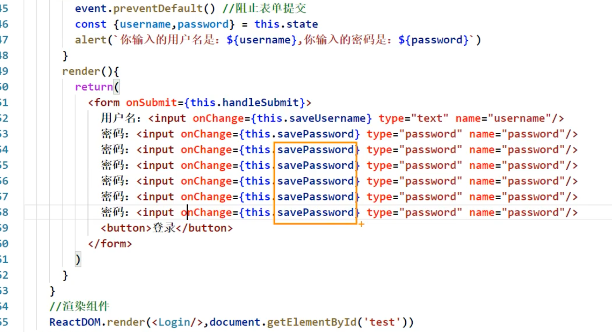

## 高阶函数_函数柯里化  function currying




- 原先的代码是有问题的，函数各自做各自的事情，这样会写很多函数，冗余。
- 那如何优化？


---


- 这种写法可以理解为，`this.saveFormData('username')` 的函数的返回值，作用`onChange` 的callback!


- 注意这里：


```js
//#endregion
//创建组件
class Login extends React.Component{
	//初始化状态
	state = {
		username:'', //用户名
		password:'' //密码
	}

	//保存表单数据到状态中
	saveFormData = (dataType)=>{
		return (event)=>{
			this.setState({[dataType]:event.target.value})
		}
	}

	//表单提交的回调
	handleSubmit = (event)=>{
		event.preventDefault() //阻止表单提交
		const {username,password} = this.state
		alert(`你输入的用户名是：${username},你输入的密码是：${password}`)
	}
	render(){
		return(
			<form onSubmit={this.handleSubmit}>
				用户名：<input onChange={this.saveFormData} type="text" name="username"/>
				密码：<input onChange={this.saveFormData} type="password" name="password"/>
				<button>登录</button>
			</form>
		)
	}
}
//渲染组件
ReactDOM.render(<Login/>,document.getElementById('test'))
```


- `this.saveFormData`, 这种写法实际上，是把 `this.saveFormData`, 的返回值作用 onChange 的 callback, 那么问题来了
  - 现在的，`this.saveFormData` 的返回值是： undefined

---

### 现在先来复习一下 对象相关的知识


```js
var person = new Object();

person["firstname"] = "Tony";
person["lastname"] = "Alicea";

var firstNameProperty = "firstname";

console.log(person)
console.log(person[firstNameProperty])

console.log(person.firstname);
console.log(person.lastname)

person.address = new Object();
person.address.street = "111 Main St.";
person.address.city = "New York";
person.address.state = "NY";

console.log(person.address.street)  //111 Main St.
console.log(person.address.city)    //New York
console.log(person["address"]["state"]) //NY
```

---

### 再来复习一下 函数柯里化  function currying

```js

/* function sum(a,b,c){
	return a+b+c
} */

function sum(a){
	return(b)=>{
		return (c)=>{
			return a+b+c
		}
	}
}
const result = sum(1)(2)(3)
console.log(result);
```

---

### 最终代码如下：


```html
<!DOCTYPE html>
<html lang="en">
<head>
	<meta charset="UTF-8">
	<title>高阶函数_函数柯里化</title>
</head>
<body>
	<!-- 准备好一个“容器” -->
	<div id="test"></div>
	
	<!-- 引入react核心库 -->
	<script type="text/javascript" src="../js/react.development.js"></script>
	<!-- 引入react-dom，用于支持react操作DOM -->
	<script type="text/javascript" src="../js/react-dom.development.js"></script>
	<!-- 引入babel，用于将jsx转为js -->
	<script type="text/javascript" src="../js/babel.min.js"></script>

	<script type="text/babel">
		//#region 
				/* 
					高阶函数：如果一个函数符合下面2个规范中的任何一个，那该函数就是高阶函数。
									1.若A函数，接收的参数是一个函数，那么A就可以称之为高阶函数。
									2.若A函数，调用的返回值依然是一个函数，那么A就可以称之为高阶函数。
									常见的高阶函数有：Promise、setTimeout、arr.map()等等

					函数的柯里化：通过函数调用继续返回函数的方式，实现多次接收参数最后统一处理的函数编码形式。 
						function sum(a){
							return(b)=>{
								return (c)=>{
									return a+b+c
								}
							}
						}
					*/
		//#endregion
		//创建组件
		class Login extends React.Component{
			//初始化状态
			state = {
				username:'', //用户名
				password:'' //密码
			}

			//保存表单数据到状态中
			saveFormData = (dataType)=>{
				return (event)=>{
					this.setState({[dataType]:event.target.value})
				}
			}

			//表单提交的回调
			handleSubmit = (event)=>{
				event.preventDefault() //阻止表单提交
				const {username,password} = this.state
				alert(`你输入的用户名是：${username},你输入的密码是：${password}`)
			}
			render(){
				return(
					<form onSubmit={this.handleSubmit}>
						用户名：<input onChange={this.saveFormData('username')} type="text" name="username"/>
						密码：<input onChange={this.saveFormData('password')} type="password" name="password"/>
						<button>登录</button>
					</form>
				)
			}
		}
		//渲染组件
		ReactDOM.render(<Login/>,document.getElementById('test'))
	</script>
</body>
</html>
```


