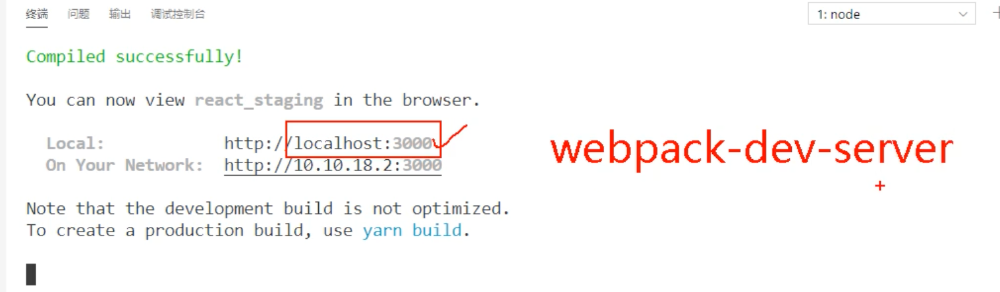

## 第一个组件


- 把 `public` and `src`, 移动到 `01_脚手架自带文件` 里，如果感兴趣有时间自己看。


---


- 重新创建 public src folder

---



- :3000 端口是借助图上的包，开的

---

- create public/index.html

```html
<!DOCTYPE html>
<html lang="en">
<head>
    <meta charset="UTF-8">
    <meta name="viewport" content="width=device-width, initial-scale=1.0">
    <title>react 脚手架</title>
    <link rel="icon" href="%PUBLIC_URL%/favicon.ico" />
</head>
<body>
    <div id="root"></div>
</body>
</html>
```


- create src/App.js     src/index.js


```js
//创建 外壳 组件App
import React from 'react'

class App extends React.Component {
    render() {
        return (
            <div>
                hello, react!
            </div>
        )
    }
}

//输出App组件
export default App
```


```js
//引入react 核心库
import React from 'react'
//引入ReactDOM
import ReactDOM from 'react-dom'
//引入App组件
import App from './App'


//渲染App到页面
ReactDOM.render(<App />, document.getElementById('root'))
```


