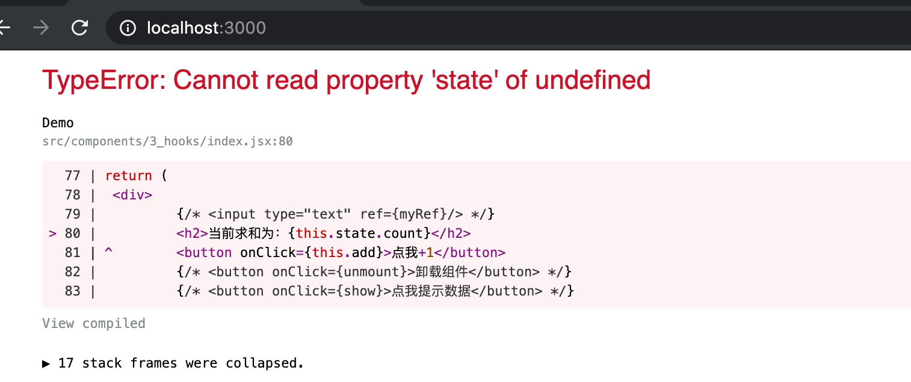
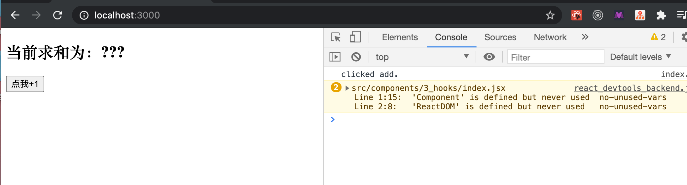

## Hook | setState()

- Recall: 函数式组件，尽管没有this,没有instance 但是它依然拥有三大属性的 props


- 同时： 函数式组件，不能用生命周期函数lifecycle

---

#### 16.8 以后，推出hook, 可以用三大属性: state props refs

- 先用 class base component 来写：


- change to `import Demo from './components/3_hooks'` for App.js


```js
import React from 'react'
import ReactDOM from 'react-dom'

//类式组件
class Demo extends React.Component {

	state = {count:0}

	add = ()=>{
		this.setState(state => ({count:state.count+1}))
	}

	render() {
		return (
			<div>
				<h2>当前求和为{this.state.count}</h2>
				<button onClick={this.add}>点我+1</button>
			</div>
		)
	}
} 

export default Demo
```


-----

### 函数式组件

```js
function Demo(){
	return (
		<div>
			<h2>当前求和为：{this.state.count}</h2>
			<button onClick={this.add}>点我+1</button>
		</div>
	)
}

export default Demo
```




- 因为函数式组件，连自己的 this 都没有

---

```js
import React,{Component} from 'react'
import ReactDOM from 'react-dom'

function Demo(){

	//加的回调
	function add(){
		console.log("clicked add.")
	}

	return (
		<div>
			<h2>当前求和为：{this.state.count}</h2>
			<button onClick={add}>点我+1</button>
		</div>
	)
}

export default Demo
```



- 说明没有使用到component
- 借助 `useState()`, 函数式组件也能用 state


- demo 调用 1 + n 次!


```js
function Demo(){
	//console.log('Demo');

	const [count,setCount] = React.useState(0)

	//加的回调
	function add(){
		//setCount(count+1) //第一种写法
		setCount(count => count+1 )
	}

	return (
		<div>
			<h2>当前求和为：{count}</h2>
			<button onClick={add}>点我+1</button>
		</div>
	)
}

export default Demo
```

- 每次更改state, 组件重新渲染，那么再次调用 `React.useState(0)`, 但是react底层做了处理，
  - `const [count,setCount] = React.useState(0)` ，并不会因为，每一次 调用 `React.useState(0)`, 而重新赋值给count
  - 而是这里的 count 是一个 static variable


