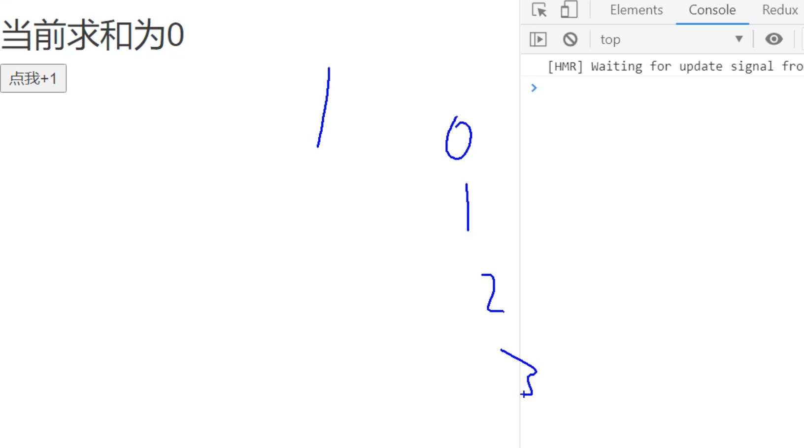
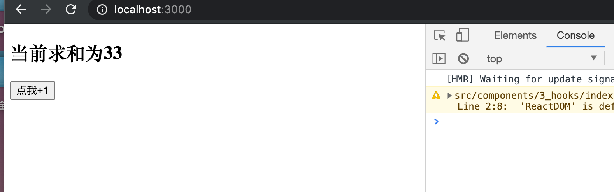
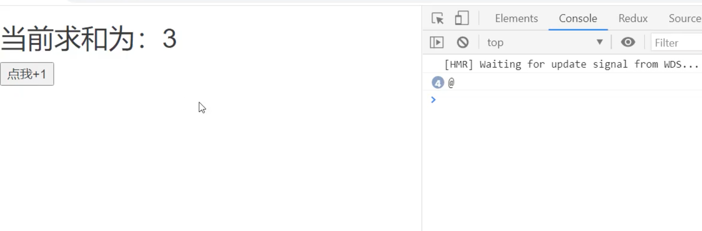
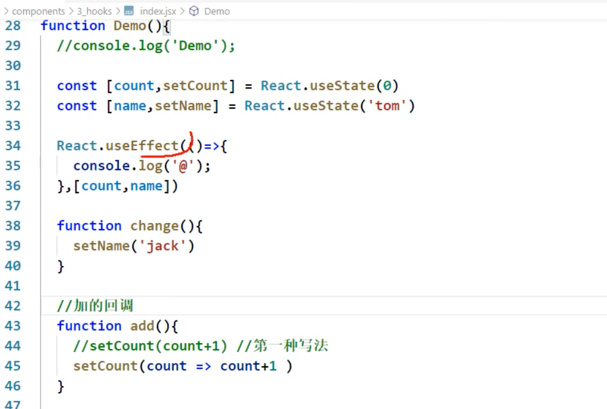
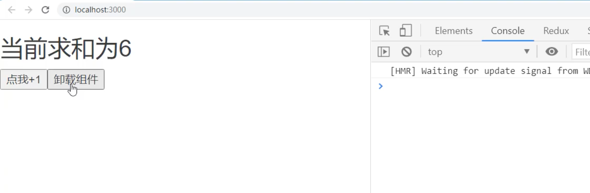
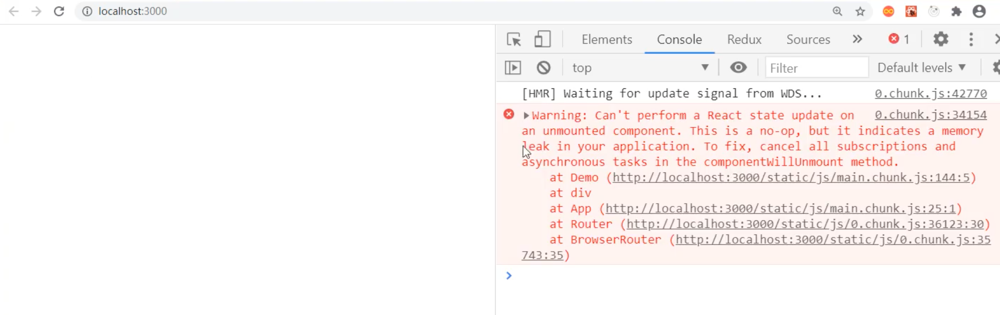
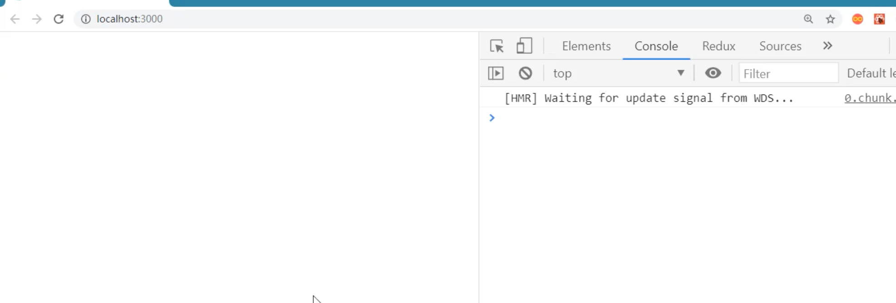
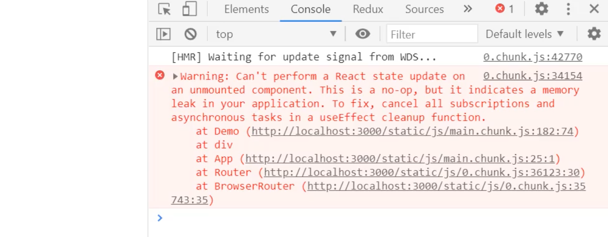
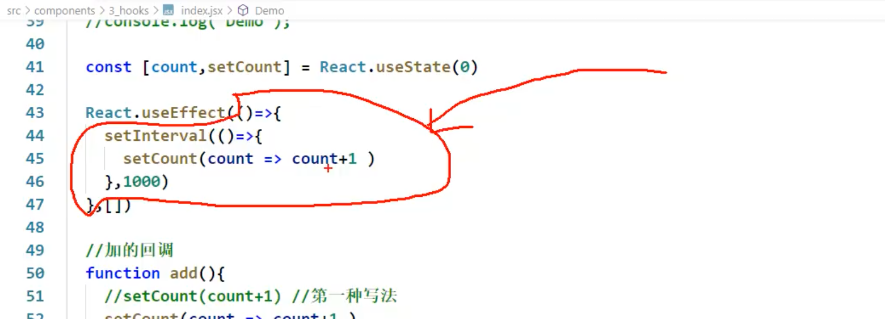
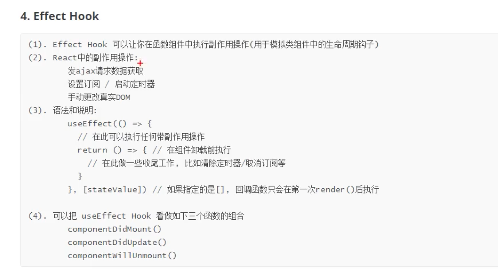

## useEffect()

- change to `import Demo from './components/3_hooks'` for App.js

---


- 需求：




- 每一次数值自增长:


- 先写一个class base component


```js
//类式组件
class Demo extends React.Component {

	state = {count:0}

	add = ()=>{
		this.setState(state => ({count:state.count+1}))
	}

	componentDidMount(){
		this.timer = setInterval(()=>{
			this.setState( state => ({count:state.count+1}))
		},1000)
    }
    
	render() {
		return (
			<div>
				<h2>当前求和为{this.state.count}</h2>
				<button onClick={this.add}>点我+1</button>
			</div>
		)
	}
} 

export default Demo
```



- 因为class 组件是可以定义 lifecycle 函数的.

---

- 因为函数组件里，是不可以写componentDidMount()的，没有this
- 函数组件用`useEffect()` 来代替class里的生命周期函数:


```js
function Demo(){
	//console.log('Demo');

	const [count,setCount] = React.useState(0)

	React.useEffect(()=>{
		let timer = setInterval(()=>{
			setCount(count => count+1 )
		},1000)
		return ()=>{
			clearInterval(timer)
		}
	},[])  //注意这里，第二个参数传递的是一个数组，如果不写就全都监测

	//加的回调
	function add(){
		//setCount(count+1) //第一种写法
		setCount(count => count+1 )
	}

	return (
		<div>
			<h2>当前求和为：{count}</h2>
			<button onClick={add}>点我+1</button>
		</div>
	)
}

export default Demo
```


- useEffect(), 注意这里，第二个参数传递的是一个数组，如果不写就全都监测
  - 比如：const [count,setCount] = React.useState(0), 会监测 count
  - 如果写一个空数组 `[]`, 那么谁也不监测
  - 如果写一个数组 `[count]`, 那么就监测： count

```js
	const [count,setCount] = React.useState(0)

	React.useEffect(()=>{
		let timer = setInterval(()=>{
			setCount(count => count+1 )
		},1000)
		return ()=>{
			clearInterval(timer)
		}
	},[count])  //注意这里，第二个参数传递的是一个数组，如果不写就全都监测
```




- 当然它也可以监测两个：



---

### 再回来看class base component

```js
//类式组件
class Demo extends React.Component {

	state = {count:0}

	add = ()=>{
		this.setState(state => ({count:state.count+1}))
	}

	unmount = ()=>{
		ReactDOM.unmountComponentAtNode(document.getElementById('root'))
	}

	componentDidMount(){
		this.timer = setInterval(()=>{
			this.setState( state => ({count:state.count+1}))
		},1000)
	}

	render() {
		return (
			<div>
				<h2>当前求和为{this.state.count}</h2>
				<button onClick={this.add}>点我+1</button>
				<button onClick={this.unmount}>卸载组件</button>
			</div>
		)
	}
} 
```




- 可以看到是在很稳定的一点点增长，但是点击卸载组件：



- 这是因为组件卸载，但是 setInterval() 定时器并没有停止，意味着，组件依然在更新：

- 需要 componentWillUnmount()


```js
//类式组件
class Demo extends React.Component {

	state = {count:0}

	add = ()=>{
		this.setState(state => ({count:state.count+1}))
	}

	unmount = ()=>{
		ReactDOM.unmountComponentAtNode(document.getElementById('root'))
	}

	componentDidMount(){
		this.timer = setInterval(()=>{
			this.setState( state => ({count:state.count+1}))
		},1000)
    }
    
    componentWillUnmount(){
		clearInterval(this.timer)
	}

	render() {
		return (
			<div>
				<h2>当前求和为{this.state.count}</h2>
				<button onClick={this.add}>点我+1</button>
				<button onClick={this.unmount}>卸载组件</button>
			</div>
		)
	}
} 
```

- 现在就可以卸载组件，并且不会有警告:




---

- 现在把这个相同的功能用 函数式组件来写：

```js
function Demo(){
	//console.log('Demo');

	const [count,setCount] = React.useState(0)

	React.useEffect(()=>{
		let timer = setInterval(()=>{
			setCount(count => count+1 )
		},1000)
	},[])

	//加的回调
	function add(){
		//setCount(count+1) //第一种写法
		setCount(count => count+1 )
	}

	//卸载组件的回调
	function unmount(){
		ReactDOM.unmountComponentAtNode(document.getElementById('root'))
	}

	return (
		<div>
			<h2>当前求和为：{count}</h2>
			<button onClick={add}>点我+1</button>
			<button onClick={unmount}>卸载组件</button>
		</div>
	)
}

export default Demo
```



- 现在问题和前面一样，也需要一个 `componentWillUnmount()`, 但是在函数组件里该怎么写？



- 如果在红色区域，希望写一个 `componentWillUnmount()`, 就需要返回一个函数, 记住必须有返回值，才能模拟 `componentWillUnmount()`

- 所以应该清楚定时器：


```js
React.useEffect(()=>{
    let timer = setInterval(()=>{
        setCount(count => count+1 )
    },1000)
    return ()=>{
        clearInterval(timer)
    }
},[])
```

- 所以可以实现。


---

## 总结:




