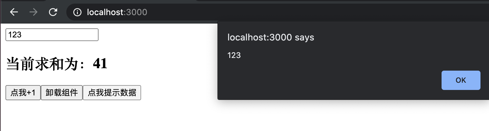

## 比较常见的hook: useRef()

- 先看 class base component

```js
//类式组件
class Demo extends React.Component {

	state = {count:0}

	myRef = React.createRef()

	add = ()=>{
		this.setState(state => ({count:state.count+1}))
	}

	unmount = ()=>{
		ReactDOM.unmountComponentAtNode(document.getElementById('root'))
	}

	show = ()=>{
		alert(this.myRef.current.value)
	}

	componentDidMount(){
		this.timer = setInterval(()=>{
			this.setState( state => ({count:state.count+1}))
		},1000)
	}

	componentWillUnmount(){
		clearInterval(this.timer)
	}

	render() {
		return (
			<div>
				<input type="text" ref={this.myRef}/>
				<h2>当前求和为{this.state.count}</h2>
				<button onClick={this.add}>点我+1</button>
				<button onClick={this.unmount}>卸载组件</button>
				<button onClick={this.show}>点击提示数据</button>
			</div>
		)
	}
} 

export default Demo
```


---

### 函数式组件 useRef()


```js
function Demo(){
	//console.log('Demo');

	const [count,setCount] = React.useState(0)
	const myRef = React.useRef()

	React.useEffect(()=>{
		let timer = setInterval(()=>{
			setCount(count => count+1 )
		},1000)
		return ()=>{
			clearInterval(timer)
		}
	},[])

	//加的回调
	function add(){
		//setCount(count+1) //第一种写法
		setCount(count => count+1 )
	}

	//提示输入的回调
	function show(){
		alert(myRef.current.value)
	}

	//卸载组件的回调
	function unmount(){
		ReactDOM.unmountComponentAtNode(document.getElementById('root'))
	}

	return (
		<div>
			<input type="text" ref={myRef}/>
			<h2>当前求和为：{count}</h2>
			<button onClick={add}>点我+1</button>
			<button onClick={unmount}>卸载组件</button>
			<button onClick={show}>点我提示数据</button>
		</div>
	)
}

export default Demo
```


- 切记这是函数式组件，可别写  this



---


## 总结:


- 它与 class base component 的 createRef() 用法一样，也是专人专用，不允许多个使用


