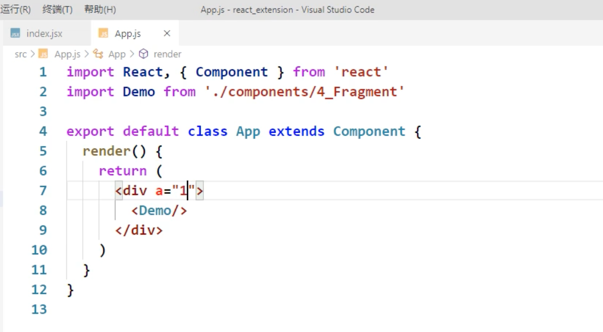

## Fragement





- 这样做层级有点多，所以我们可以借用 Fragement 来解决这个问题:


- Fragement 是为了骗过jsx语法，最终会被解析时候丢掉


---

## 总结


```js
	<Fragment><Fragment>
	<></>
```


### 作用

> 可以不用必须有一个真实的DOM根标签了


- Fragement, 最终是会被丢掉，但是如果你想让Fragement参与遍历，是可以加上key, 但是name 是没有意义的。


